# Graphs

In this notes, we are going to discuss about graphs.

## Types Of Graphs

The graphs are of two types. `Undirected Graphs` and `Directed Graphs`. Image-wise we can differentiate them as follows,

__Undirected Graphs__
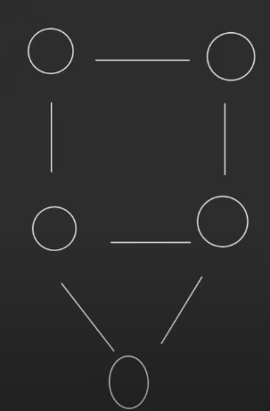

__Directed Graphs__
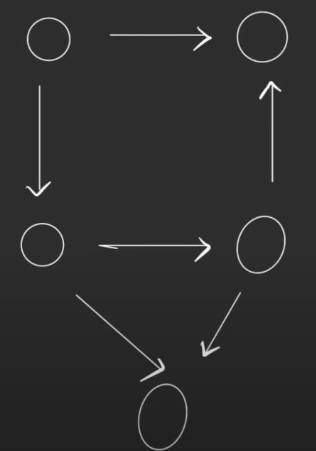

## Nodes and Edges

The circular thing in the pictures above are known as nodes or vertex.

The lines that we see above are known as edges. The first diagram has what we call `undirected edge` and the second diagram has `directed edge`.
Note a undirected graph has edges extented in both directions hence also called `bidirectional`. That is a egde between node 1 and 2 can be represented as 1->2 or 2->1 and both representations would be correct. Though in case of directed graphs, since a egde between nodes 2 and 1 can be of a specific direction, there could only exist a single representation. For instance, in the image that we have used above for directed graph, the edge between node 1 and 2(the first two notes on the top) can be written as 1->2 only. Hence, this is `single directional`. 

## Cyclic and Acyclic

Now there is a term here called `Cyclic Graph`. As the name suggest, a closed graph structure is a cyclic graph. The above diagram of undirected graph is cyclic and consists of 3 cycles. The Square cycle, the triangle cycle and the cycle formed via combination of the two. Though note in case of directed graph, we have the square component as cyclic, but triangle component is not cyclic as when we start from one point, we do not get back at it. As a result, the structure as a whole is not cyclic, hence is called a `Acyclic Graph` or in this case, `Directed Acyclic Graph`.

## Path

Defination wise a path consists of lot of nodes and edges which are reachable, such that no node appears twice.

For instance, look at this picture,

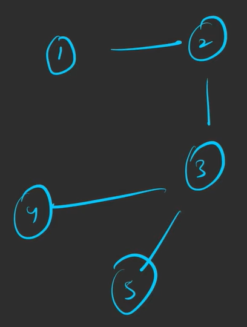

In this picture, 1->2->3->5 and 1->2->3->4 and thier reverse are paths.

## Degree Of Nodes

In essence degree of any node in a undirected graph is the sum all the edges connected to it.

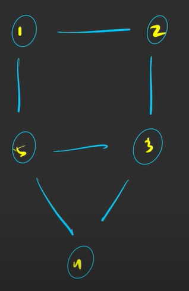

Also note for a undirected graphs,

    Total Degree of a Graph= 2 x Egdes in it

Now lets talk about the directed graph. For any node in a directed graph, there are two types of degree associated to it. `Indegree` and `Outdegree`. `Indegree` represents the total incoming edges, while `Outdegree` represent total number of outgoing edges.

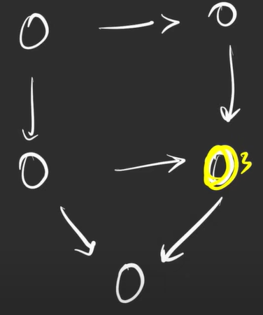

For context look at node 3 of this graph. Outdegree here will be $1$, while in degree here will be $2$. 

## Egde Weight

Every edge in a graph is assigned some weight. For instance, look at the following graphs edges and the weights assigned to them.

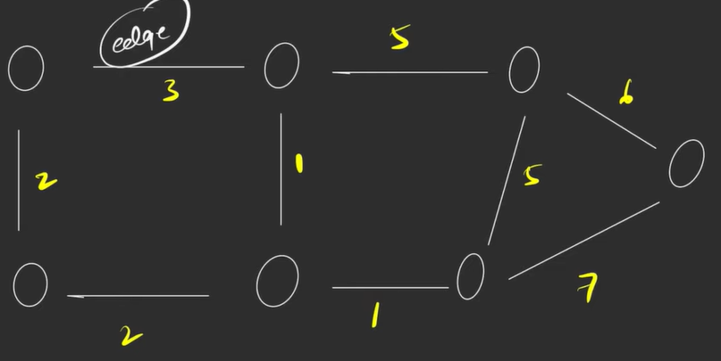

If in case no weights are assigned, then we assume that all edges have the weight $1$.

# Representation or Creation Of Graph in Java

Here we are going to discuss how can we create a graph with information given to us.

## Undirected Graph

__Adjacency Matrix__

The information that will be given to us to aid in development of the graph are as follows:

* Number of nodes(n)
* Number of edges(e)
* Pairs of nodes connected to one another

For instance lets say we have been given,

__Number of nodes(N)__=5

__Number of edges(E)__=6

And the node egde pairs are as follows,

* 1->2
* 1->3
* 3->4
* 2->4
* 2->5
* 4->5

Then the resulting graph will be as follows,

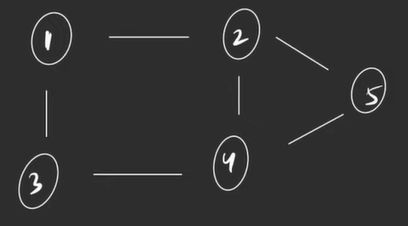

But the question is how do we create this kind of graph. Well there are two ways to do it, they are

* Adjacency Matrix
* Adjacency List 

Now here are the steps we have to follow in case of Adjacency Matrix

* First check the type of indexing. Whether its 1-based indexing or 0-based indexing.

* Next we need to construct a matrix of the dimension [N+1]x[N+1]. Something like this,

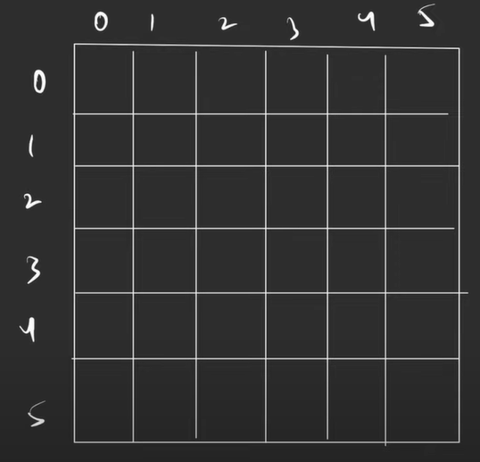

* Now take a look at the edge-nodes pairs available to us. And start filling the matrix. For instance, for the egde-node pair 1->2 we will fill the boxes (1,2) and (2,1) since the graph is undirected. For instance,

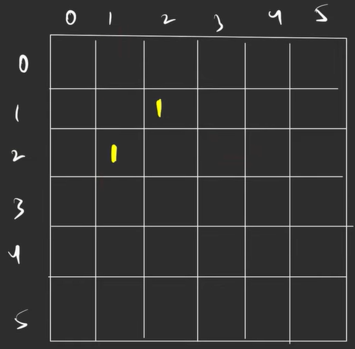

Similar thing will be done for the other pairs.

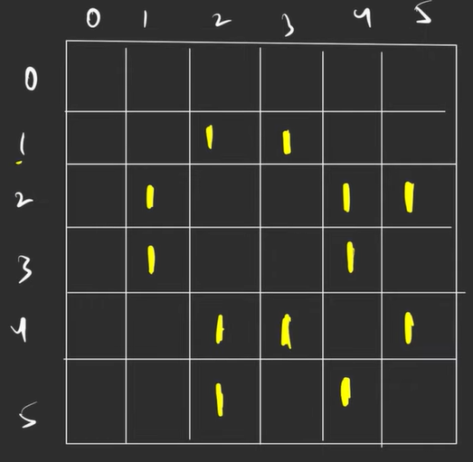

Remaining can be filled by 0. The space complexity of the process is $O(n^2)$. Hence we not use this method but we use adjacency list.

## Directed Graph

__Adjacency List__

See the simple concept here is we create a nested ArrayList. The number of child arraylist in the main array list will be [N+1]. 

Now note that each child list will represent a node. For instance, child arraylist  1 will be for node 1 and so on. What we will do is fill these lists with neighbours of the concerned node. For the example mentioned above, the list structure will look something like this,

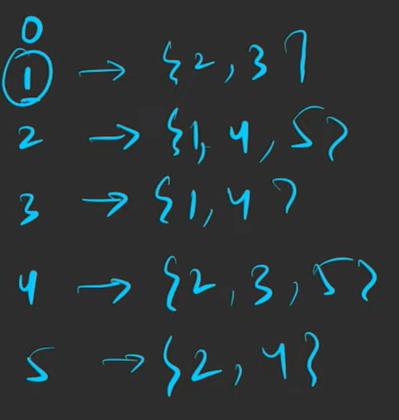

The space complexity here will be $O(2E)$. Note this adjacency list is for a directed graph.

Though its important to note that adjacency matrix and list are not exclusives to Directed and undirected graphs. Both can be used for both of them. Only marking criteria will be different.

## Weighted Graph

Suppose we have the following graph,

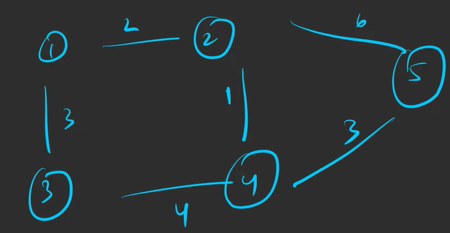

Then the pair 1->2 will be represented as,

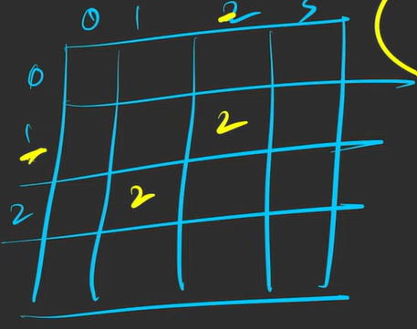

As observable, the only changes made here was that in place of 1, we fill the matrix with edge weights.

The adjacency list elements will be filled something like this. Here we are presenting only one example of node 4. The entry in the child arraylist will be `(Node Number,Edge weight)`.

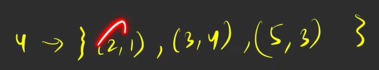

Please see the file,

    Graph.java

For code of adjacency matrix and list.  

# Connected Components

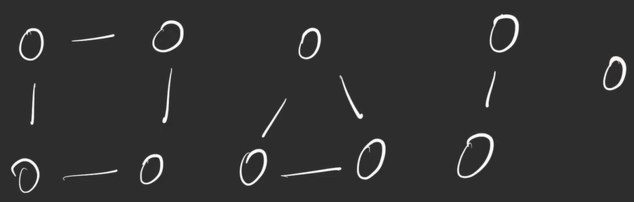

In the picture above we may see things in two ways.

* There 4 different graphs
* This whole thing is a graph

Both of the statements are true but we assume that for this case we move on with case $2$. Here the graph has been broken down into 4 different `Components` and connected together.

Now the next question that we need to answer here is how do we traverse the graph its in this manner. Well follow these steps.

* First create a array of lenght [N+1]. This array will be the visited non-visited array, which keeps the record of nodes have been visited and which have not been visited.

* Design a traversal algorithm that can traverse all the notes from a particular node if they are reachable.

* Run code of the structure,

        for(int i=0,len(visited_array),1):
            if(visited_array(i)){
                continue;
            }
            else{
                traversal_algo(Node[i])
            }
Now how will this work?

See the above example. This algo will start at node 1, check if its visited, since no is the answer, traversal algo will be runned, and the node 2, 3 and 4 will be marked visited. The loop will then go to i=2,3,4 but no actions to be taken since they are already visited. Then it will go to 5, check, since not visited, the traversal algorithm will be called. Then, 6 and 7 will be visited. Loop will then go to i=6,7 but no action will be performed since both these nodes have been visited. Similar 8, checked, since unvisited, will call traversal algorithm and then 9 will be visited.Loop will then go to i=9 but no action will be performed since this node have been visited. Then 10 will be visited, barring intervals where the node is already visited and no action is taken.

# Traversal Algorithms

## Breadth First Search Algorithm

See the picture below,

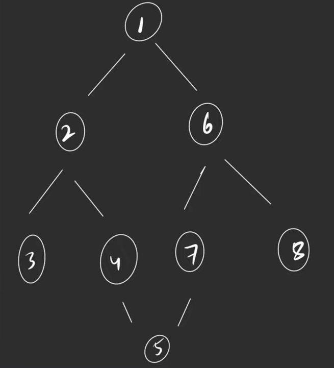

When following BFS, we traverse the graph level by level. For now we assume the starting node is $1$.

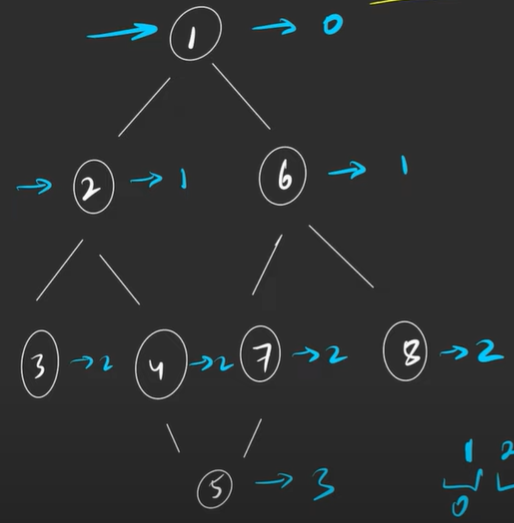


We will first traverse level 0, that has 1.
Then we will traverse level 1, that 2 and 6.
Then we will traverse level 2, that has 3,4,7,8.
Then we will traverse level 3, that has 5.

The net path via BFS will be,

    1-> 2-> 6-> 3-> 4-> 7-> 8-> 5

Now lets re-image this. Lets assume the first node in place of 1 is 6. Then, level 0 will have 6. Level 1 will have 1,7,8. The criteria of level 1 is the node are at 1 edge distance from root node.

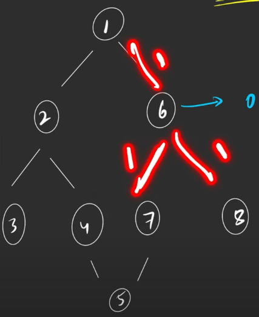

Now level 2 will have the nodes, at a 2 edge distance from root node. This consists of 2 and 5.

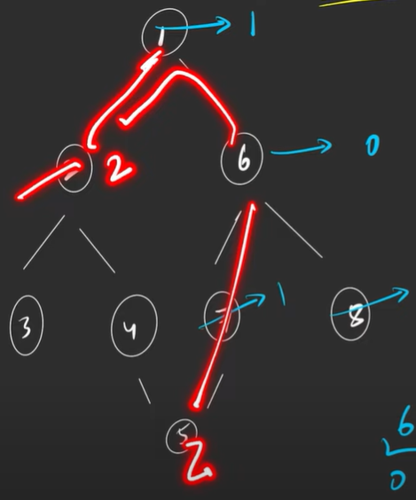

Now level 3 will have the nodes, at a 3 edge distance from node. This consists of 3 and 4.

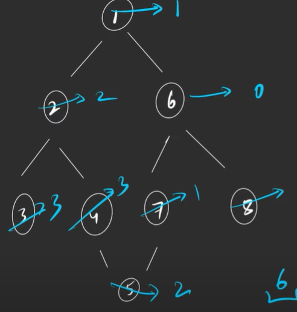

Hence, the traversel as per BFS is as follows,

    6-> 1-> 7-> 8-> 2-> 5-> 3-> 4

Now lets understand in depth the algorithm of BFS.

* We have been given 5 nodes and 6 edges and Adjacency ArrayList for the graph. 
* We then build a queue and visited/non-visited list.
* Then we see the root node. We turn it to be visited. We then add it to queue.

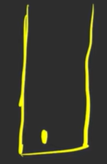

* Now we remove the first element of the queue. This in this case is 1. When doing so we refer to adjacency list and add the connected nodes in the queue. In this case they will be 2 and 6.

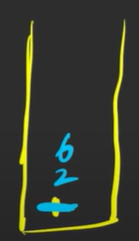

* Now we will repeat the process. We will select the first node on top of queue. In this case it will be 2. We will mark it visited and remove it from queue. We will then add the neighbours of the 2 node to queue. In this case it will be 3 and 4. This process will be continued untill all the nodes have been marked visited. 

To see the code, refer to the file,

    BFS.java

or you can see the code below,

```java 
class BFS {
    public ArrayList<Integer> bfsOfGraph(int V, ArrayList<ArrayList<Integer>> adj) {
        ArrayList<Integer> bfs=new ArrayList<>();
        boolean vis[]=new boolean[V];
        Queue<Integer> q=new LinkedList<>();
        
        q.add(0);
        vis[0]=true;
        
        while(!q.isEmpty()){
            Integer node=q.poll();
            bfs.add(node);
            
            for(Integer it: adj.get(node)){
                if(vis[it]==false){
                    vis[it]=true;
                    q.add(it);
                }
            }
        }
        return bfs;
    }
}
```

## Depth First Search(DFS)

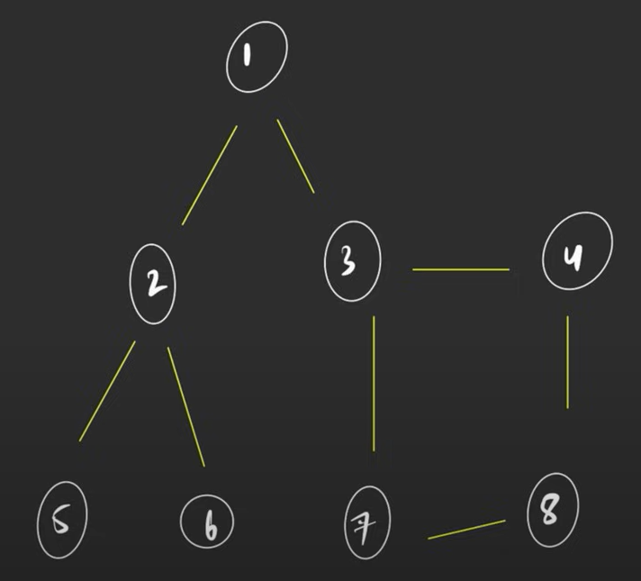

    


## Topographical Sort DFS

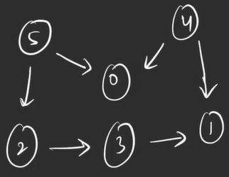

Lets assume this is image we are going to use to understand topo sort. Now what is topo sort?
    
    Topological sort is a linear ordering of vertices/nodes such that if there is a edge between u & v, u appears before v in that ordering.

Note that topological sort can only be applied on `Directed Acyclic Graph`.

Hence for this case topo sort will be,

    5 4 2 3 1 0

The code is as follows,

```
class Solution
{
    
    public static void dfs(int node, ArrayList<ArrayList<Integer>> adj, Stack<Integer> stk,boolean[] visitedArray){
        visitedArray[node]=true;
        for(Integer iter:adj.get(node)){
            if(!visitedArray[iter]){
                dfs(iter,adj,stk,visitedArray);
            }
        }
        stk.push(node);
    }
    
    static int[] topoSort(int V, ArrayList<ArrayList<Integer>> adj) 
    {
        boolean[] visitedArray=new boolean[V];
        Stack<Integer> stk=new Stack<>();
        for(int i=0;i<V;i++){
            if(!visitedArray[i]){
                dfs(i,adj,stk,visitedArray);
            }
        }
        int[] sol=new int[V];
        int index=0;
        while(!stk.isEmpty()){
            sol[index++]=stk.pop();
        }
        return(sol);
    }
}
```

Now lets understanding how is this happening. 

The process is simple, run a simple loop from node 0 to node n-1. We will call normal DFS algorithm, and reach to the terminal nodes on each call, while maintaining visitedNode array. Terminal node are nodes that have 0 out degree. On each DFS call whenever we encounter terminal nodes , we will add the terminal nodes to a stack. Once done, we will then add the previous nodes to terminal nodes to stack too. Once all the nodes are visited, we will the pull out elements from stack and add to topo sort array. The array obtained after this operation is topo sort array.

## Topographical Sort BFS- Kahn Algorithm


Lets assume this is image we are going to use to understand topo sort. Now what is topo sort?
    
    Topological sort is a linear ordering of vertices/nodes such that if there is a edge between u & v, u appears before v in that ordering.

Note that topological sort can only be applied on `Directed Acyclic Graph`.

Hence for this case topo sort will be,

    5 4 2 3 1 0

The code is as follows,
```
class Solution
{
    //Function to return list containing vertices in Topological order. 
    static int[] topoSort(int V, ArrayList<ArrayList<Integer>> adj) 
    {
        Queue<Integer> q=new LinkedList<>();
        int[] inDegree=new int[V];
        int[] sol=new int[V];
        for(int i=0;i<V;i++){
            for(Integer iter:adj.get(i)){
                inDegree[iter]++;
            }   
        }
        for(int j=0;j<V;j++){
            if(inDegree[j]==0){
                q.add(j);
            }
        }
        int index=0;
        while(!q.isEmpty()){
            int outNode=q.poll();
            sol[index++]=outNode;
            for(Integer it:adj.get(outNode)){
                inDegree[it]--;
                if(inDegree[it]==0){
                    q.add(it);
                }
            }
        }
        return(sol);
    }
}
```

Now lets understanding how is this happening. 

We create a few elements. A queue, a inDegree array, and sol array that will store the topo sort. We will analyse the adjacency list or matrix, and we then calculate inDegree of each node. Initially we will check inDegree of each node, if found 0, we will add those nodes into queue. Now after that we will start a loop until the queue is not empty.

Inside the loop, we will pull elements from the queue, and after than all the nodes to which this node was connected, thier inDegree is reduced. Checks are run whether any node's inDegree has turned 0 and then that elements is added to queue. After that, again element are removed from queue and this loop continues.

## Cycle Detection in Directed Graphs Using Topo Sort

Concept is simple, Topo sort only acts on DAG. If cyclic graph comes, topo sort won't work perfectly. When topo sort is run of such graphs length of the topo sort array will be less than actual number of node. On comparison of length we can hence conclude whether graph is cyclic or not.


## Shortest Path Distance

### Directed Acyclic Graph

The algorithm is quite simple.

1) If given a adjacency matrix, first convert it to adjacency list. Store elements here in the form of pairs, containing the node and the distance values.

2) Apply topo sort to find the order of integers and last and first elements but do not throw them out of the queue just yet.

3) Create a distanceArray(initialise it with max_value) which will be returned as solution. Turn the distance for the first node(found via peek in queue).

4) Now run a simple algorithm, pop one element out of queue, check for its adjacent nodes, see the distance of currentNode+distance of adjacent node is less than the value already saved, and if yes update. Repeat this step until the queue is empty.

5) Mark all the unvisited elements distances as -1.

The solution code is as follows,

```
class Solution {
    
    public class Pair {
        int node;
        int distance;
        public Pair(int node, int distance) {
            this.node = node;
            this.distance = distance;
        }
    }
    
    public void dfs(ArrayList<ArrayList<Pair>> adj, boolean[] visitedArray, Stack<Integer> stk, int node) {
        visitedArray[node] = true;
        for (Pair iter : adj.get(node)) {
            if (!visitedArray[iter.node]) {
                dfs(adj, visitedArray, stk, iter.node);
            }
        }
        stk.push(node);
    }

    public int[] shortestPath(int N, int M, int[][] edges) {
        // Create adjacency list
        ArrayList<ArrayList<Pair>> adj = new ArrayList<>();
        for (int j = 0; j < N; j++) {
            adj.add(new ArrayList<>());
        }
       
        // Add elements to adjacency list
        for (int k = 0; k < M; k++) {
            Pair element = new Pair(edges[k][1], edges[k][2]);
            adj.get(edges[k][0]).add(element);
        }
        
        // Create DFS elements
        boolean[] visitedArray = new boolean[N];
        Stack<Integer> stk = new Stack<>();
        
        // Run DFS Topo Sort
        for (int i = 0; i < N; i++) {
            if (!visitedArray[i]) {
                dfs(adj, visitedArray, stk, i);
            }
        }
        
        // Initialize distance array
        int[] distanceArray = new int[N];
        Arrays.fill(distanceArray, Integer.MAX_VALUE);
        distanceArray[0] = 0; // Assuming 0 as the starting node
        
        // Process the nodes in topological order
        while (!stk.isEmpty()) {
            int outNode = stk.pop();
            if (distanceArray[outNode] != Integer.MAX_VALUE) {
                for (Pair iter : adj.get(outNode)) {
                    int vertex = iter.node;
                    int dist = iter.distance;
                    if (distanceArray[outNode] + dist < distanceArray[vertex]) {
                        distanceArray[vertex] = distanceArray[outNode] + dist;
                    }
                }
            }
        }
        
        // Replace unreachable nodes with -1
        for (int i = 0; i < N; i++) {
            if (distanceArray[i] == Integer.MAX_VALUE) {
                distanceArray[i] = -1;
            }
        }
        
        return distanceArray;
    }
}

```

### Undirected Graph
The algorithm is quite simple and listed below.

1) Convert adjacency matrix into list or any other matrix in adjacency list and add elements.

2) Create a distance array. Note the source will be given hence, turn the distance of the source as zero and let all other distance be set to MAX_VALUE.

3) Create a queue. Add source to it initially. Run a loop with condition until queue is empty. Pop out the element present, add its connected element. Add distance 1 to the distance of connected element. This one is to be added to distance of parent element.

4) Turn the distance of unreachable nodes to -1.

The code is as follows,

```
class Solution {
    
    public int[] shortestPath(int[][] edges,int n,int m ,int src) {
        //Creating adjacency array skeleton
        ArrayList<ArrayList<Integer>> adj=new ArrayList<>();
        for(int i=0;i<n;i++){
            adj.add(new ArrayList<>());
        }
        
        //Entering values
        for(int j=0;j<m;j++){
            adj.get(edges[j][0]).add(edges[j][1]);
            adj.get(edges[j][1]).add(edges[j][0]);
        }
        
        //Creating distance array and turning src position dist as 0
        int[] distanceArray=new int[n];
        Arrays.fill(distanceArray,Integer.MAX_VALUE);
        distanceArray[src]=0;
        
        //Creating new stack and adding source element
        Queue<Integer> q=new LinkedList<>();
        q.add(src);
        
        
        while(!q.isEmpty()){
            int outNode=q.poll();
            for(Integer iter:adj.get(outNode)){
                if(distanceArray[outNode]+1<distanceArray[iter]){
                    distanceArray[iter]=distanceArray[outNode]+1;
                    q.add(iter);
                }
            }
        }
        
        for(int k=0;k<n;k++){
            if(distanceArray[k]==Integer.MAX_VALUE){
                distanceArray[k]=-1;
            }
        }
        
        return(distanceArray);
    }
}
```

## Dijkstra Algorithm (Shortest Path Difference)

Dijkstra's algorithm is used to find the shortest path from a single source node to all other nodes in a weighted graph. It works efficiently for graphs with non-negative edge weights.

__Algorithm__

1. __Initialization:__

    __Inputs:__    

        V: Number of vertices in the graph.

        adj: Adjacency list where each node contains a list of pairs [neighbor, weight] representing the neighboring node and the edge weight.

        S: The source vertex from which to calculate the shortest paths.

    Distance Array: Create an array distanceArray of size V and initialize all elements to ∞ (or Integer.MAX_VALUE in Java), representing the initial distance to each node. Set the distance to the source node S to 0.

    Priority Queue: Use a min-heap priority queue to keep track of the minimum distance discovered so far. The queue stores pairs of (distance, node), where distance is the current shortest distance to node.

2. __Start from the Source Node:__

        Insert the source node into the priority queue with a distance of 0.

3. __Processing Nodes:__

* While the priority queue is not empty, do the following:
    
        Extract the Node: Extract the node u with the smallest distance from the priority queue.

        Relaxation: For each neighbor v of u, check if the path from u to v through the current edge offers a shorter path than previously known:

        If distanceArray[u] + weight(u, v) < distanceArray[v], update distanceArray[v] with the new shorter distance.

        Insert v with the updated distance into the priority queue.

4. __Repeat Until All Nodes Are Processed:__

        Continue extracting nodes and relaxing edges until the priority queue is empty.

5. __Output:__

        The distanceArray now contains the shortest distance from the source node S to every other node in the graph.


The code is as follows,

```
class Solution {

    public static class Pair {
        int distance;
        int node;

        public Pair(int distance, int node) {
            this.distance = distance;
            this.node = node;
        }
    }

    // Function to find the shortest distance of all the vertices
    // from the source vertex S.
    static int[] dijkstra(int V, ArrayList<ArrayList<ArrayList<Integer>>> adj, int S) {
        // Min-heap priority queue. The last condition states, minimum distance to be stored at the top.
        PriorityQueue<Pair> pq = new PriorityQueue<>((x, y) -> x.distance - y.distance);

        // Distance array AND filling it with max integer
        int[] distanceArray = new int[V];
        Arrays.fill(distanceArray, Integer.MAX_VALUE);

        // Changing the distance for source array to 0
        distanceArray[S] = 0;

        // Adding start node to priority queue
        Pair startNode = new Pair(0, S);
        pq.add(startNode);

        // Running modified BFS
        while (!pq.isEmpty()) {
            // Pulling element out from queue
            Pair outNode = pq.poll();

            // Iterating to each of its connected Nodes
            for (ArrayList<Integer> iter : adj.get(outNode.node)) {
                int node = iter.get(0);
                int distance = iter.get(1);
                if (distanceArray[outNode.node] + distance < distanceArray[node]) {
                    distanceArray[node] = distanceArray[outNode.node] + distance;
                    Pair newNode = new Pair(distanceArray[node], node);
                    pq.add(newNode);  // Add the updated distance and node to the priority queue
                }
            }
        }
        return distanceArray;
    }
}
```

## Floyd Warshall Algorithm

The Floyd-Warshall algorithm is an all-pairs shortest path algorithm, which computes the shortest paths between all pairs of nodes in a graph. This algorithm is particularly useful for dense graphs and can handle both positive and negative edge weights (but no negative cycles).

__Algorithm__

1. __Initialization:__

    Input:

        matrix: A 2D matrix (adjacency matrix) where matrix[i][j] represents the weight of the edge from node i to node j.

    If there's no direct edge between nodes i and j, matrix[i][j] should initially be set to -1.

2. __Preprocessing:__
    
    Traverse the entire matrix:
            
            Convert all -1 values to a very large value (representing infinity), as -1 indicates no direct path. In this algorithm, a large value will signify an unreachable path.

            Set matrix[i][i] to 0 for all i, because the shortest distance from a node to itself is 0.

3. __Main Algorithm:__

    Triple Loop Structure:
        
        Iterate over each possible intermediate node k (referred to as via in the code):

        For each pair of nodes (i, j), check if the path from i to j through k is shorter than the currently known shortest path:

        Update matrix[i][j] to min(matrix[i][j], matrix[i][k] + matrix[k][j]).
        
        This step essentially checks if the shortest path from i to j can be improved by going through node k.

4. __Postprocessing:__

        After running the main algorithm, convert any values that are still set to the large "infinity" value back to -1 to maintain the integrity of the output (as -1 is used to denote no path exists).
5. __Output:__

        The matrix now contains the shortest paths between all pairs of nodes. If matrix[i][j] is still a large value (infinity), it means there's no path between i and j.

The code is as follows,

```
class Solution
{
    public void shortest_distance(int[][] matrix)
    {
        int n = matrix.length;
        int INF = (int)(1e8);

        // Preprocessing
        for(int i = 0; i < n; i++){
            for(int j = 0; j < n; j++){
                if(matrix[i][j] == -1){
                    matrix[i][j] = INF;  // Treat -1 as infinity
                }
                if(i == j){
                    matrix[i][j] = 0;  // Distance from a node to itself is 0
                }
            }
        }
        
        // Main Floyd-Warshall algorithm
        for(int k = 0; k < n; k++){
            for(int i = 0; i < n; i++){
                for(int j = 0; j < n; j++){
                    matrix[i][j] = Math.min(matrix[i][j], matrix[i][k] + matrix[k][j]);
                }
            }
        }
        
        // Postprocessing: Convert infinity back to -1 for unreachable nodes
        for(int i = 0; i < n; i++){
            for(int j = 0; j < n; j++){
                if(matrix[i][j] == INF){
                    matrix[i][j] = -1;  // Restore -1 for no path
                }
            }
        }
    }
}
```

## Bellman-Ford Algorithm

The Bellman-Ford algorithm is used to find the shortest paths from a single source vertex to all other vertices in a weighted graph. It can handle graphs with negative weight edges, but it will detect and report if there is a negative weight cycle reachable from the source vertex.

__Algorithm__

1. __Initialization:__

    Input:

        V: Number of vertices in the graph.

        edges: A list of edges where each edge is represented by a triplet (u, v, wt) indicating there is an edge from vertex u to vertex v with weight wt.

        S: The source vertex from which the shortest paths are calculated.

    Distance Array:
    Create a distanceArray of size V to store the shortest distance from the source to each vertex.
    Initialize the distanceArray with a large value (infinity) for all vertices except the source vertex S, which is initialized to 0.

2. __Relaxation Step:__


    Iteration:

        Repeat the relaxation process V-1 times (where V is the number of vertices).

    Relaxation:

        For each edge (u, v, wt), check if the current known distance to v can be shortened by taking the edge from u to v.

        If distanceArray[u] + wt < distanceArray[v], update distanceArray[v] to distanceArray[u] + wt.

3. __Negative Cycle Detection:__

        After V-1 iterations, perform one more iteration over all edges to check for any negative weight cycles.
        
        If any edge (u, v, wt) still satisfies distanceArray[u] + wt < distanceArray[v], then a negative weight cycle exists, and the algorithm should return an array with a single element -1 indicating the presence of a negative cycle.

4. __Output:__

        If no negative weight cycle is detected, return the distanceArray, which contains the shortest distances from the source vertex S to all other vertices.

The code is as follows,

```
class Solution {
    static int[] bellman_ford(int V, ArrayList<ArrayList<Integer>> edges, int S) {
        // Distance array to store the shortest distance from source to each vertex
        int[] distanceArray = new int[V];
        
        // Initialize the distance array with a large value (infinity)
        Arrays.fill(distanceArray, (int)(1e8));
        distanceArray[S] = 0;  // Distance from the source to itself is 0
        
        // Relaxation step
        for (int i = 0; i < V - 1; i++) {  // Perform V-1 iterations
            for (ArrayList<Integer> edge : edges) {
                int u = edge.get(0);
                int v = edge.get(1);
                int wt = edge.get(2);
                // Relax the edge
                if (distanceArray[u] + wt < distanceArray[v] && distanceArray[u] != (int)(1e8)) {
                    distanceArray[v] = distanceArray[u] + wt;
                }
            }
        }
        
        // Check for negative weight cycles
        for (ArrayList<Integer> edge : edges) {
            int u = edge.get(0);
            int v = edge.get(1);
            int wt = edge.get(2);
            // If a shorter path is found, a negative cycle exists
            if (distanceArray[u] + wt < distanceArray[v] && distanceArray[u] != (int)(1e8)) {
                return new int[] {-1};  // Return -1 indicating a negative cycle
            }
        }
        
        return distanceArray;  // Return the shortest distance array
    }
}

```

# Minimum Spanning Tree

Spanning tree is a tree with n nodes and n-1 edges. Minimum spanning tree is a one of the many spanning tree for a n node configration that has the least sum of edge weight. 

One of the algo used to find the edges of spaning tree from a given tree and calculate weight sum is Prim's algorithm. Lets study that.

## Prim's Algorithm

Prim's Algorithm is used to find the minimum spanning tree (MST) of a connected, undirected graph. The MST is a subset of the graph's edges that connects all vertices together without any cycles and with the minimum possible total edge weight.

Here is the step-by-step algorithm:

1. **Initialize Structures**:
   - Create a priority queue (min-heap) to store nodes based on the minimum weight edge connecting them.
   - Create a `visitedArray` to keep track of the vertices that have already been added to the MST.
   - Create a `mstArray` to store the edges that are part of the MST.
   - Initialize the `sum` variable to zero, which will hold the total weight of the MST.

2. **Start with an Arbitrary Node**:
   - Begin with an arbitrary starting node (typically node 0). Push it onto the priority queue with an initial weight of 0 and a parent of -1 (indicating no parent).

3. **Main Algorithm Loop**:
   - While the priority queue is not empty:
     1. **Extract the Node with the Minimum Edge Weight**:
        - Pop the node with the minimum weight edge from the priority queue.
     2. **Check if the Node is Already in MST**:
        - If the node is not already visited, mark it as visited.
     3. **Include the Node in MST**:
        - Add the weight of the edge to the `sum`.
        - Add the corresponding edge (between the node and its parent) to the `mstArray`.
     4. **Update Neighboring Nodes**:
        - For each unvisited neighbor of the current node:
          - Push the neighbor onto the priority queue with the weight of the connecting edge.
          - Track the edge connecting the node to the neighbor for possible inclusion in the MST.

4. **Result**:
   - The algorithm continues until all nodes are included in the MST. The final `sum` represents the total weight of the minimum spanning tree, and `mstArray` contains all the edges of the MST.

5. **Return**:
   - Return the total weight of the MST (`sum`).

### Example Reference Code:

```java
class Solution {

    public static class Edge {
        int x;
        int y;
        public Edge(int x, int y) {
            this.x = x;
            this.y = y;
        }
    }

    public static class Triplet {
        int weight;
        int node;
        int parent;
        public Triplet(int wt, int n, int p) {
            this.weight = wt;
            this.node = n;
            this.parent = p;
        }
    }

    static int spanningTree(int V, int E, List<List<int[]>> adj) {
        // Creating priority queue, visited array, and MST array
        PriorityQueue<Triplet> pq = new PriorityQueue<>((x, y) -> x.weight - y.weight);
        boolean[] visitedArray = new boolean[V];
        ArrayList<Edge> mstArray = new ArrayList<>();

        // Initializing starting node
        Triplet startNode = new Triplet(0, 0, -1);
        pq.add(startNode);

        int sum = 0;

        // Main loop of Prim's algorithm
        while (!pq.isEmpty()) {
            Triplet outNode = pq.poll();
            int weight = outNode.weight;
            int node = outNode.node;
            int parent = outNode.parent;

            if (!visitedArray[node]) {
                visitedArray[node] = true; 
                sum += weight;
                if (parent != -1) {
                    Edge newMST = new Edge(parent, node);
                    mstArray.add(newMST);
                }

                for (int[] iter : adj.get(node)) {
                    int destNode = iter[0];
                    int wt = iter[1];
                    if (!visitedArray[destNode]) {
                        Triplet newNode = new Triplet(wt, destNode, node);
                        pq.add(newNode);
                    }
                }
            }
        }
        return sum;
    }
}
```

### Key Points:
- **Priority Queue** ensures that the edge with the smallest weight is selected first.
- **Visited Array** prevents cycles and ensures that each vertex is included only once in the MST.
- **Sum** keeps track of the total weight of the edges included in the MST.
- The algorithm efficiently finds the MST by always choosing the smallest possible edge that expands the MST without forming a cycle.

# Disjoint Set 

Disjoint set is a component that could tell whether two nodes belong to the same component in constant time unlike BFS and DFS that have the complexity O(N+E). These are generally used in case of Dynamic graphs.

Disjoint set provides 2 major functionalities,

1) FindParent
2) Find Union either via size or rank

What do we mean by Dynamic Graph? When we discuss graph in context of Disjoint set we see that initially all the nodes are isolated(not connected to one another) and later we supply them with edges. These edges are added one after the another, hence at every point in time, the configration of graph will be different as there will be few edges that are still being added, hence we refer to this kind of graph as dynamic graph. 

At any point during the formation of DG, one could ask wheather two nodes are connected to each other. Disjoint set happens to be a algo/structure that answers this question in constant time.

## Union By Rank

To perform this operation we need two thing initially,

1) Rank Array with rank of each node initialised to 0.
2) Parent array with i initialised to each index, that is 0 for 0, 1 for 1 and so on.

The pseudocode to perform Union(u,v) is as follows,

1) Find the ultimate parent of u and v. Lets say them as pu and pv.
2) Find the rank of pu and pv.
3) Connect smaller rank parent to larger rank parent.

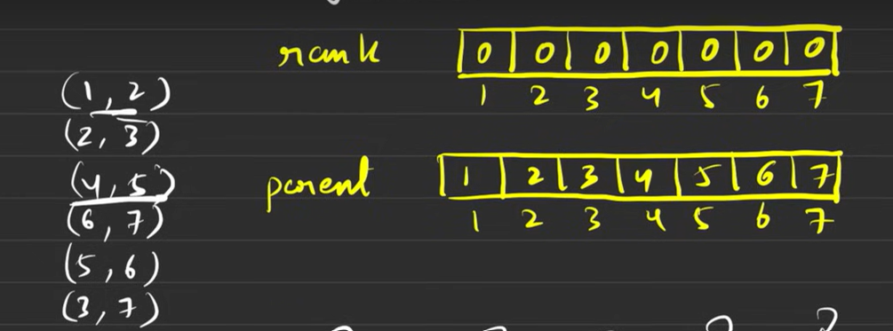