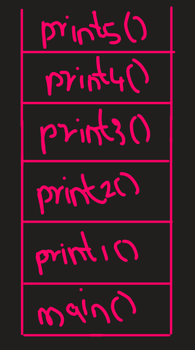
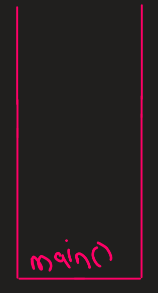

# How Function Call Works In Java?

Suppose this is the code we are taking for demonstration. The code basically calls a series of fuction to print 1 2 3 4 and 5.

```java
class demonstration{
    public static void main(String[] args){
        print1(1);
    }

    public void print1(int num){
        System.out.println(num);
        print2(2);
    }

    public void print2(int num){
        System.out.println(num);
        print3(3);
    }

    public void print3(int num){
        System.out.println(num);
        print4(4);
    }
    
    public void print4(int num){
        System.out.println(num);
        print5(5);
    }

    public void print5(int num){
        System.out.println(num);
    }
}
```

Now there are some fundamental rules we need to know when we are working with functions. They are :

__Rule 1__

    Whenever a function is called, the function is loaded into the stack and stays there until its operation is completed.

__Rule 2__

    When the function that is already in executions and already loaded in stack finishes its operation, its removed from the stack and the flow of the program begins from the point after the function call took place.

Lets see these rules in action with the help of the code above.

When the above code is executed, the first function that is called is the main function. When that happens, the stack diagram looks something like this,


The output window at the same time will remain empty.

This is followed by main function calling the print1 function. When the call takes place and the function comes into execution the call stack looks something like this,


The output window will look something like this,

    1

This will be followed by a call to function print2. The call stack will update and look something like this,


The output window will look something like this,

    1 2

This function will then call the next function to print 3. The function is named as print3, and after that call takes place, the call stack will look something like this,


The output window will look something like this,

    1 2 3

print3 function will then call print4 function to print 4. The call stack after this function call takes place, is


The output window will look something like this,

    1 2 3 4 

This will be followed by print4 function calling print5 function to print the number 5, and the call stack will look something like this,



The output window will look something like this,

    1 2 3 4 5

Now no function call will take place after this. As observable, the print5 function ends here. As soon as it ends, it will be removed from the call stack, and the code will resume from print4 function after the line at which the call for print5 function took place. The call stack will look something like this,


print4 function will also end at this point. The code will resume at line 4 of print3 function. The updated call stack after completion of the print4 function will look something like this,


print3 function of execution of resumption after termination of print4 function opens up at line4, which is pratically the end of the function(as was the case for print4 and print5), it will be removed from the call stack too, then updated call stack will be,


After print3 function has ended, the code will resume at print2 function at line after the call for print3 function took place. At that point, the function print2 would also have been completed, so this function will also be removed from the call stack. Updated call stack will look as follows,


After print2 function has ended, the code will resume at print1 function at line after the call for print2 function took place. At that point, the function print1 would also have been completed, so this function will also be removed from the call stack. Updated call stack will look as follows,



After print1 function has ended, the code will resume at main function at line after the call for print1 function took place. At that point, the function main would also have been completed, so this function will also be removed from the call stack leaving the call stack empty. Updated call stack will look as follows,


Above is a demonstration of how to function call works internally. Now lets talk about the next this, that is __Recurison__.

# Recursion

__Recursion is a programing practice where we call a function from itself.__

For instance look at the code below,

```java
class demonstraction{
    public void print(){
        System.out.println("Hi");
        print();
    }
}
```
In the code above we see a basic implementation of recursion where the print function is calling itself from itself.

Now why do we need recursion?

One simple answer to that question will be the code we did in the previous section. In that code we printed numbers from 1 to 5, via 5 different functions each calling the other in a defined sequence. What if we needed to do that but not for 5 numbers but for say 1 crore numbers. In that case physically writing 5 crore functions is not possible. For solving that issue we have what we call recursion. 

Below we see the previous code implemented recursively doing the same task, that is printing from 1 to 5.

```java
class demonstration{
    public static void main(String[] args){
        print(1);
    }

    public void print(int num){
        if(num>5){
            return;
        }
        System.out.println(num);
        print(num);
    }
}
```
Above what we see is the recursive implementation of the code in the previous section. As observable, the code is a lot cleaner and shorter than the previous case. There are some important points that I need to highlight before I take a deep dive into the code and explore the outputs and call stack.

__Point 1__

    The print function above is a recursive function. It calls itself multiple number of times until it meets a specific condition.

__Point 2__

    The specific condition at which a recursive function stops calling itself is called the  base condition. In the above code, (num>5) is the base condition after which no further recursion calls are undertaken.

__Point 3__

    The `return` in the code above is used to terminate a particular function, after which it is also removed from the call stack and the operation resumes at line after the line in which the recursive call took place.

__Point 4__

    Though the function is of recursive nature, it doen't mean that a single instance in the call stack will suffice for all the calls. Every call made recursively will acount for a seperate entry in the call stack.

With all the above points clear now lets dive into call explanation.

The code begins with the code execution, which first calls the main function. As the main function is load, it will be loaded in the call stack and updated call stack will look as follows,


The output window will not be changed. With the main function running and the lines in it being executed, we will see the main function calling the print function with the argument 1. Print function will load in the call stack and call stack will look something like this,


When the print function will be executed, the base condition will be checked first. It will be a fail. The 1 will be printed, making the output as,

    1

After this print function will be called again from print function but with 2 as an argument. The call stack as per the rules will update again and will look something like this,


When the print function will be executed, the base condition will be checked first. It will be a fail. The 2 will be printed, making the output as,

    1 2

After this print function will be called again from print function but with 3 as an argument. The call stack as per the rules will update again and will look something like this,


When the print function will be executed, the base condition will be checked first. It will be a fail. The 3 will be printed, making the output as,

    1 2 3

After this print function will be called again from print function but with 4 as an argument. The call stack as per the rules will update again and will look something like this,


When the print function will be executed, the base condition will be checked first. It will be a fail. The 4 will be printed, making the output as,

    1 2 3 4

After this print function will be called again from print function but with 5 as an argument. The call stack as per the rules will update again and will look something like this,


When the print function will be executed, the base condition will be checked first. It will be a fail. The 4 will be printed, making the output as,

    1 2 3 4 5

After this print function will be called again from print function but with 6 as an argument. The call stack as per the rules will update again and will look something like this,


When the print function will be executed, the base condition will be checked first. It will be a pass. This would mean no more recursive calls from this point. After this, this function call will be terminated, and this will effect the call stack as follows,


After that the program will resume at the line next after the recursively calling line of the previous function which is print(5) function. This line would be the last line of this function after which the function will be terminated. On termination, the function will be removed from the call stack and the resultant call stack will look something like this,


After that the program will resume at the line next after the recursively calling line of the previous function which is print(4) function. This line would be the last line of this function after which the function will be terminated. On termination, the function will be removed from the call stack and the resultant call stack will look something like this,


After that the program will resume at the line next after the recursively calling line of the previous function which is print(3) function. This line would be the last line of this function after which the function will be terminated. On termination, the function will be removed from the call stack and the resultant call stack will look something like this,


After that the program will resume at the line next after the recursively calling line of the previous function which is print(2) function. This line would be the last line of this function after which the function will be terminated. On termination, the function will be removed from the call stack and the resultant call stack will look something like this,


After that the program will resume at the line next after the recursively calling line of the previous function which is print(1) function. This line would be the last line of this function after which the function will be terminated. On termination, the function will be removed from the call stack and the resultant call stack will look something like this,


After that the program will resume at the line next after the recursively calling line of the previous function which is main function. This line would be the last line of this function after which the function will be terminated. On termination, the function will be removed from the call stack and the resultant call stack will look something like this,


Since the call stack is now empty, all the lines in the code would have been performed, and the program will be terminated.

## Why use Recursion?

* It helps in solving bigger/complex problems in a simple way.
* Recursive function are easier to imagine, formulate and write. This can be then converted into iterative solution which are difficult to write but a way more optimized.

## Visualising Recursion

Visualising the recursion problem is a very important element of learning recursion from the base, while also very helpful to us in decoding complex recursion problems. One example of the previous code is below where we are visualizing it,


## When To Use Recurison For Solving Questions?

    We should use recursion for solving questions only when we can break a large problem into smaller problems.

In the examples following this part of explaination we are going to see different types of question and for each question we are going to see in details how can we implement it recursive. We would not only looking at the concept of the code but also at things like, recurence relation, recursion tree, code and etc.

## Fibonacci Series

We already know how this question can be solved iteratively. So as an concept its nothing new. What's going to be new is implementation of the solution recursively.

    The first thing to do whenever we solve a question via recursion is to write the Recurrence Relation using which we are going to solve the question.

So we first write recurence relation. 

In Fibonacci Series, For any number $F(N)$ in the Fibonacci series, it is the sum of previous two numbers of the same series, that is $F(N-1)$ and $F(N-2)$. Hence the recurrence relation of this question can be written as,

$F(N)$ = $F(N-1)$ + $F(N-2)$

Lets assume we are solving Fibonacci Series for n=4 of $F(4)$.In that case the recursive tree will look something like this, when written based on the recurrence relations,


As observable above we see the recursive tree of solving the question $F(4)$. One interesting thing to note above is how each branch is ending with $f(1)$ or $f(0)$ or both of them together. Why?

The solution is simple. While solving Fibonacci Series all the n value from 2 are to be calculated as they are unknown, but on the other hand, the values of $f(1)$ and $f(0)$ are already known as 1 and 0 respectively. Since these are known values, they also form the base conditions of the recursive function implementing Fibonacci Series recursively.

The code is as follows,

```java
class demonstration{
    public int fib(int n){
        //Base Cases
        if(n==1){
            return 1;
        }
        if(n==0){
            return 0;
        }
        //Recurrence Relation
        return fib(n-1)+fib(n-2);
    }
}
```

## Concept Of Tail Recursion

Till this point in recursion we have seen 2 examples of recursive code,
* Print 1 to 5 
* Fibonacci Numbers

Now there is a concept of __Tail Recursion__. The concept is that if for any recursive function the last act is to call itself and be independent from what happens next, then in that case, the recursive function can be called __Tail Recursive__ function.

The `Print 1 to 5` code can be called Tail Recursive since the last action of this recursive code is to call itself and this particular instance of function is not dependent on what the next instance of function does when it is called.

On the other hand, `Fibonacci Numbers` function is not a __Tail Recursive__ function because,

* On its exit it makes 2 recursive calls, add thier outputs and then terminates, instead of just calling the functions.

* Each instance of this function is dependent on the next instance for its solution.

Because of these reasons the `Fibonacci Numbers` function is not __Tail Recursive__.

## Key rules of approaching problems on which recursion is applied

* The first step is to identify whether we can break the larger problem into smaller problems.

* Write the recurrence relation.

* Draw the recursion tree. When observing the tree keep the following points in mind,
    
    * See the flow of functions and how they are getting in the stack. 

    * Identify and focus on the left tree calls and right tree calls. Observe things such as how always the left tree calls need to be completed first before right tree calls.

* See how the values and what type of values are returned at each step. See where the function call will come out. In the end we will come out of the main function itself.

* One very confusing aspect associated to recursion is `variables`. In a normal recursion function, there are mainly three kinds of variables.

    * Variables accepted as arguments. Whatever variables are put into the arguments are required in the next function call.

    * Variables that are returned.
    
    * Variables that are created in the body. Remain in that recursive call only and do not need to be passed.

  Its important to understand and work with all these types of variables. They all could be the same, they all could be different. If we can get a command on this, then we are good to go.

* If the recursion function is returning something and is not void, then in that case, we need to ensure that every recursive call made must contain the return statement. It can be observed in case of Fibonacci series number question where recursion call is made with return statement.

## Binary Search

The next question that we are going to solve is binary search. We already know the concept, only thing to learn here is the recursive implementation of binary search.

The first thing we need to discuss is the recurence relation needed to solve this question. So in binary search, there are two operation involved. 

1) Match the middle element of the array and the key. This comparison takes $O(1)$ time.

2) Divide the array into have on the basis of the verdict of the previous step.

Combining these two we can make our recurrence relation, which is going to be,

$F(N)$ = $O(1)$ + $F(N/2)$

This is the relation we need to implement when solving the question. Next thing is to draw the recursion tree.

Lets assume the following example,

[1,5,7,10,15,78,99] and key=15. The function is going to have 4 arguments, array,start,end and k. Then the recursion tree will look something like this.


The next thing to take tension about is the base cases. For that we need to know what is already known to us. They are two things.

1) Program will be terminated if required index is found. Hence First base case will check arr[mid]=key.

2) If the start index and end index cross each other(array is empty) then in that case program will be terminated. Also this will be our second base case.

Now that the recurrence relation and the recurrence tree is clear, next will be the code implementation.

```java
class demonstration{
    public binarySearch(int[] arr,int s,int e,int k){
        //base case 1
        if(s>e){
            return -1;
        }
        
        int mid=(e+s)/2

        //base case 2
        if(arr[mid]==k){
            return mid;
        }

        //recurrence relation implementation.
        if(arr[mid]>k){
            return(arr,s,mid-1,k);
        }
        else{
            return(arr,mid+1,e,k)
        }
    }
}
```

## Types of Recurrence Relation

* Linear Recurence Relation. For instance, Fibonacci Numbers.

* Divide and Conquer Recurrence Relation. For instance, Binary Search

## Factorial Of A Number

Factorial is nothing new, as we already know the concept, this time we just need to implement it recursively. The first step for us to design the recurrence relation. For that think of this example. If we want to find the factorial of 5, what will it be? It will be 5 x Factorial Of 4. Similarly, factorial of 4 will be 4 x Factorial of 3. Taking inspiration from these examples, the recurrence equation for factorial will be,

$F(N)$ = N * $F(N-1)$

Next step is to find the base condition. One thing that we know about factorial is that Factorial of 1 is 1. So this can serve as the base case for the recursive function. 

An examplar implementation recursion tree is in order. Lets take the example of factorial of 5. The recursive tree will look like,


Now that all of this is clear, the next step is coding. The code is as follows,

```java
class demonstration{
    public int factorial(int n){
        //Base Case
        if(n==1){
            return 1;
        }

        //Recurrence relation
        return n*factorial(n-1);
    }
}
```

## Sum Of N to 1

The general concept here is similar to factorial. Factorial was product of N to 1, this is sum of N to 1, so in the recurrence relation, we just need to replace the product sign with summation sign. Then recurrence relation is going to be,

$F(N)=N+F(N-1)$

The base condition as in the previous case will be something we already know. That is F(1) which is summation of 1 to 1 will be 1. Hence base condition will be $F(1)=1$.

Now the recursive tree observation. Say we draw it for $F(5)$. Then the tree will look like this,


The code is going to be as follows,

```java
class demonstration{
    public int sumNto1(int n){
        //Base Case
        if(n==1){
            return 1;
        }
        //Recurrence relation implementation
        return n+sumNto1(n-1);
    }
}
```
## Sum Of Digits

The question is that we are going to be given a number and we need to find the sum of its digits. Again, this question is nothing new, its just we need to implement it recursively.

The first step for recursive implementation is to find the recurrence relation. In this question at every step, we first find the modulo by 10 to extract the last digit, and follow this up removing that extracted digit from the number by dividing the number by 10 and follow this cycle until the number is zero. Then recurrence relation on the basis of this can be written as,

$F(N)=N(modulo)10+F(N/10)$

The base condition as mentioned above will be when the number turns 0(no digits can be extracted further). In that case we return a zero and kill the functional calls.

Next is the recurence tree. Lets draw one for $F(1324)$.


Next is the code implementation,

```java
class demonstration{
    public int sumOfDigits(int n){
        //Base Condition
        if(n==0){
            return 0;
        }
        //Recurrence Relation
        return n%10+sumOfDigits(n/10);
    }
}
```

## Product Of Digits

The question is that we are going to be given a number and we need to find the product of its digits. Again, this question is nothing new, its just we need to implement it recursively.

The first step for recursive implementation is to find the recurrence relation. In this question at every step, we first find the modulo by 10 to extract the last digit, and follow this up removing that extracted digit from the number by dividing the number by 10 and follow this cycle until the number is zero. Then recurrence relation on the basis of this can be written as,

$F(N)=N(modulo)10+F(N/10)$

The base condition as mentioned above will not be when the number turns 0(no digits can be extracted further). This is because if its zero, then no matter what, the product of all the digits of the number is going to be 0. Hence, the real base condition will be when we have a single digit remaining in the number and that can be checked via,
```java
if(n==n%10){
    return n
}
```
In that case we return n and kill the functional calls.

Next is the recurence tree. Lets draw one for $F(1324)$.


Next is the code implementation,

```java
class demonstration{
    public int productOfDigits(int n){
        //Base Condition
        if(n%10==n){
            return n;
        }
        //Recurrence Relation
        return n%10*productOfDigits(n/10);
    }
}
```

## Reverse A Number

We already know the iterative solution of this question. We will now learn the recursive solution. 

The basic implementation of this question is going to be, for every call we will extract the last digit, then multiply it with 10 raised to the power number of digits-1(This is done to place the digit in the correct place). This will be followed by further function call, where we are removing the particular digit we used in this call and are sending the rest of the digits to the next call. These calls will be made until we have a single digit remaining after which we will terminate the further calls.

On the basis of the previous explanation, the recurence relation will be,

$F(N)$=$N modulo 10$ * $10^(NumberOfDigits-1)$ + $F(N/10)$

The base condition will be similar to the last case, that is when modulo of a number is equal to a number(single digit left).

The recurrence tree can be visualised as the following,


The code will be as follows,

```java
class demonstration {
    
    public int numberOfDigits(int n){
        int numDigits=0;
        while(n>0){
            n=n/10;
            numDigits++;
        }
        return(numDigits);
    }
    
    public int reverseDigits(int n) {
        //Base Condition
        if(n%10==n){
            return n;
        }
        //Recurrence Relation
        return (n%10)*(int)Math.pow(10,numberOfDigits(n)-1)+reverseDigits(n/10);
    }
}
```

Another extention of this question can be Palindrome Number Question. A simple implementation will be, to implement the above code for reversing a number then comparing it to original number. If same, return true, else return false.

The code can be seen below,

```java
class demonstration{

    public int numOfDigits(int n){
        int numDigits=0;
        while(n>0){
            n=n/10;
            numDigits++;
        }
        return numDigits;
    }

    public int reverseANumber(int n){
        if(n%10==n){
            return n;
        }
        return n%10*(int)(Math.pow(10,numOfDigits(n)-1))+reverseANumber(n/10);
    }

    public boolean isPalindrome(int x) {
        int n=x;
        int reverse=reverseANumber(n);
        if(reverse==x){
            return(true);
        }
        else{
            return(false);
        }
    }
}
```

## Counting The Zeros In a Number

The code will be simple. For every recursive call we will extract the last digit of the number. We will check whether this number is zero or not. If yes, we update the zero counter variable or leave it as it is. For the next call, send the number but remove the digit from the number we examined in the current call. The termination condition will be when only on digit is left.

On the basis of explanation above, recurrence relation is,

$ F(N,Count)=O(1)+F(N,Count)$

The base condition will be same as the previous question. 

The recurrence tree will be for 30203 will be,


The code implementation will be as follows,

```java
class demonstration{
    public int countZeros(int number,int count){
        //Base Case
        if(number%10==number){
            if(number==0){
                count++;
            }
            return count;
        }

        //Counting part
        if(number%10==0){
            count++;
        }

        //Recurrence Relation
        return countZeros(number/10,count);
    }
}
```

## Check Whether Array Is Sorted Or Not

The general concept of solving the question is going to be, have a single pointer, `index`, start from index `0` and go upto index `Length-1`. While traversing through the array for every index we check, whether `array[index]<=array[index+1]`. If true we move the index pointer ahead else return a `false` output. If we reach the end of the array without encountering the false statement, then we return true.

So on the basis explanation above, the recurrence relation can be written as,

$F(Array,Index)$=$Array[Index]$<=$Array[Index+1]$ && $F(Array,Index+1)$

The base condition will be the point when we come to the end of the array.

For visualizing, we can see 2 recurrence trees, one for sorted one and the other for the unsorted one.

__Sorted One__


__Unsorted One__


The code will be as follows,

```java
class demonstration{
    public boolean checkSorted(int[] array,int index){
        //Base Condition
        if(index==array.length-1){
            return true;
        }
        //Recurrence Relation
        return array[index]<=array[index+1] && checkSorted(array,index+1);
    }
}
```

## Linear Search Recursively

The concept of linear search can be implemented easily. The basic implemation is going to be explained further.We will have a single pointer, `index`, start from index `0` and go upto index `Length-1`. While calling functions recursively for every index we check, whether `array[index]==target`. In every recursive call we are going to pass 3 things, the array, current index whose element we are going to access, the targert which we are trying to search. In each call, we compare the current index element we are accessing with the target, and then make a call with next call accessing the next index element and comparing it with the target. Calling will terminate when we reach the end of array or if we find the match.

On the basis of above explanation, the recurrence relation will be,

$F(N)=Array[index]==target || F(Array,target,index)$

The base case as explained above will be when we reach the end of the array.

The examplar recursive tree for this is as follows, 


The code implementation is as follows,

```java
class demonstration{
    public int linearSearch(int[] array,int index,int target){
        //Base Condition 1
        if(index==array.length){
            return -1;
        }
        //Base Condition 2
        if(array[index]==target){
            return index;
        }
        //Recurrence Relation
        return linearSearch(array,index+1,target);
    }
}
```

Now we can extend this question to a situation where we have multiple occurences of the target number, and we need to return all the indexes in an Arraylist. To solve this question the general approach will be the same, but there are 3 different ways to implement it. 

First lets note the appraoch we are going to follow. We will have a index pointer that traverses across the array recursively and accesses each element. When elements are accessed, if they match the target, their index is added into the solution array list. This procedure is continued until the end, until we reach the last index. After that the solution arraylist is returned.

Now that we have discussed the approach, lets see how we can implement this in 3 different ways.

### Implementation 1: Use a Global ArrayList

```java
class demonstration{

    //Global Solution ArrayList
    ArrayList<Integer> solution=new ArrayList<>();

    public ArrayList<Integer> linearSearch(int[] arr,int index, int target){
        //Base Condition 1
        if(index==arr.length){
            return solution;
        }
        //Updation Condition
        if(arr[index]==target){
            solution.add(index);
        }
        //Recurence relation
        return(linearSearch(arr,index+1,target));
    }
}
```

### Implementation 2: Create and Pass Solution ArrayList With Each Function Call

```java
class demonstration{
    public ArrayList<Integer> linearSearch(int[] arr,int index, int target, ArrayList<Integer> solution){
        //Base Condition 1
        if(index==arr.length){
            return solution;
        }
        //Updation Condition
        if(arr[index]==target){
            solution.add(index);
        }
        //Recurence relation
        return(linearSearch(arr,index+1,target,solution));
    }
}
```

### Implementation 3: Create A Solution ArrayList At Each Call, Don't Pass it, Rather Concatanate it With Returning ArrayList Of The Next Recursion Calls

```java
class demonstration{
    public ArrayList<Integer> linearSearch(int[] arr,int index, int target){
        //Base Condition 1
        if(index==arr.length){
            return solution;
        }
        //Locally Created ArrayList
        ArrayList<Integer> solution=new ArrayList<>();
        //Updation Condition
        if(arr[index]==target){
            solution.add(index);
        }
        //Recieving solution arraylist from previous calls
        ArrayList<Integer> listFromFutureCalls=(linearSearch(arr,index+1,target));

        //Concatanating the two ArrayList
        solution.concat(listFromFutureCalls);

        return solution;
    }
}
```

## Pattern Questions

### Print this Pattern Recursively

    * * * *
    * * *
    * *
    *

The code will be as follows,

```java
class demonstration{
    public void pattern(int row,int col){
        //Base Case
        if(row==0){
            return;
        }
        //Printint stars
        System.out.print('*');
        //Change Line Code
        if(row==column){
            System.out.println();
            pattern(row-1,0);
        }
        //Normal Recursive Call
        pattern(row,col+1);
    }
}
```

The explanation is as follows,

## **Explanation**  

This code prints a **right-angled triangular pattern of `*` characters** using recursion. Instead of using loops, it leverages **recursive calls** to control both row and column positions.

---

## **Step 1: Base Condition (Stopping Point)**
The recursion needs to stop when all rows are printed. This happens when `row < 0`, and we return from the function.

```java
if (row < 0) {
    return;
}
```
This ensures that once all rows have been processed, recursion stops.

---

## **Step 2: Printing the `*` Character**
Every function call prints **one `*` character**. The function uses recursion to determine how many `*` to print per row.

```java
System.out.print('*');
```

---

## **Step 3: Moving to the Next Line**
Since we are printing row by row, we need a way to **break the line** when a row is completed.  
This is done by checking if the number of columns printed so far (`col`) matches the row index (`row`):

```java
if (row == col) {
    System.out.println();  // Move to the next line
    pattern(row - 1, 0);   // Recursive call for the next row
}
```
Here, we:
- Move to a new line (`System.out.println()`).
- Reset `col = 0` for the next row.
- Decrease `row` (moving to the next row in the pattern).

---

## **Step 4: Recursive Call to Print the Next `*` in the Row**
If the row is not yet fully printed, the function makes a **normal recursive call** to print the next `*` in the same row:

```java
pattern(row, col + 1);
```
This **increments `col`**, meaning the next `*` will be printed.

---

## **Example Walkthrough**  
Let's print a **5-row pattern**:

```
*
**
***
****
*****
```

1. **First Call:** `pattern(4,0)`
   - Prints `*`
   - Calls `pattern(4,1) → *`
   - Calls `pattern(4,2) → *`
   - Calls `pattern(4,3) → *`
   - Calls `pattern(4,4) → *`
   - Since `row == col`, moves to **next line** and calls `pattern(3,0)`

2. **Second Row:** `pattern(3,0)`
   - Prints `*`
   - Calls `pattern(3,1) → *`
   - Calls `pattern(3,2) → *`
   - Calls `pattern(3,3) → *`
   - Since `row == col`, moves to **next line** and calls `pattern(2,0)`

This continues until `row < 0`, stopping the recursion.

---

## **Key Takeaways**
✔ **Recursive approach** replaces nested loops.  
✔ Uses **two recursive calls**—one to print `*`, another to move to the next row.  
✔ **Base condition** ensures recursion stops when all rows are printed.  
✔ **Row and column logic** controls pattern structure.  

---

This explanation **simplifies** the recursion logic while maintaining clarity. Let me know if you need any modifications! 🚀

## Bubble Sort

We already know how bubble sort works and we have already implemented it iteratively. What we need to do now is to implement it recursively. But first lets look how it used to be implemented and the approach we are adopting to implement it recursively.

We know in bubble sort, we are given an array with n elements, and we sort the array in n-1 iterations. In each iteration we simply place the largest number at the end of the array for that particular iteration.

In order to implement it recursively we can take the concept we learned in the previous question, yes the pattern one. In iterative bubble sort we take two loops(nested), in here we will replace this concept using the two pointers, `row` and `col`. The `row` pointer will function as the outer loop(if it was iterative) and will govern which iteration(if approach was iterative) is currently happening and which `col`th greatest element in the array is being placed at its correct position.The `col` pointer will function as the inner loop, which with each recursive call will move onto each element of the array upto `length-col` index. It will run as special comparison at each iteration where it will compare the `col` and `col+1` index element of the array and swap if they don't follow the ascending order. On the recursive call's nature, they will be returning nothing. There will be two types of recursive calls being made. One type will be the normal recursive call where the `row` variable will remain same the `col` variable will be increased. The other type of call will happen when `col` variable has reached to index before `length-col` index limit. In that case, `row` will decremented and `col` will be reset to zero.

The base case of the code is going to be when `n-1` loops have already taken place and we can get to know this when `row==0`.

The recursive tree for exampler implementation is as follows,


The code is as follows,

```java
public static void bubbleSort(int[] arr,int row,int col){
        //Base Case
        if(row==0){
            return;
        }
        
        //Now there are Two routes that we can adopt. For all the cases where col is less than row(signifies we are still finding the correct element to fit a particular index), we will swap elements if neccessary and recursive move our pointer ahead.
        if(col<row){

            //Sorting Logic
            if(arr[col]>arr[col+1]){
                //Swap them
                int temp=arr[col];
                arr[col]=arr[col+1];
                arr[col+1]=temp;
            }
            
            bubbleSort(arr,row,col+1);
        }
        
        //The other way is when row and col become equal(signifies that the correct element for a certain position in the array has been found and its time to move to next index), then we will move to next row and recursive increase our pointer from the start.
        else{
            bubbleSort(arr, row-1, 0);
        }
    }
```

## Selection Sort

We already know how bubble sort works and we have already implemented it iteratively. What we need to do now is to implement it recursively. But first lets look how it used to be implemented and the approach we are adopting to implement it recursively.

For selection sort we use two nested loop, the outer nested loops keep the count of number of passes completed and also maintains the boundary index seperating the sorted and unsorted parts of the array, while the inner nested loop traverses through each element in the unsorted part of the array and finds the smallest element. After the inner loop reaches the last index, it swaps the smallest element with element at the index represented by the variable of the outer loop. This continues until all the pases by the outer variable is completed.

In order to implement it recursively we can take the concept we learned in the previous question, yes the pattern one. In iterative selection sort we take two loops(nested), in here we will replace this concept using the two pointers, `row` and `col`. The `row` pointer will function as the outer loop(if it was iterative) and will govern which pass we are currently in, will seperate the sorted and unsorted part of the array, and will mark the index with at which the smallest element found in the unsorted part of the array is to be swapped at. The `col` pointer will function as the inner loop, which with each recursive call will move onto each element of the array upto the last index. While running through the unsorted array, it will find the smallest element in this section of the array. After `col` has traversed the unsorted section of array, the elements at indexes represented by `col` and `row` will be swapped.In this operation, there will be two types of recursive calls being made. One type will be the normal recursive call where the `row` variable will remain same the `col` variable will be increased. The other type of call will happen when `col` variable has reached to the last index. In that case, swapping will happen and a new recursive call will be made where `row` will incremented and `col` will be reset to `row`'s new value.

The base case of the code is going to be when `n-1` loops have already taken place and we can get to know this when `row==array.length-1`.

The recursive tree for exampler implementation is as follows,


The code implementation is as follows,

```java
public static void selectionSort(int[] arr,int row,int col,int minIndex){
        //Base Condition
        if(row==arr.length-1){
            return;
        }

        //There are two ways of recalling the function. One is keep the row fixed, and move through the column(This signifies that we are in a phase of traversing through the array and selecting the minimum element in the unsorted section of the array)
        if(col<arr.length){
            //Search the smallest element via traversing through the array one index at each recursive call.
            if(arr[col]<arr[minIndex]){
                minIndex=col;
            }

            //recursive call
            selectionSort(arr, row, col+1, minIndex);
        }
        //The other way to call is to reset the row to the next row(row+1) and reset the column variable at the point where unsorted array starts.
        else{
            //Swap the current index element pointed by row, with the element pointed by minIndex in the array.
            int temp=arr[row];
            arr[row]=arr[minIndex];
            arr[minIndex]=temp;

            //Recursive call
            selectionSort(arr, row+1, row+1, row+1);
        }
    }
```

## Merge Sort

### **Merge Sort: Recursive Approach**
**Merge Sort** is a **divide-and-conquer** sorting algorithm that recursively divides the array into smaller subarrays, sorts them, and then merges them back in a sorted manner.

### **How It Works**
1. **Divide:** Recursively split the array into two halves until each subarray contains only **one element** (base case).
2. **Conquer:** Recursively sort each half.
3. **Merge:** Combine the sorted halves back into a single sorted array.

### **Recursive Implementation Breakdown**
#### **1. Base Case (Stopping Condition)**
- When the array contains only **one element (`arr.length == 1`)**, further division is not possible. The function simply returns the array.

#### **2. Dividing the Array**
- The array is split into **two halves** using the midpoint:
  - `leftHalfArray = Arrays.copyOfRange(arr, start, mid)`
  - `rightHalfArray = Arrays.copyOfRange(arr, mid, end)`

#### **3. Recursive Sorting**
- We recursively call `mergeSort()` on both halves:
  - `leftSortedArray = mergeSort(leftHalfArray)`
  - `rightSortedArray = mergeSort(rightHalfArray)`

#### **4. Merging Two Sorted Halves**
- The `merge()` function **combines** the two sorted arrays (`leftSortedArray` and `rightSortedArray`) into a **single sorted array**:
  - Two pointers traverse both arrays.
  - The smaller element from either array is added to the merged array.
  - If one array is exhausted, remaining elements from the other array are copied.

### **Time Complexity Analysis**
- **Splitting the array** takes **O(log N)** (since we divide it into halves recursively).
- **Merging** takes **O(N)** for each level of recursion.
- Thus, the overall time complexity is **O(N log N)**.

### **Key Takeaways**
✔ **Stable sorting algorithm** (preserves the order of equal elements).  
✔ **Efficient for large datasets** compared to algorithms like Bubble Sort or Selection Sort.  
✔ **Recursive approach eliminates the need for explicit loops for sorting**.  

The recursive tree of examplar implementation is as follows,


The code is as follows,

```java
public static int[] merge(int[] arr1,int[] arr2){
        //Lenght of merged array
        int lenNewArray=arr1.length+arr2.length;

        //New mergedArray
        int[] mergedArray=new int[lenNewArray];

        //Two pointers to traverse the two arrays.
        int pointer1=0;
        int pointer2=0;

        //Index pointer to add elements in the merged 
        int index=0;

        //Adding elements until both arrays have elements.
        while(pointer1<arr1.length && pointer2<arr2.length){
            if(arr1[pointer1]<arr2[pointer2]){
                mergedArray[index]=arr1[pointer1];
                pointer1++;
            }
            else{
                mergedArray[index]=arr2[pointer2];
                pointer2++;
            }
            index++;
        }

        //Adding leftover elements of arr1 at the end of mergedArray
        while(pointer1<arr1.length){
            mergedArray[index]=arr1[pointer1];
            pointer1++;
            index++;
        }

        //Adding leftover elements of arr2 at the end of mergedArray
        while(pointer2<arr2.length){
            mergedArray[index]=arr2[pointer2];
            pointer2++;
            index++;
        }

        //returning the merged array
        return mergedArray;
    }

    public static int[] mergeSort(int[] arr){
        //Further division of array is not possible if the length is one. This will be our base condition.
        if(arr.length==1){
            return arr;
        }

        //These are the indexes according to which we will divide the array into 2 halfs.
        int start=0;
        int end=arr.length;
        int mid=arr.length/2;

        //Creating the two half arrays.
        int[] rightHalfArray=Arrays.copyOfRange(arr, start, mid);
        int[] leftHalfArray=Arrays.copyOfRange(arr, mid, end);

        //Calling the mergeSort function of the left half first.
        int[] leftSortedArray=mergeSort(leftHalfArray);
        
        //Calling the mergeSort function for the right half next.
        int[] rightSortedArray=mergeSort(rightHalfArray);

        //After we have left and right sorted arrays we will merge them and return them.
        return merge(leftSortedArray,rightSortedArray);
    }   
```

## Quick Sort

### **Quick Sort: A Step-by-Step Explanation**  
Quick Sort is a **divide-and-conquer** algorithm used to sort an array efficiently. It works by selecting a **pivot element**, **partitioning** the array around the pivot, and then **recursively sorting** the two halves.

---

## **Step 1: Base Case (Stopping Condition)**
Before performing any operations, Quick Sort checks if the array (or subarray) has one or zero elements. If `start >= end`, it means no sorting is needed, and we return.

```java
if (start >= end) {
    return;
}
```

---

## **Step 2: Choosing the Pivot**
A **pivot** is an element used to divide the array into two parts. In this code, the pivot is chosen as the **middle element**:

```java
int pivot = arr[(start + end) / 2];  // Choosing middle element as pivot
```

This choice helps reduce the chances of an unbalanced partition.

---

## **Step 3: Partitioning the Array**
We use **two pointers (`s` and `e`)** to rearrange elements based on the pivot:
1. `s` starts from the **left** and moves **right** until it finds an element **greater than or equal** to the pivot.
2. `e` starts from the **right** and moves **left** until it finds an element **less than or equal** to the pivot.
3. If `s` is still **before or at `e`**, swap the elements at `s` and `e` and move both pointers further.

```java
while (s <= e) {
    while (arr[s] < pivot) {  
        s++;  // Move right if the element is smaller than pivot
    }
    while (arr[e] > pivot) {  
        e--;  // Move left if the element is greater than pivot
    }
    if (s <= e) {  // Swap elements when s has a larger value and e has a smaller value
        int temp = arr[s];
        arr[s] = arr[e];
        arr[e] = temp;
        s++;
        e--;
    }
}
```

This ensures that:
- **Smaller elements are on the left.**
- **Larger elements are on the right.**

---

## **Step 4: Recursively Sorting the Subarrays**
Once partitioning is done, Quick Sort **recursively sorts the left and right halves** of the array.

```java
quickSort(arr, start, e); // Recursively sort the left part
quickSort(arr, s, end);   // Recursively sort the right part
```

Since `e` stops before the pivot and `s` starts after the pivot, the pivot itself is in the correct position.

---

## **Example Walkthrough**
Let’s sort the array **`[8, 3, 7, 4, 6, 2, 5]`**.

### **First Recursive Call**
- **Pivot = `4`** (middle element)
- **Partitioning** results in **`[3, 2] 4 [8, 7, 6, 5]`**
- Recursively sorting **`[3, 2]`** and **`[8, 7, 6, 5]`**

### **Sorting Left Half `[3, 2]`**
- **Pivot = `3`**
- Partitioning gives **`[2] 3 []`**
- **Base case reached**, recursion stops.

### **Sorting Right Half `[8, 7, 6, 5]`**
- **Pivot = `7`**
- Partitioning gives **`[6, 5] 7 [8]`**
- Recursively sorting `[6, 5]` and `[8]`

#### **Sorting `[6, 5]`**
- **Pivot = `6`**
- Partitioning gives **`[5] 6 []`**
- **Base case reached**, recursion stops.

---

## **Time Complexity Analysis**
| Case        | Complexity |
|------------|------------|
| **Best/Average Case** | **O(N log N)** (Balanced partitions) |
| **Worst Case** | **O(N²)** (Unbalanced partitions, e.g., sorted array with bad pivot choice) |

---

## **Key Takeaways**
✔ **Efficient sorting algorithm** (faster than Bubble, Selection, or Insertion Sort).  
✔ **Works in-place** (no extra space needed like Merge Sort).  
✔ **Not stable** (relative order of equal elements may change).  
✔ **Pivot choice is crucial** for performance.