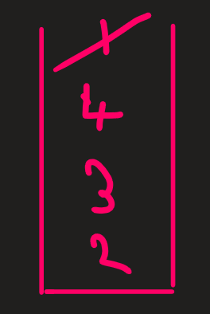

# Stack

Stack is a datatype that stores data of any given type. It follows the `LIFO` mechanism that states, `Last In First Out`. This means, the element that is filled into the stack at the last, will be ejected first.

There are various operations that can be performed on a stack. Some of them are,

* `push`
* `pop`
* `top`
* `size`

Lets say we perform the following functionalities on stack and simultaneously observe how the stack responds.

* push(2)


* push(3)


* push(4)


* push(1)


* pop



* top


The output will be four.

* top


The output will be four.

* pop


* push(5)


* top


The output will be five.

* size

The size will be 3, as the stack only contains 3 elements.

# Queue

Queue is a datatype that stores data of any given type. It follows the `FIFO` mechanism that states, `First In First Out`. This means, the element that is filled into the stack at the first, will be ejected first.

There are various operations that can be performed on a stack. Some of them are,

* `push`
* `pop`
* `top`
* `size`

Lets say we perform the following functionalities on stack and simultaneously observe how the stack responds.

* push(2)


* push(1)


* push(3)


* push(4)


* pop


* top


The output will be 1.

* pop


* top


The output will be 3.

* push(7)


* top


The output will be 3.

* size

The size of the queue will be 3.

# Implementing Stack Using Array and LinkedLists

## Using Array

### Code

```java
class Stack{
    int top=-1;
    int length;
    int[] stack;

    public Stack(int sizeOfStack){
        this.length=sizeOfStack;
        stack=new int[length];
    }

    public void push(int number){
        if(top==length-1){
            System.out.println("Stack Overflow");
            return;
        }
        top=top+1;
        stack[top]=number;
        
    }
    
    public int pop(){
        if(top==-1){
            System.out.println("There is no element in the stack to pop");
            return(-1);
        }
        int numberToReturn=stack[top];
        top=top-1;
        return(numberToReturn);
    }

    public int size(){
        if(top==-1){
            return(0);
        }
        return(top+1);
    }

    public int top(){
        if(top==-1){
            System.out.println("There is no element in the stack to show");
            return(-1);
        }
        return(stack[top]);
    }
}

```

### Explanation

Here is a detailed explanation of your stack implementation using an array, along with concepts, algorithms, and complexity analysis:

---

### **1. Concept Behind Each Operation**
#### **a. Push Operation**
- **Concept**: Add a new element to the top of the stack.
- **Purpose**: Maintain the LIFO (Last In First Out) property of the stack by always inserting at the top.
- **Precondition**: Check for stack overflow (if the stack is already full).

#### **b. Pop Operation**
- **Concept**: Remove the topmost element from the stack.
- **Purpose**: Maintain the LIFO property by always removing the last added element.
- **Precondition**: Check for stack underflow (if the stack is empty).

#### **c. Size Operation**
- **Concept**: Determine the number of elements currently in the stack.
- **Purpose**: Provide information about the stack's usage.

#### **d. Top Operation**
- **Concept**: Retrieve the topmost element without removing it.
- **Purpose**: Allow the user to access the most recent element without modifying the stack.

---

### **2. Algorithm for Each Operation**

#### **a. Push Operation**
```java
public void push(int number) {
    if (top == length - 1) { // Check if the stack is full
        System.out.println("Stack Overflow"); // Notify the user about overflow
        return; // Exit the function
    }
    top = top + 1; // Move the `top` pointer up by 1
    stack[top] = number; // Insert the new number at the `top` index
}
```
- **Explanation**:
  1. `if (top == length - 1)` ensures we don’t exceed the array size.
  2. `top = top + 1` moves the stack pointer to the next available position.
  3. `stack[top] = number` assigns the number to the correct position.

- **Time Complexity**: \(O(1)\) (direct access and assignment).

---

#### **b. Pop Operation**
```java
public int pop() {
    if (top == -1) { // Check if the stack is empty
        System.out.println("There is no element in the stack to pop");
        return -1; // Return a sentinel value
    }
    int numberToReturn = stack[top]; // Save the top element
    top = top - 1; // Move the `top` pointer down by 1
    return numberToReturn; // Return the popped value
}
```
- **Explanation**:
  1. `if (top == -1)` prevents accessing invalid indices in the array.
  2. `numberToReturn = stack[top]` saves the current top element for return.
  3. `top = top - 1` removes the element logically by decrementing the pointer.

- **Time Complexity**: \(O(1)\) (direct access and assignment).

---

#### **c. Size Operation**
```java
public int size() {
    if (top == -1) { // Check if the stack is empty
        return 0; // Return size as 0
    }
    return top + 1; // Return the number of elements
}
```
- **Explanation**:
  1. `if (top == -1)` ensures that the empty stack case is handled properly.
  2. `return top + 1` gives the total number of elements in the stack.

- **Time Complexity**: \(O(1)\) (constant computation).

---

#### **d. Top Operation**
```java
public int top() {
    if (top == -1) { // Check if the stack is empty
        System.out.println("There is no element in the stack to show");
        return -1; // Return a sentinel value
    }
    return stack[top]; // Return the top element
}
```
- **Explanation**:
  1. `if (top == -1)` prevents invalid access for an empty stack.
  2. `return stack[top]` directly retrieves the topmost element without modifying the stack.

- **Time Complexity**: \(O(1)\) (direct access).

---

### **3. Complexity Analysis**
#### **a. Push Operation**
- **Time Complexity**: \(O(1)\) (constant time for insertion at the top).
- **Space Complexity**: \(O(1)\) for the operation itself (stack size is already fixed).

#### **b. Pop Operation**
- **Time Complexity**: \(O(1)\) (constant time to remove the top element).
- **Space Complexity**: \(O(1)\) (logical removal, no additional space used).

#### **c. Size Operation**
- **Time Complexity**: \(O(1)\) (constant time to calculate size).
- **Space Complexity**: \(O(1)\).

#### **d. Top Operation**
- **Time Complexity**: \(O(1)\) (direct retrieval of the top element).
- **Space Complexity**: \(O(1)\).

---

### **4. Additional Notes**
1. **Error Handling**:
   - The code handles stack overflow and underflow conditions gracefully, ensuring robustness.
   - Sentinel values (\(-1\)) and error messages are used to indicate issues.

2. **Improvements**:
   - Dynamic resizing of the array can be implemented to handle arbitrary growth.
   - Enhance the `top()` and `pop()` methods to throw exceptions instead of returning sentinel values.

3. **Use Case Scenarios**:
   - **Push**: Adding items during iterative computations.
   - **Pop**: Backtracking problems (e.g., maze solving).
   - **Size**: Monitoring usage of stack in limited memory conditions.
   - **Top**: Accessing the most recent item without altering stack state.

By revisiting this explanation, you will have a clear understanding of how the stack operates, why each step is necessary, and how efficient it is for various operations.

## Using LinkedList

### Code

```java
class Node {
    int value;
    Node next;

    public Node(int value) {
        this.value = value;
    }
}

class Stack {
    Node start;
    int currSize = 0;

    public Stack() {
        System.out.println("New Stack Is Created");
    }

    public void push(int value) {
        Node newNode = new Node(value);
        newNode.next = start;
        start = newNode;
        currSize++;
    }

    public int pop() {
        if (start == null) {
            System.out.println("The stack is empty");
            return (-1);
        }
        int valueToReturn = start.value;
        start = start.next;
        currSize--;
        return (valueToReturn);
    }

    public int size() {
        return (currSize);
    }

    public int top() {
        if (start == null) {
            System.out.println("The stack is empty");
            return (-1);
        }
        return (start.value);
    }
}
```

### Explanation

Here is a detailed explanation of your stack implementation using a linked list, along with concepts, algorithms, and complexity analysis:

---

### **1. Concept Behind Each Operation**
#### **a. Push Operation**
- **Concept**: Add a new element at the top of the stack by creating a new node and linking it to the current top node.
- **Purpose**: Maintain the LIFO (Last In, First Out) property of the stack.
- **Precondition**: No capacity limit since the linked list grows dynamically.

#### **b. Pop Operation**
- **Concept**: Remove the top element of the stack by unlinking the current top node.
- **Purpose**: Ensure the LIFO property by always removing the most recently added element.
- **Precondition**: Check if the stack is empty to avoid errors.

#### **c. Size Operation**
- **Concept**: Keep track of the total number of elements in the stack using a variable (`currSize`).
- **Purpose**: Efficiently provide the size without traversing the linked list.

#### **d. Top Operation**
- **Concept**: Retrieve the value of the top node without modifying the stack.
- **Purpose**: Allow access to the most recent element without altering the structure.

---

### **2. Algorithm for Each Operation**

#### **a. Push Operation**
```java
public void push(int value) {
    Node newNode = new Node(value); // Create a new node with the given value
    newNode.next = start; // Link the new node to the current top node
    start = newNode; // Update the top pointer to the new node
    currSize++; // Increment the size of the stack
}
```
- **Explanation**:
  1. `Node newNode = new Node(value)` creates a new node to hold the value.
  2. `newNode.next = start` links the new node to the current top of the stack.
  3. `start = newNode` updates the stack's top pointer to the new node.
  4. `currSize++` increments the size of the stack for efficient size retrieval.

- **Time Complexity**: \(O(1)\) (constant time for node creation and pointer updates).

---

#### **b. Pop Operation**
```java
public int pop() {
    if (start == null) { // Check if the stack is empty
        System.out.println("The stack is empty");
        return -1; // Return a sentinel value
    }
    int valueToReturn = start.value; // Save the top value for return
    start = start.next; // Move the top pointer to the next node
    currSize--; // Decrement the size of the stack
    return valueToReturn; // Return the popped value
}
```
- **Explanation**:
  1. `if (start == null)` checks for an empty stack to avoid errors.
  2. `valueToReturn = start.value` stores the current top value before removing it.
  3. `start = start.next` removes the top node logically by updating the pointer.
  4. `currSize--` adjusts the size for accurate tracking.

- **Time Complexity**: \(O(1)\) (constant time for pointer updates and size adjustment).

---

#### **c. Size Operation**
```java
public int size() {
    return currSize; // Return the current size of the stack
}
```
- **Explanation**:
  1. The `currSize` variable is updated in push and pop operations.
  2. The method simply retrieves and returns this value.

- **Time Complexity**: \(O(1)\) (direct retrieval of the size).

---

#### **d. Top Operation**
```java
public int top() {
    if (start == null) { // Check if the stack is empty
        System.out.println("The stack is empty");
        return -1; // Return a sentinel value
    }
    return start.value; // Return the value of the top node
}
```
- **Explanation**:
  1. `if (start == null)` checks for an empty stack to prevent invalid access.
  2. `return start.value` directly retrieves the value of the top node.

- **Time Complexity**: \(O(1)\) (direct access to the top node).

---

### **3. Complexity Analysis**

#### **a. Push Operation**
- **Time Complexity**: \(O(1)\) (constant time for node creation and pointer updates).
- **Space Complexity**: \(O(1)\) for the operation itself. However, total space grows linearly with the number of elements.

#### **b. Pop Operation**
- **Time Complexity**: \(O(1)\) (constant time for pointer updates and size decrement).
- **Space Complexity**: \(O(1)\).

#### **c. Size Operation**
- **Time Complexity**: \(O(1)\) (constant retrieval of `currSize`).
- **Space Complexity**: \(O(1)\).

#### **d. Top Operation**
- **Time Complexity**: \(O(1)\) (direct access to the `start` node).
- **Space Complexity**: \(O(1)\).

---

### **4. Additional Notes**
1. **Error Handling**:
   - Empty stack conditions are handled gracefully using sentinel values and messages.
   - Sentinel values like \(-1\) can be replaced with exceptions for stricter error management.

2. **Advantages of Linked List Implementation**:
   - Dynamic resizing: Unlike an array-based stack, there’s no need to define or resize the stack capacity.
   - Memory efficiency: Memory is allocated only when needed for a new element.

3. **Use Case Scenarios**:
   - **Push**: Useful for tasks requiring dynamic additions, like recursion simulation.
   - **Pop**: Helps in undo operations or reversing data structures.
   - **Size**: Useful in cases where stack usage monitoring is essential.
   - **Top**: Allows temporary access to the latest element for decision-making without modifying the stack.

This detailed explanation should help you understand and revise the stack implementation easily.

# Implementing Queue Using Array and LinkedList

## Using Array

### Code

```java
class Queue{
    int size;
    int start=-1;
    int end=-1;
    int[] queue;
    int currSize=0;

    public Queue(int size){
        this.size=size;
        queue=new int[size];
    }

    public void push(int number){
        if(currSize>=size){
            System.out.println("Queue is full");
            return;
        }
        if(currSize==0){
            start=0;
        }
        end=(end+1)%size;
        queue[end]=number;
        currSize++;
    }

    public int pop(){
        if(currSize==0){
            System.out.println("Queue is empty");
            return(-1);
        }
        int elementToReturn=queue[start];
        if(currSize==1){
            start=end=-1;
            return(elementToReturn);

        }
        start=(start+1)%size;
        currSize--;
        return(elementToReturn);
    }

    public int top(){
        if(currSize==0){
            System.out.println("Queue is empty");
            return(-1);
        }
        return(queue[start]);
    }

    public int size(){
        return(currSize);
    }

}
```

### Explaination

Here’s a detailed breakdown of your queue implementation using a circular array, covering concepts, algorithms, complexity analysis, and additional insights:

---

### **1. Concept Behind Each Operation**

#### **a. Push Operation**
- **Concept**: Add an element at the rear (end) of the queue. The `end` pointer moves forward in a circular manner.
- **Purpose**: Maintain the First-In-First-Out (FIFO) property of a queue.
- **Precondition**: Ensure the queue is not full before adding an element.

#### **b. Pop Operation**
- **Concept**: Remove an element from the front (start) of the queue. The `start` pointer moves forward in a circular manner.
- **Purpose**: Dequeue the oldest element (FIFO).
- **Precondition**: Ensure the queue is not empty before removing an element.

#### **c. Top Operation**
- **Concept**: Retrieve the front element of the queue without modifying it.
- **Purpose**: Provide access to the oldest element for decision-making without altering the queue.

#### **d. Size Operation**
- **Concept**: Use a variable (`currSize`) to track the current number of elements in the queue.
- **Purpose**: Efficiently provide the size without traversing the array.

---

### **2. Algorithm for Each Operation**

#### **a. Push Operation**
```java
public void push(int number) {
    if (currSize >= size) { // Check if the queue is full
        System.out.println("Queue is full");
        return;
    }
    if (currSize == 0) { // Special case for the first element
        start = 0; // Initialize the start pointer
    }
    end = (end + 1) % size; // Update the end pointer in a circular manner
    queue[end] = number; // Insert the new element
    currSize++; // Increment the size of the queue
}
```
- **Explanation**:
  1. `if (currSize >= size)` prevents overflow by ensuring the queue is not full.
  2. `if (currSize == 0)` initializes the `start` pointer for the first element.
  3. `end = (end + 1) % size` wraps the `end` pointer around when it reaches the array's end.
  4. `queue[end] = number` places the new element in the correct position.
  5. `currSize++` increments the size tracker.

- **Time Complexity**: \(O(1)\) (constant time for pointer updates and element addition).

---

#### **b. Pop Operation**
```java
public int pop() {
    if (currSize == 0) { // Check if the queue is empty
        System.out.println("Queue is empty");
        return -1;
    }
    int elementToReturn = queue[start]; // Retrieve the front element
    if (currSize == 1) { // Special case for the last element
        start = end = -1; // Reset pointers to the initial state
        currSize--; // Decrement size
        return elementToReturn; // Return the last element
    }
    start = (start + 1) % size; // Move the start pointer in a circular manner
    currSize--; // Decrement size
    return elementToReturn; // Return the removed element
}
```
- **Explanation**:
  1. `if (currSize == 0)` ensures no underflow occurs when the queue is empty.
  2. `elementToReturn = queue[start]` stores the front element for return.
  3. `if (currSize == 1)` resets pointers when the queue becomes empty.
  4. `start = (start + 1) % size` wraps the `start` pointer in a circular manner.
  5. `currSize--` decrements the size tracker.

- **Time Complexity**: \(O(1)\) (constant time for pointer updates and size decrement).

---

#### **c. Top Operation**
```java
public int top() {
    if (currSize == 0) { // Check if the queue is empty
        System.out.println("Queue is empty");
        return -1; // Return a sentinel value
    }
    return queue[start]; // Return the front element
}
```
- **Explanation**:
  1. `if (currSize == 0)` prevents access to an empty queue.
  2. `return queue[start]` retrieves the value at the front of the queue.

- **Time Complexity**: \(O(1)\) (direct access to the front element).

---

#### **d. Size Operation**
```java
public int size() {
    return currSize; // Return the current size of the queue
}
```
- **Explanation**:
  1. The `currSize` variable is maintained in `push` and `pop` operations.
  2. `return currSize` directly retrieves and returns the size.

- **Time Complexity**: \(O(1)\) (direct retrieval of the size).

---

### **3. Complexity Analysis**

#### **a. Push Operation**
- **Time Complexity**: \(O(1)\) (constant time for element addition and pointer update).
- **Space Complexity**: \(O(1)\) for the operation itself. Total space is \(O(n)\), where \(n\) is the array size.

#### **b. Pop Operation**
- **Time Complexity**: \(O(1)\) (constant time for pointer update and size adjustment).
- **Space Complexity**: \(O(1)\).

#### **c. Top Operation**
- **Time Complexity**: \(O(1)\) (direct access to the front element).
- **Space Complexity**: \(O(1)\).

#### **d. Size Operation**
- **Time Complexity**: \(O(1)\) (direct retrieval of size).
- **Space Complexity**: \(O(1)\).

---

### **4. Additional Notes**

1. **Error Handling**:
   - The code handles edge cases like empty and full queues by printing messages and returning sentinel values.

2. **Circular Array Implementation**:
   - The use of modulo (`%`) ensures that the `start` and `end` pointers wrap around the array, making it circular.
   - This design prevents the need for array resizing, saving time and space.

3. **Advantages**:
   - Efficient \(O(1)\) operations for push, pop, top, and size.
   - Memory efficiency due to fixed-size allocation.

4. **Disadvantages**:
   - The size of the queue is fixed and must be determined in advance.

5. **Use Case Scenarios**:
   - **Push**: Useful in scenarios like task scheduling where tasks are enqueued.
   - **Pop**: Used for consuming tasks or elements in FIFO order.
   - **Top**: Helps in examining the next element to process.
   - **Size**: Useful for monitoring queue usage and determining when it’s full or empty.

This detailed explanation provides a comprehensive understanding of the queue implementation for easy revision.

## Using LinkedLists

### Code

```java
class Node{
    int value;
    Node next;

    public Node(int value){
        this.value=value;
    }
}

class Queue{
    Node start;
    Node end;
    int currSize=0;

    public Queue(){
        System.out.println("Queue is created");
    }

    public void push(int value){
        if(start==null && end==null){
            start=new Node(value);
            end=start;
            currSize++;
            return;
        }
        Node newNode=new Node(value);
        end.next=newNode;
        end=end.next;
        currSize++;
    }

    public int pop(){
        if(start==null){
            System.out.println("Queue is empty");
            return(-1);
        }
        int valueToReturn=start.value;
        start=start.next;
        if (start == null) {
            end = null;
        }
        currSize--;
        return(valueToReturn);
    }

    public int top(){
        if(start==null){
            System.out.println("Queue is empty");
            return(-1);
        }
        return(start.value);
    }

    public int size(){
        return(currSize);
    }


}
```

### Explaination

Here's a detailed explanation of your queue implementation using a linked list, covering the concepts, algorithms, complexity analysis, and additional insights for better revision:

---

### **1. Concept Behind Each Operation**

#### **a. Push Operation**
- **Concept**: Add a new element to the end of the queue.
- **Purpose**: Maintain the First-In-First-Out (FIFO) property.
- **How It Works**: The new node is created and appended to the current end of the queue. The `end` pointer is updated to the new node.

#### **b. Pop Operation**
- **Concept**: Remove and return the front element of the queue.
- **Purpose**: Remove the oldest added element (FIFO).
- **How It Works**: The `start` pointer is moved to the next node in the queue. If the queue becomes empty, reset both `start` and `end` pointers to `null`.

#### **c. Top Operation**
- **Concept**: Retrieve the value of the front element without removing it.
- **Purpose**: Examine the next element to process without altering the queue structure.
- **How It Works**: The value of the `start` node is returned.

#### **d. Size Operation**
- **Concept**: Keep track of the number of elements in the queue.
- **Purpose**: Efficiently get the size without traversing the linked list.
- **How It Works**: A counter (`currSize`) is maintained and updated during push and pop operations.

---

### **2. Algorithm for Each Operation**

#### **a. Push Operation**
```java
public void push(int value) {
    if (start == null && end == null) { // If the queue is empty
        start = new Node(value); // Create a new node as the first element
        end = start; // Set both start and end to the new node
        currSize++; // Increment the size
        return; // Exit the function
    }
    Node newNode = new Node(value); // Create a new node
    end.next = newNode; // Link the current end to the new node
    end = end.next; // Update the end pointer to the new node
    currSize++; // Increment the size
}
```
- **Explanation**:
  1. `if (start == null && end == null)` checks if the queue is empty.
  2. `start = new Node(value)` creates the first element and sets it as both the start and end.
  3. For subsequent elements, a new node is created and linked to the current end using `end.next = newNode`.
  4. `end = end.next` updates the end pointer to the new node.
  5. The size counter is incremented to reflect the addition.

- **Time Complexity**: \(O(1)\) (constant time for pointer updates and node creation).

---

#### **b. Pop Operation**
```java
public int pop() {
    if (start == null) { // If the queue is empty
        System.out.println("Queue is empty");
        return -1; // Return sentinel value
    }
    int valueToReturn = start.value; // Store the front element
    start = start.next; // Move the start pointer to the next node
    if (start == null) { // If the queue is now empty
        end = null; // Reset the end pointer
    }
    currSize--; // Decrement the size
    return valueToReturn; // Return the removed element
}
```
- **Explanation**:
  1. `if (start == null)` checks for an empty queue and handles it gracefully.
  2. `valueToReturn = start.value` retrieves the value of the front element.
  3. `start = start.next` advances the `start` pointer to the next node.
  4. If the queue becomes empty, both `start` and `end` pointers are reset.
  5. `currSize--` decrements the size tracker.

- **Time Complexity**: \(O(1)\) (constant time for pointer updates and size adjustment).

---

#### **c. Top Operation**
```java
public int top() {
    if (start == null) { // If the queue is empty
        System.out.println("Queue is empty");
        return -1; // Return sentinel value
    }
    return start.value; // Return the value of the front element
}
```
- **Explanation**:
  1. `if (start == null)` prevents access to an empty queue.
  2. `return start.value` retrieves and returns the front element's value.

- **Time Complexity**: \(O(1)\) (direct access to the front element).

---

#### **d. Size Operation**
```java
public int size() {
    return currSize; // Return the current size of the queue
}
```
- **Explanation**:
  1. `currSize` is maintained during `push` and `pop` operations.
  2. `return currSize` directly retrieves the current size.

- **Time Complexity**: \(O(1)\) (direct retrieval of size).

---

### **3. Complexity Analysis**

#### **a. Push Operation**
- **Time Complexity**: \(O(1)\) (node creation and pointer updates take constant time).
- **Space Complexity**: \(O(1)\) for the operation itself. Overall space grows linearly with the number of elements, i.e., \(O(n)\).

#### **b. Pop Operation**
- **Time Complexity**: \(O(1)\) (constant time for pointer updates and size decrement).
- **Space Complexity**: \(O(1)\) (no additional space used).

#### **c. Top Operation**
- **Time Complexity**: \(O(1)\) (direct access to the front element).
- **Space Complexity**: \(O(1)\).

#### **d. Size Operation**
- **Time Complexity**: \(O(1)\) (direct retrieval of size).
- **Space Complexity**: \(O(1)\).

---

### **4. Additional Notes**

1. **Error Handling**:
   - The code gracefully handles edge cases like an empty queue by printing messages and returning sentinel values (`-1`).

2. **Dynamic Nature**:
   - Unlike an array-based queue, a linked list implementation dynamically adjusts its size, removing the limitation of a fixed capacity.

3. **Advantages**:
   - Efficient \(O(1)\) operations for push, pop, top, and size.
   - No fixed size limitation, making it suitable for scenarios with unpredictable queue sizes.

4. **Disadvantages**:
   - Slightly higher memory overhead due to storing pointers (`next`) for each node.

5. **Use Case Scenarios**:
   - **Push**: Useful for enqueuing tasks, requests, or data in a FIFO order.
   - **Pop**: Used for processing or consuming tasks sequentially.
   - **Top**: Helps examine the front task or data without removal.
   - **Size**: Useful for monitoring queue usage and implementing backpressure mechanisms.

This detailed explanation ensures a clear understanding of the linked list-based queue implementation for your revision.

# Infix, Prefix and Postfix Conversions

There are two things to be considered before we dive in the concept of infix, prefix and postfix. We need to understand what are `Operands` and `Operators`.

`Operands` generally refers to characters on which arithematic operations can be perform. Elements such as `1-9`, `a-z` and `A-Z` are all classified as `Operands`.

`Operators` on the other hand are the expressions/elements which define what arithematic operation is to be performed on the `Operand`. Now there are multiple operators, `+`, `-`, `*`, `/`, `%`, `^` and etc.

Before we move ahead in the concept of all the fixes and thier conversions, we also need to understand the order of preference of all the `Operators`. This looks like as follows,

| Operator | Preference |
|----------|------------|
| ^ | 3 |
| * / | 2 |
| + - | 1 |

Now lets dive into the concept of Infix, Prefix and Postfix. 

Lets first understand what are they. The general mathematical equations that we solve in our day to day lifes are general a example of `Infix`. For example, if `a` and `b` are two number to be added, the infix expression will be,

    a+b

The `Prefix` expression of this very expression will be,

    +ab

The `Postfix` expression of this very expression will be,

    ab+

So from the example, we understand that in `Infix` expression, the operator occurs between the operands between which a arithematic operation is to be performed. For `Prefix` the operator occurs before the operands and for `Postfix` the operator occurs after the operands.

Lets now move onto conversions.

## Infix to Postfix

### Code

```java
class Solution {
    // Function to convert an infix expression to a postfix expression.
    
    public static int precedence(char operator){
        if(operator=='^'){
            return(3);
        }
        else if(operator=='*' || operator=='/'){
            return(2);
        }
        else if(operator=='+' || operator=='-'){
            return(1);
        }
        else{
            return(0);
        }
    }
    
    public static boolean checkOperator(char character){
        if(character=='+' || character=='-' || character=='*' || character=='/' || character=='^'){
            return(true);
        }
        else{
            return(false);
        }
    }
    
    
    public static String infixToPostfix(String s) {
        Stack<Character> stack=new Stack<>();
        StringBuilder solution=new StringBuilder();
        int sizeOfString=s.length();
        int currIndex=0;
        
        while(currIndex<sizeOfString){
            char currentChar=s.charAt(currIndex);
            if(checkOperator(currentChar)){
                if(stack.isEmpty()){
                    stack.push(currentChar);
                    currIndex++;
                    continue;
                }
                if(precedence(currentChar)>precedence(stack.peek())){
                    stack.push(currentChar);
                }
                else{
                    while(!stack.isEmpty() && precedence(currentChar)<=precedence(stack.peek())){
                        solution.append(stack.pop());
                    }
                    stack.push(currentChar);
                }
            }
            else if(currentChar=='('){
                stack.add(currentChar);
            }
            else if(currentChar==')'){
                while(stack.peek()!='('){
                    solution.append(stack.pop());
                }
                stack.pop();
            }
            else{
                solution.append(currentChar);
            }
            currIndex++;
        }
        
        while(!stack.isEmpty()){
            solution.append(stack.pop());
        }
        
        return(solution.toString());
    }
}
```

### Explaination

Here’s a detailed explanation of the code for converting an infix expression to postfix:

---

### **1. Concept of Conversion**

Infix expressions are human-readable but difficult for computers to evaluate directly. Postfix expressions, however, are easier for a computer to evaluate since they remove the need for parentheses and follow operator precedence automatically.

#### **Steps for Conversion**:
1. Traverse the infix expression from left to right.
2. Use a stack to temporarily store operators and parentheses.
3. Append operands (letters or numbers) directly to the postfix expression.
4. Push operators onto the stack, considering precedence and associativity rules. If precedence of the operator to be pushed is greater than the top, push can go on, else, pop the elements of the stack until we reach the operator whose precedence is less than the currentCharacter.
5. Parentheses:
   - Push `(` onto the stack.
   - Pop and append all operators until a matching `(` is found when `)` is encountered. Discard both parentheses.
6. At the end of the traversal, append all remaining operators in the stack to the postfix expression.

---

### **2. Example Demonstration**

#### Input: `A*(B+C)/D`
We will process each character and show the state of the `solution` (postfix expression) and the `stack`.

| Step | Current Character | Solution (Postfix) | Stack           |
|------|--------------------|--------------------|-----------------|
| 1    | `A`               | `A`                | `[]`            |
| 2    | `*`               | `A`                | `[*]`           |
| 3    | `(`               | `A`                | `[* (`]`        |
| 4    | `B`               | `AB`               | `[* (`]`        |
| 5    | `+`               | `AB`               | `[* (+]`        |
| 6    | `C`               | `ABC`              | `[* (+]`        |
| 7    | `)`               | `ABC+`             | `[*]`           |
| 8    | `/`               | `ABC+`             | `[/]`           |
| 9    | `D`               | `ABC+D`            | `[/]`           |
| End  | -                 | `ABC+D/`           | `[]`            |

---

### **3. Algorithm**

#### Precedence Function
```java
public static int precedence(char operator) {
    if (operator == '^') return 3; // Highest precedence
    if (operator == '*' || operator == '/') return 2; // Medium precedence
    if (operator == '+' || operator == '-') return 1; // Lowest precedence
    return 0; // Non-operators
}
```
- **Purpose**: To prioritize operators based on standard rules.

---

#### Check Operator Function
```java
public static boolean checkOperator(char character) {
    return (character == '+' || character == '-' || character == '*' || character == '/' || character == '^');
}
```
- **Purpose**: Determines whether the current character is an operator.
- **Why Necessary**: Operators require special handling compared to operands or parentheses.

---

#### Conversion Function
```java
public static String infixToPostfix(String s) {
    Stack<Character> stack = new Stack<>(); // To hold operators and parentheses
    StringBuilder solution = new StringBuilder(); // To construct the postfix expression
    int sizeOfString = s.length();
    int currIndex = 0;
```
1. Initialize the stack and result container (`solution`).
2. Traverse the input string using a loop:
   ```java
   while (currIndex < sizeOfString) {
       char currentChar = s.charAt(currIndex);
   ```

---

#### **Main Logic**

1. **If Current Character is an Operator**:
   ```java
   if (checkOperator(currentChar)) {
       if (stack.isEmpty()) {
           stack.push(currentChar);
           currIndex++;
           continue;
       }
       if (precedence(currentChar) > precedence(stack.peek())) {
           stack.push(currentChar);
       } else {
           while (!stack.isEmpty() && precedence(currentChar) <= precedence(stack.peek())) {
               solution.append(stack.pop());
           }
           stack.push(currentChar);
       }
   }
   ```
   - **Why Necessary**: Handles operators with precedence rules.
   - **Explanation**:
     - Push the operator if the stack is empty or its precedence is higher than the top of the stack.
     - Otherwise, pop operators of equal or higher precedence into `solution` before pushing the current operator.

2. **If Current Character is `(`**:
   ```java
   else if (currentChar == '(') {
       stack.add(currentChar);
   }
   ```
   - **Why Necessary**: Push `(` to indicate the start of a sub-expression.

3. **If Current Character is `)`**:
   ```java
   else if (currentChar == ')') {
       while (stack.peek() != '(') {
           solution.append(stack.pop());
       }
       stack.pop(); // Remove '('
   }
   ```
   - **Why Necessary**: Resolves sub-expressions and appends enclosed operators to `solution`.

4. **If Current Character is an Operand**:
   ```java
   else {
       solution.append(currentChar);
   }
   ```
   - **Why Necessary**: Operands are directly added to the postfix result.

---

#### **Post-Traversal Logic**
```java
while (!stack.isEmpty()) {
    solution.append(stack.pop());
}
```
- **Purpose**: Append any remaining operators in the stack to the postfix expression.

---

### **4. Complexity Analysis**

#### Time Complexity
- **Traversal of Input String**: \(O(n)\), where \(n\) is the length of the infix expression.
- **Stack Operations**:
  - Each operator is pushed and popped once: \(O(n)\).
- **Overall**: \(O(n)\).

#### Space Complexity
- **Stack Storage**:
  - At most, all operators and parentheses could be in the stack simultaneously: \(O(n)\).
- **Result Storage**:
  - The `solution` string is of size \(O(n)\).
- **Overall**: \(O(n)\).

---

### **Key Notes for Revision**
1. **Associativity**: This implementation assumes left-to-right associativity for most operators except `^` (right-to-left).
2. **Error Handling**: Ensure the input string is valid (balanced parentheses, valid characters).
3. **Evaluation**: The postfix result can be directly evaluated using another stack-based algorithm.

This breakdown covers all aspects of the code and adds additional insights for better understanding.


## Infix to Prefix

```java
public static String infixToPrefix(String s) {
    // Step 1: Reverse the infix expression
    StringBuilder reversedInfix = new StringBuilder(s).reverse();
    for (int i = 0; i < reversedInfix.length(); i++) {
        if (reversedInfix.charAt(i) == '(') {
            reversedInfix.setCharAt(i, ')');
        } else if (reversedInfix.charAt(i) == ')') {
            reversedInfix.setCharAt(i, '(');
        }
    }
    
    // Step 2: Convert the reversed infix to postfix
    String postfix = infixToPostfix(reversedInfix.toString());

    //Infix to Postfix
    public static String infixToPostfix(String s) {
        Stack<Character> stack=new Stack<>();
        StringBuilder solution=new StringBuilder();
        int sizeOfString=s.length();
        int currIndex=0;
        
        while(currIndex<sizeOfString){
            char currentChar=s.charAt(currIndex);
            if(checkOperator(currentChar)){
                if(stack.isEmpty()){
                    stack.push(currentChar);
                    currIndex++;
                    continue;
                }
                if(precedence(currentChar)>precedence(stack.peek())){
                    stack.push(currentChar);
                }
                else{
                    while(!stack.isEmpty() && precedence(currentChar)<=precedence(stack.peek())){
                        solution.append(stack.pop());
                    }
                    stack.push(currentChar);
                }
            }
            else if(currentChar=='('){
                stack.add(currentChar);
            }
            else if(currentChar==')'){
                while(stack.peek()!='('){
                    solution.append(stack.pop());
                }
                stack.pop();
            }
            else{
                solution.append(currentChar);
            }
            currIndex++;
        }
        
        while(!stack.isEmpty()){
            solution.append(stack.pop());
        }
        
        return(solution.toString());
    }

    public static int precedence(char operator){
        if(operator=='^'){
            return(3);
        }
        else if(operator=='*' || operator=='/'){
            return(2);
        }
        else if(operator=='+' || operator=='-'){
            return(1);
        }
        else{
            return(0);
        }
    }
    
    public static boolean checkOperator(char character){
        if(character=='+' || character=='-' || character=='*' || character=='/' || character=='^'){
            return(true);
        }
        else{
            return(false);
        }
    }
    
    // Step 3: Reverse the postfix to get prefix
    String prefix = new StringBuilder(postfix).reverse().toString();
    return prefix;
}
```

### Explanation

Here’s a detailed explanation of converting an infix expression to a prefix expression:

---

### **1. Concept of Conversion**

Infix expressions (e.g., `A + B`) are human-readable but not efficient for computation. Prefix expressions (e.g., `+ A B`), also known as Polish Notation, evaluate without parentheses by following the operator precedence and associativity directly.

#### **Steps for Conversion**:
1. Reverse the infix expression:
   - Reverse the order of operands and operators.
   - Replace `(` with `)` and vice versa.
2. Convert the reversed infix expression to postfix (following similar rules as infix-to-postfix conversion).
3. Reverse the postfix expression to get the prefix expression.

---

### **2. Example Demonstration**

#### Input: `(A + B) * C`
Steps to convert it to prefix:
1. **Reverse the Infix**: `C * (B + A)`
   - Reverse the order of elements.
   - Replace `(` with `)` and vice versa.
2. **Convert to Postfix**: `CBA+*`
3. **Reverse the Postfix**: `*+ABC`

#### **Demonstration of Stack Changes**
Input: `A * (B + C)`
| Step | Current Character | Operation                         | Solution (Prefix) | Stack           |
|------|--------------------|-----------------------------------|--------------------|-----------------|
| 1    | `C`                | Append to Solution               | `C`                | `[]`            |
| 2    | `B`                | Append to Solution               | `BC`               | `[]`            |
| 3    | `+`                | Push to Stack                    | `BC`               | `[+]`           |
| 4    | `(`                | Push to Stack                    | `BC`               | `[+ (]`         |
| 5    | `A`                | Append to Solution               | `BCA`              | `[+ (]`         |
| 6    | `)`                | Pop and Append Until `(`         | `BCA+`             | `[*]`           |
| 7    | `*`                | Push to Stack                    | `BCA+`             | `[*]`           |
| End  | -                  | Pop All Operators                | `BCA+*`            | `[]`            |
Reverse `BCA+*` to get: `*+ABC`.

---

### **3. Algorithm**

#### **Precedence Function**
Same as in infix-to-postfix:
```java
public static int precedence(char operator) {
    if (operator == '^') return 3; // Highest precedence
    if (operator == '*' || operator == '/') return 2; // Medium precedence
    if (operator == '+' || operator == '-') return 1; // Lowest precedence
    return 0; // Non-operators
}
```

---

#### **Check Operator Function**
Same as in infix-to-postfix:
```java
public static boolean checkOperator(char character) {
    return (character == '+' || character == '-' || character == '*' || character == '/' || character == '^');
}
```

---

#### **Conversion Function**
Here’s the complete function:
```java
public static String infixToPrefix(String s) {
    // Step 1: Reverse the infix expression
    StringBuilder reversedInfix = new StringBuilder(s).reverse();
    for (int i = 0; i < reversedInfix.length(); i++) {
        if (reversedInfix.charAt(i) == '(') {
            reversedInfix.setCharAt(i, ')');
        } else if (reversedInfix.charAt(i) == ')') {
            reversedInfix.setCharAt(i, '(');
        }
    }
    
    // Step 2: Convert the reversed infix to postfix
    String postfix = infixToPostfix(reversedInfix.toString());
    
    // Step 3: Reverse the postfix to get prefix
    String prefix = new StringBuilder(postfix).reverse().toString();
    return prefix;
}
```

---

#### **Explanation of Each Step**

1. **Reverse the Infix Expression**:
   - Use `StringBuilder` to reverse the string.
   - Replace `(` with `)` and vice versa for accurate parsing.
   - This step transforms the problem into a standard postfix conversion.

2. **Convert to Postfix**:
   - Use the existing infix-to-postfix logic.
   - This simplifies the middle step and ensures consistency.

3. **Reverse the Postfix**:
   - Once postfix is obtained, reversing it gives the prefix result.
   - This works because reversing the operands and operators aligns them with prefix notation.

---

### **4. Complexity Analysis**

#### Time Complexity
1. **Reversing the Expression**:
   - \(O(n)\), where \(n\) is the length of the string.
2. **Infix-to-Postfix Conversion**:
   - \(O(n)\).
3. **Reversing the Postfix**:
   - \(O(n)\).
4. **Total Complexity**:
   - \(O(n)\).

#### Space Complexity
1. **Stack Usage**:
   - \(O(n)\), as operators are temporarily stored.
2. **Result Storage**:
   - \(O(n)\) for the reversed infix, postfix, and final prefix.
3. **Total Space**:
   - \(O(n)\).

---

### **Key Notes for Revision**
1. **Associativity and Precedence**:
   - Operators like `^` (exponentiation) are right-associative, while others are left-associative.
2. **Special Cases**:
   - Ensure parentheses are properly matched in the input.
   - Handle edge cases like empty input or invalid characters.
3. **Applications**:
   - Prefix expressions are used in compilers, calculators, and expression evaluation algorithms.

This detailed breakdown helps in revisiting the logic and mechanics of infix-to-prefix conversion.

## Prefix To Infix

### Code

```java
class Solution {
    
    public static boolean checkOperator(char character){
        if(character=='+' || character=='-' || character=='*' || character=='/' || character=='*'){
            return(true);
        }
        else{
            return(false);
        }
    }
    
    static String preToInfix(String pre_exp) {
        Stack<String> stack=new Stack<>();
        StringBuilder solution=new StringBuilder();
        int sizeOfString=pre_exp.length();
        int currIndex=sizeOfString-1;
        
        while(currIndex>=0){
            char currCharacter=pre_exp.charAt(currIndex);
            if(checkOperator(currCharacter)){
                String first=stack.pop();
                String second=stack.pop();
                StringBuilder newTerm=new StringBuilder();
                newTerm.append('(');
                newTerm.append(first);
                newTerm.append(currCharacter);
                newTerm.append(second);
                newTerm.append(')');
                stack.push(newTerm.toString());
            }
            else{
                stack.push(String.valueOf(currCharacter));
            }
            currIndex--;
        }
        return(stack.pop());
    }
}

```

### Explaination

Here’s a comprehensive breakdown of the code to help you revise it later:

---

### **1. Concept: How Does the Conversion Take Place?**

#### Prefix to Infix Conversion:
- In prefix notation, operators appear before their operands (e.g., `+AB`).
- To convert to infix, each operator combines its operands into a valid infix expression with parentheses.
- This is achieved using a stack:
  1. Traverse the prefix expression from right to left.
  2. Push operands onto the stack.
  3. When an operator is encountered, pop two operands, combine them into a new infix expression(pop first+ operator+ pop second), and push the result back onto the stack.
  4. At the end, the stack contains the final infix expression.

---

### **2. Example Demonstration**

#### Input: `*+AB-CD`
**Output**: `((A+B)*(C-D))`

| Step | Current Char | Operation                              | Stack State                             |
|------|--------------|----------------------------------------|-----------------------------------------|
| 1    | `D`          | Push `D`                              | `["D"]`                                 |
| 2    | `C`          | Push `C`                              | `["D", "C"]`                            |
| 3    | `-`          | Pop `C` and `D`, form `(C-D)`         | `["(C-D)"]`                             |
| 4    | `B`          | Push `B`                              | `["(C-D)", "B"]`                        |
| 5    | `A`          | Push `A`                              | `["(C-D)", "B", "A"]`                   |
| 6    | `+`          | Pop `A` and `B`, form `(A+B)`         | `["(C-D)", "(A+B)"]`                    |
| 7    | `*`          | Pop `(A+B)` and `(C-D)`, form `((A+B)*(C-D))` | `["((A+B)*(C-D))"]` |

Final stack state contains the result: `((A+B)*(C-D))`.

---

### **3. Algorithm with Explanations**

#### Function: `checkOperator`
```java
public static boolean checkOperator(char character) {
    if (character == '+' || character == '-' || character == '*' || character == '/' || character == '^') {
        return true; // Identifies valid operators.
    }
    return false; // For operands or invalid characters.
}
```

**Purpose**: This function checks whether the given character is a valid operator. It ensures we process operators differently from operands.

---

#### Function: `preToInfix`
```java
static String preToInfix(String pre_exp) {
    Stack<String> stack = new Stack<>();
    int sizeOfString = pre_exp.length();
    int currIndex = sizeOfString - 1; // Start from the end of the prefix expression.
    
    while (currIndex >= 0) {
        char currCharacter = pre_exp.charAt(currIndex);
        
        if (checkOperator(currCharacter)) { // Check if the character is an operator.
            String first = stack.pop(); // Pop two operands for the operator.
            String second = stack.pop();
            StringBuilder newTerm = new StringBuilder();
            newTerm.append('('); // Add parentheses for valid infix expression.
            newTerm.append(first); // Append first operand.
            newTerm.append(currCharacter); // Append operator.
            newTerm.append(second); // Append second operand.
            newTerm.append(')');
            stack.push(newTerm.toString()); // Push the new infix expression back to stack.
        } else {
            stack.push(String.valueOf(currCharacter)); // Push operands directly to stack.
        }
        currIndex--; // Move to the next character.
    }
    return stack.pop(); // Final infix expression is at the top of the stack.
}
```

---

### **Step-by-Step Algorithm**

1. **Initialize the Stack**:
   - Used to store intermediate infix expressions during conversion.

2. **Iterate from Right to Left**:
   - Process each character in the prefix expression in reverse order.

3. **Check for Operators**:
   - If the character is an operator:
     - Pop two elements from the stack (these are operands).
     - Combine them into a new infix expression(pop first+ operator+ pop second), placing the operator between them and adding parentheses.

4. **Check for Operands**:
   - Push the operand directly onto the stack.

5. **Final Step**:
   - After the loop, the stack contains the complete infix expression.

---

### **4. Complexity Analysis**

#### **Time Complexity**:
1. **Traversal**:
   - The prefix expression is traversed once, which takes \(O(n)\), where \(n\) is the length of the expression.
2. **Stack Operations**:
   - Push and pop operations are \(O(1)\), performed at most \(n\) times.
3. **Total**: \(O(n)\).

#### **Space Complexity**:
1. **Stack Storage**:
   - The stack stores at most \(n\) elements (operands and intermediate infix expressions), which requires \(O(n)\) space.
2. **StringBuilder**:
   - Temporary strings for infix expressions also require \(O(n)\) space.
3. **Total**: \(O(n)\).

---

### **Key Notes for Revision**
1. **Edge Cases**:
   - Ensure the input contains valid characters (operators and operands only).
   - Handle empty input strings gracefully.
2. **Use of Parentheses**:
   - Parentheses are critical for maintaining the correct operator precedence in infix notation.
3. **Applications**:
   - Useful in compilers and interpreters for converting prefix notation (generated by parsers) into human-readable infix notation.

This structured explanation provides a clear understanding of the code, its operation, and complexity for future reference.

## Postfix to Infix

```java
class Solution {
    
    public static boolean checkOperator(char character){
        if(character=='+' || character=='-' || character=='*' || character=='/' || character=='*'){
            return(true);
        }
        else{
            return(false);
        }
    }
    
    static String postToInfix(String exp) {
        Stack<String> stack=new Stack<>();
        int sizeOfString=exp.length();
        int currIndex=0;
        
        while(currIndex<sizeOfString){
            char currCharacter=exp.charAt(currIndex);
            if(checkOperator(currCharacter)){
                String second=stack.pop();
                String first=stack.pop();
                StringBuilder newTerm=new StringBuilder();
                newTerm.append('(');
                newTerm.append(first);
                newTerm.append(currCharacter);
                newTerm.append(second);
                newTerm.append(')');
                stack.push(newTerm.toString());
            }
            else{
                stack.push(String.valueOf(currCharacter));
            }
            currIndex++;
        }
        return(stack.pop());
    }
}
```

### Explaination

Here is a detailed breakdown of the **postfix to infix** code for your revision:

---

### **1. Concept: How Does the Conversion Take Place?**

#### Postfix to Infix Conversion:
- In postfix notation, operators appear after their operands (e.g., `AB+`).
- To convert postfix to infix:
  1. Traverse the postfix expression from left to right.
  2. Push operands onto a stack.
  3. When an operator is encountered, pop the top two elements from the stack. These are the operands for the operator.
  4. Combine the two operands and the operator into a valid infix expression(second pop+ operator+ first pop) with parentheses, then push this new expression back onto the stack.
  5. At the end, the stack contains the final infix expression.

---

### **2. Example Demonstration**

#### Input: `AB+C*`
**Output**: `((A+B)*C)`

| Step | Current Char | Operation                              | Stack State                             |
|------|--------------|----------------------------------------|-----------------------------------------|
| 1    | `A`          | Push `A`                              | `["A"]`                                 |
| 2    | `B`          | Push `B`                              | `["A", "B"]`                            |
| 3    | `+`          | Pop `A` and `B`, form `(A+B)`         | `["(A+B)"]`                             |
| 4    | `C`          | Push `C`                              | `["(A+B)", "C"]`                        |
| 5    | `*`          | Pop `(A+B)` and `C`, form `((A+B)*C)` | `["((A+B)*C)"]`                         |

Final stack state contains the result: `((A+B)*C)`.

---

### **3. Algorithm of the Code**

#### **Function: `checkOperator`**
```java
public static boolean checkOperator(char character) {
    if (character == '+' || character == '-' || character == '*' || character == '/' || character == '^') {
        return true; // Identifies valid operators.
    }
    return false; // For operands or invalid characters.
}
```

**Purpose**:  
- Determines whether a given character is an operator.
- Helps in differentiating operators from operands.

---

#### **Function: `postToInfix`**
```java
static String postToInfix(String exp) {
    Stack<String> stack = new Stack<>(); // Initialize a stack for intermediate expressions.
    int sizeOfString = exp.length();
    int currIndex = 0; // Start traversing from the beginning of the postfix expression.
    
    while (currIndex < sizeOfString) {
        char currCharacter = exp.charAt(currIndex); // Read the current character.
        
        if (checkOperator(currCharacter)) { // If it's an operator:
            String second = stack.pop(); // Pop the second operand (right-hand side).
            String first = stack.pop(); // Pop the first operand (left-hand side).
            
            // Combine them into a valid infix expression with parentheses.
            StringBuilder newTerm = new StringBuilder();
            newTerm.append('(');
            newTerm.append(first);
            newTerm.append(currCharacter);
            newTerm.append(second);
            newTerm.append(')');
            
            stack.push(newTerm.toString()); // Push the new infix expression back onto the stack.
        } else {
            stack.push(String.valueOf(currCharacter)); // Push operands directly onto the stack.
        }
        
        currIndex++; // Move to the next character.
    }
    
    return stack.pop(); // The final infix expression is at the top of the stack.
}
```

### **Function: `postToInfix`**

This function converts a **postfix expression** (operators come after operands) into its equivalent **infix expression** (operators are between operands).

---

### **Code: Step-by-Step Explanation**

```java
static String postToInfix(String exp) {
    Stack<String> stack = new Stack<>();
```
1. **Initialize a Stack**:
   - The stack stores intermediate infix expressions as strings.
   - It helps to process operands and operators in the correct order.

---

```java
    int sizeOfString = exp.length();
    int currIndex = 0;
```
2. **Set up Loop Variables**:
   - `sizeOfString`: Stores the length of the postfix expression to control the loop.
   - `currIndex`: Tracks the current character in the postfix expression being processed.

---

```java
    while (currIndex < sizeOfString) {
        char currCharacter = exp.charAt(currIndex);
```
3. **Iterate Through the Expression**:
   - Loop through each character of the postfix expression (`exp`).
   - `currCharacter` holds the current character being processed.

---

```java
        if (checkOperator(currCharacter)) {
            String second = stack.pop();
            String first = stack.pop();
```
4. **Check if the Current Character is an Operator**:
   - Use the `checkOperator` function to verify if `currCharacter` is an operator (e.g., `+`, `-`, `*`, `/`).
   - If it is an operator:
     - **Pop the Top Two Strings from the Stack**:
       - `second`: Right-hand operand.
       - `first`: Left-hand operand.
     - These are combined to form a valid infix expression.

---

```java
            StringBuilder newTerm = new StringBuilder();
            newTerm.append('(');
            newTerm.append(first);
            newTerm.append(currCharacter);
            newTerm.append(second);
            newTerm.append(')');
```
5. **Build a New Infix Expression**:
   - Create a `StringBuilder` to construct the new infix expression.
   - Add:
     - Left parenthesis (`(`).
     - First operand (`first`).
     - Operator (`currCharacter`).
     - Second operand (`second`).
     - Right parenthesis (`)`).

---

```java
            stack.push(newTerm.toString());
        } else {
            stack.push(String.valueOf(currCharacter));
        }
```
6. **Push the Result Back Onto the Stack**:
   - **If it's an operator**: Push the newly formed infix expression onto the stack.
   - **If it's an operand**: Push it as-is (convert the character to a string).

---

```java
        currIndex++;
    }
```
7. **Increment the Index**:
   - Move to the next character in the postfix expression.

---

```java
    return stack.pop();
}
```
8. **Return the Final Infix Expression**:
   - At the end of the loop, the stack contains only one element: the final infix expression.
   - Pop and return this value.

---

### **Concept and Purpose**

#### How It Works:
- **Operators**:
  - When encountering an operator, the function pops the top two elements from the stack. These represent the operands for the operator.
  - It combines them into an infix format, respecting operator precedence by adding parentheses.
- **Operands**:
  - Directly pushed onto the stack as they don't require processing.

---

### **4. Complexity Analysis**

#### **Time Complexity**:
1. **Traversal**:
   - The expression is traversed once, which takes \(O(n)\), where \(n\) is the length of the postfix expression.
2. **Stack Operations**:
   - Push and pop operations take \(O(1)\), performed \(O(n)\) times in total.
3. **String Manipulation**:
   - Combining strings into a new infix expression involves concatenation, which is efficient for small strings.
4. **Total**: \(O(n)\).

#### **Space Complexity**:
1. **Stack Storage**:
   - The stack stores intermediate infix expressions, requiring \(O(n)\) space in the worst case.
2. **StringBuilder**:
   - Temporary strings for infix expressions require \(O(n)\) space.
3. **Total**: \(O(n)\).

---

### **5. Key Notes for Revision**
- **Role of Parentheses**: Adding parentheses ensures correct operator precedence in the resulting infix expression.
- **Stack Usage**: The stack simplifies managing and combining operands and operators into expressions.
- **Edge Cases**:
  1. Input contains invalid characters (should be handled with validation).
  2. Empty or single-character input.
  3. Incorrect postfix notation (e.g., insufficient operands for an operator).

---

This structured explanation provides a detailed understanding of how the code works, making it easier for you to revise and retain the concepts.

## Prefix to Postfix

### Code
```java
class Solution {
    
    public static boolean checkOperator(char character){
        if(character=='+' || character=='-' || character=='*' || character=='/' || character=='^'){
            return(true);
        }
        else{
            return(false);
        }
    }
    
    static String preToPost(String pre_exp) {
        Stack<String> stack=new Stack<>();
        int sizeOfString=pre_exp.length();
        int currIndex=sizeOfString-1;
        
        while(currIndex>=0){
            char currCharacter=pre_exp.charAt(currIndex);
            if(checkOperator(currCharacter)){
                String first=stack.pop();
                String second=stack.pop();
                StringBuilder newTerm=new StringBuilder();
                newTerm.append(first);
                newTerm.append(second);
                newTerm.append(currCharacter);
                stack.push(newTerm.toString());
            }
            else{
                stack.push(String.valueOf(currCharacter));
            }
            currIndex--;
        }
        
        return(stack.pop());
    }
}
```

### Explaination

### **Prefix to Postfix Conversion**

This function, `preToPost`, converts a **prefix expression** (operators before operands) into its equivalent **postfix expression** (operators after operands).

---

### **1. Concept of Conversion**

#### How the Conversion Works:
- A **prefix expression** is processed **from right to left**.
- For every operator encountered, the top two elements in the stack are popped:
  1. These two elements represent the operands of the operator.
  2. A new postfix expression is formed by appending the operands followed by the operator.
  3. This new expression is pushed back onto the stack.
- For every operand encountered, it is pushed onto the stack.
- At the end of processing, the stack contains one element, which is the resulting **postfix expression**.

#### Example:
**Input Prefix Expression:** `*-A/BC-/AKL`

**Output Postfix Expression:** `ABC/-AK/L-*`

---

### **2. Example Demonstration**

#### Input: `*-A/BC-/AKL`

**Steps**:

| **Step** | **Current Character** | **Stack State**                            | **Explanation**                                              |
|----------|------------------------|--------------------------------------------|--------------------------------------------------------------|
| 1        | `L`                    | `["L"]`                                   | Operand `L` is pushed onto the stack.                        |
| 2        | `K`                    | `["L", "K"]`                              | Operand `K` is pushed onto the stack.                        |
| 3        | `A`                    | `["L", "K", "A"]`                         | Operand `A` is pushed onto the stack.                        |
| 4        | `/`                    | `["L", "AK/"]`                            | Operator `/` pops `A` and `K` to form `AK/`, then pushes it. |
| 5        | `-`                    | `["L", "AK/L-"]`                          | Operator `-` pops `AK/` and `L` to form `AK/L-`, then pushes.|
| 6        | `C`                    | `["L", "AK/L-", "C"]`                     | Operand `C` is pushed onto the stack.                        |
| 7        | `B`                    | `["L", "AK/L-", "C", "B"]`                | Operand `B` is pushed onto the stack.                        |
| 8        | `/`                    | `["L", "AK/L-", "BC/"]`                   | Operator `/` pops `B` and `C` to form `BC/`, then pushes it. |
| 9        | `A`                    | `["L", "AK/L-", "BC/", "A"]`              | Operand `A` is pushed onto the stack.                        |
| 10       | `-`                    | `["L", "AK/L-", "ABC/-"]`                 | Operator `-` pops `A` and `BC/` to form `ABC/-`, then pushes.|
| 11       | `*`                    | `["ABC/-AK/L-*"]`                         | Operator `*` pops `ABC/-` and `AK/L-` to form `ABC/-AK/L-*`. |

**Final Output:** `ABC/-AK/L-*`

---

### **3. Algorithm of the Code**

```java
static String preToPost(String pre_exp) {
```
**Purpose**: This function converts the given prefix expression (`pre_exp`) into its equivalent postfix expression.

---

```java
    Stack<String> stack = new Stack<>();
```
1. **Initialize a Stack**:
   - The stack is used to store intermediate results during the conversion.

---

```java
    int sizeOfString = pre_exp.length();
    int currIndex = sizeOfString - 1;
```
2. **Set up Iteration Variables**:
   - `sizeOfString`: Length of the input string, used to iterate through the expression.
   - `currIndex`: Starts at the last character of the prefix expression since we process prefix from **right to left**.

---

```java
    while (currIndex >= 0) {
        char currCharacter = pre_exp.charAt(currIndex);
```
3. **Loop Through the Prefix Expression**:
   - Iterate from the last character to the first.

---

```java
        if (checkOperator(currCharacter)) {
```
4. **Check if the Character is an Operator**:
   - Use the `checkOperator` function to determine if the current character is an operator.

---

```java
            String first = stack.pop();
            String second = stack.pop();
```
5. **Pop Two Elements from the Stack**:
   - `first`: The first operand.
   - `second`: The second operand.
   - These are used to create the new postfix expression.

---

```java
            StringBuilder newTerm = new StringBuilder();
            newTerm.append(first);
            newTerm.append(second);
            newTerm.append(currCharacter);
```
6. **Form the Postfix Expression**:
   - Combine the two operands and the operator in the postfix format: `operand1 operand2 operator`.

---

```java
            stack.push(newTerm.toString());
        } else {
            stack.push(String.valueOf(currCharacter));
        }
```
7. **Push Result Back onto the Stack**:
   - **If it's an operator**: Push the newly created postfix expression.
   - **If it's an operand**: Push the operand as-is.

---

```java
        currIndex--;
    }
```
8. **Decrement the Index**:
   - Move to the previous character in the prefix expression.

---

```java
    return stack.pop();
}
```
9. **Return the Final Result**:
   - At the end of the loop, the stack contains one element: the final postfix expression.

---

### **4. Complexity Analysis**

1. **Time Complexity**:
   - **Traversal**: The function iterates through the prefix expression once (\(O(n)\)).
   - **Stack Operations**: Each `push` and `pop` operation takes \(O(1)\).
   - **String Concatenation**: Combining two strings into a postfix expression takes \(O(k)\), where \(k\) is the size of the intermediate strings. On average, this is \(O(n)\).
   - **Overall**: \(O(n)\).

2. **Space Complexity**:
   - **Stack**: Stores intermediate results, requiring \(O(n)\) space.
   - **StringBuilder**: Used to construct postfix expressions, requiring \(O(n)\) space.
   - **Overall**: \(O(n)\).

---

This detailed explanation ensures you understand the flow of the code and the underlying logic, helping in your revision. Let me know if you’d like further assistance!

## Postfix to Prefix

### Code

```java
class Solution {
    
    public static boolean checkOperator(char character){
        if(character=='+' || character=='-' || character=='*' || character=='/' || character=='^'){
            return(true);
        }
        else{
            return(false);
        }
    }
    
    static String postToPre(String post_exp) {
        Stack<String> stack=new Stack<>();
        int sizeOfString=post_exp.length();
        int currIndex=0;
        
        while(currIndex<sizeOfString){
            char currCharacter=post_exp.charAt(currIndex);
            if(checkOperator(currCharacter)){
                String second=stack.pop();
                String first=stack.pop();
                StringBuilder newTerm=new StringBuilder();
                newTerm.append(currCharacter);
                newTerm.append(first);
                newTerm.append(second);
                stack.push(newTerm.toString());
            }
            else{
                stack.push(String.valueOf(currCharacter));
            }
            currIndex++;
        }
        
        return(stack.pop());
    }
}

```

### Explaination

### **Postfix to Prefix Conversion**

This function, `postToPre`, converts a **postfix expression** (operators after operands) into its equivalent **prefix expression** (operators before operands).

---

### **1. Concept of Conversion**

#### How the Conversion Works:
- A **postfix expression** is processed **from left to right**.
- For every operator encountered:
  1. The top two elements in the stack are popped.
  2. A new prefix expression is formed by appending the operator before the two operands.
  3. This new expression is pushed back onto the stack.
- For every operand encountered, it is pushed onto the stack.
- At the end of processing, the stack contains one element, which is the resulting **prefix expression**.

#### Example:
**Input Postfix Expression:** `ABC/-AK/L-*`

**Output Prefix Expression:** `*-A/BC-/AKL`

---

### **2. Example Demonstration**

#### Input: `ABC/-AK/L-*`

**Steps**:

| **Step** | **Current Character** | **Stack State**                            | **Explanation**                                              |
|----------|------------------------|--------------------------------------------|--------------------------------------------------------------|
| 1        | `A`                    | `["A"]`                                   | Operand `A` is pushed onto the stack.                        |
| 2        | `B`                    | `["A", "B"]`                              | Operand `B` is pushed onto the stack.                        |
| 3        | `C`                    | `["A", "B", "C"]`                         | Operand `C` is pushed onto the stack.                        |
| 4        | `/`                    | `["A", "BC/"]`                            | Operator `/` pops `B` and `C` to form `/BC`, then pushes it. |
| 5        | `-`                    | `["ABC/-"]`                               | Operator `-` pops `A` and `BC/` to form `-A/BC`, then pushes.|
| 6        | `A`                    | `["ABC/-", "A"]`                          | Operand `A` is pushed onto the stack.                        |
| 7        | `K`                    | `["ABC/-", "A", "K"]`                     | Operand `K` is pushed onto the stack.                        |
| 8        | `/`                    | `["ABC/-", "AK/"]`                        | Operator `/` pops `A` and `K` to form `/AK`, then pushes it. |
| 9        | `L`                    | `["ABC/-", "AK/", "L"]`                   | Operand `L` is pushed onto the stack.                        |
| 10       | `-`                    | `["ABC/-", "AK/L-"]`                      | Operator `-` pops `AK/` and `L` to form `-AK/L`, then pushes.|
| 11       | `*`                    | `["*-A/BC-/AKL"]`                         | Operator `*` pops `ABC/-` and `AK/L-` to form `*-A/BC-/AKL`. |

**Final Output:** `*-A/BC-/AKL`

---

### **3. Algorithm of the Code**

```java
static String postToPre(String post_exp) {
```
**Purpose**: This function converts the given postfix expression (`post_exp`) into its equivalent prefix expression.

---

```java
    Stack<String> stack = new Stack<>();
```
1. **Initialize a Stack**:
   - The stack stores intermediate results during the conversion.

---

```java
    int sizeOfString = post_exp.length();
    int currIndex = 0;
```
2. **Set up Iteration Variables**:
   - `sizeOfString`: Length of the input string, used to iterate through the expression.
   - `currIndex`: Starts at the first character of the postfix expression since we process postfix **left to right**.

---

```java
    while (currIndex < sizeOfString) {
        char currCharacter = post_exp.charAt(currIndex);
```
3. **Loop Through the Postfix Expression**:
   - Iterate from the first character to the last.

---

```java
        if (checkOperator(currCharacter)) {
```
4. **Check if the Character is an Operator**:
   - Use the `checkOperator` function to determine if the current character is an operator.

---

```java
            String second = stack.pop();
            String first = stack.pop();
```
5. **Pop Two Elements from the Stack**:
   - `first`: The first operand.
   - `second`: The second operand.
   - These are used to create the new prefix expression.

---

```java
            StringBuilder newTerm = new StringBuilder();
            newTerm.append(currCharacter);
            newTerm.append(first);
            newTerm.append(second);
```
6. **Form the Prefix Expression**:
   - Combine the operator and the two operands in the prefix format: `operator operand1 operand2`.

---

```java
            stack.push(newTerm.toString());
        } else {
            stack.push(String.valueOf(currCharacter));
        }
```
7. **Push Result Back onto the Stack**:
   - **If it's an operator**: Push the newly created prefix expression.
   - **If it's an operand**: Push the operand as-is.

---

```java
        currIndex++;
    }
```
8. **Increment the Index**:
   - Move to the next character in the postfix expression.

---

```java
    return stack.pop();
}
```
9. **Return the Final Result**:
   - At the end of the loop, the stack contains one element: the final prefix expression.

---

### **4. Complexity Analysis**

1. **Time Complexity**:
   - **Traversal**: The function iterates through the postfix expression once (\(O(n)\)).
   - **Stack Operations**: Each `push` and `pop` operation takes \(O(1)\).
   - **String Concatenation**: Combining two strings into a prefix expression takes \(O(k)\), where \(k\) is the size of the intermediate strings. On average, this is \(O(n)\).
   - **Overall**: \(O(n)\).

2. **Space Complexity**:
   - **Stack**: Stores intermediate results, requiring \(O(n)\) space.
   - **StringBuilder**: Used to construct prefix expressions, requiring \(O(n)\) space.
   - **Overall**: \(O(n)\).

---

This detailed breakdown should help you revise and understand the function's logic and operations. Let me know if you’d like further clarifications or additional examples!

# Monotonic Stack Questions

__The question next greater element, next smaller element, previous greater element, previous smaller element, prefix max and suffix max are the basis of most of the question that we will solve later. Focus on them and you will have a better understanding of the question ahead.__

## Next Greater Element

### Code

```java
class Solution {
    // Function to find the next greater element for each element of the array.
    
    public ArrayList<Integer> nextLargerElement(int[] arr) {
        ArrayList<Integer> solution = new ArrayList<>(Collections.nCopies(arr.length, -1));
        Stack<Integer> stack=new Stack<>();
        int currIndex=arr.length-1;
        while(currIndex>=0){
            int currElement=arr[currIndex];
            while(!stack.isEmpty() && currElement>=stack.peek()){
                stack.pop();
            }
            if(!stack.isEmpty()){
                solution.set(currIndex,stack.peek());
            }
            stack.push(currElement);
            currIndex--;
        }
        
        return(solution);
    }
}
```

### Explantion

Here’s a detailed explanation for the given **Next Greater Element** problem and its solution.

---

### **1. Intuition: How Did This Question Come Into Existence?**

The **Next Greater Element** problem is a common array manipulation problem in computational problem-solving. It stems from the need to efficiently process elements of an array to find answers to the following type of queries:

> "For each element in the array, find the first element to its right that is greater than it. If no such element exists, return -1."

This type of problem arises in numerous practical scenarios:
- **Stock prices**: Find the next day with a higher stock price.
- **Temperature variations**: Identify the next warmer day for a given day's temperature.
- **Game dynamics**: Determine the next higher score from a list of players.

The naive approach involves iterating for each element to its right, but this is computationally expensive (\(O(n^2)\)). Hence, an optimized approach using **monotonic stacks** is employed to reduce the complexity to \(O(n)\).

---

### **2. Concept of How This Code Works**

The code uses the concept of a **monotonic decreasing stack**:
- A stack is maintained where elements are stored in decreasing order (from top to bottom).
- As we traverse the array from **right to left**, for every element:
  1. Remove all elements from the stack that are smaller than or equal to the current element because they cannot be the "next greater element."
  2. The top of the stack (if it exists) is the "next greater element" for the current array element.
  3. Push the current element onto the stack as a potential "next greater" for elements to the left.

By using this method, we avoid re-checking elements unnecessarily, achieving \(O(n)\) complexity.

---

### **3. Explanation of the Code**

```java
public ArrayList<Integer> nextLargerElement(int[] arr) {
```
**Function Definition**:
- Accepts an array `arr` as input.
- Returns an `ArrayList<Integer>` where each index corresponds to the "next greater element" of the respective index in `arr`.

---

```java
ArrayList<Integer> solution = new ArrayList<>(Collections.nCopies(arr.length, -1));
```
**Initialize the Solution Array**:
- An `ArrayList` named `solution` is initialized with size equal to `arr` and filled with `-1`. 
- Default value `-1` is used for elements that do not have a next greater element.

---

```java
Stack<Integer> stack = new Stack<>();
```
**Create a Stack**:
- A `Stack` is used to store potential "next greater elements" in a decreasing order.
- The stack helps efficiently find the next greater element.

---

```java
int currIndex = arr.length - 1;
```
**Set Start Index**:
- Start iterating from the **last element** of the array (rightmost element).

---

```java
while (currIndex >= 0) {
    int currElement = arr[currIndex];
```
**Iterate Backward Through the Array**:
- Traverse the array from right to left. The variable `currElement` holds the current element of the array.

---

```java
while (!stack.isEmpty() && currElement >= stack.peek()) {
    stack.pop();
}
```
**Remove Smaller Elements from the Stack**:
- While the stack is not empty, remove elements from the stack if they are smaller than or equal to the current element (`currElement`).
- These elements cannot be the next greater element for the current index.

---

```java
if (!stack.isEmpty()) {
    solution.set(currIndex, stack.peek());
}
```
**Set the Next Greater Element**:
- If the stack is not empty, the top element (`stack.peek()`) is the next greater element for `currElement`. Update the `solution` array at `currIndex`.

---

```java
stack.push(currElement);
currIndex--;
```
**Push the Current Element onto the Stack**:
- The current element is pushed onto the stack as a candidate for "next greater" elements to its left.
- Decrement `currIndex` to move to the previous element.

---

```java
return solution;
```
**Return the Solution**:
- The `solution` array, now containing the next greater elements for all indices, is returned.

---

### **4. Example Demonstration**

#### Input: `arr = [4, 5, 2, 25]`

| **Step** | **Current Element** | **Stack**          | **Solution**                | **Explanation**                                                                                      |
|----------|----------------------|--------------------|-----------------------------|------------------------------------------------------------------------------------------------------|
| 1        | 25                   | `[25]`             | `[-1, -1, -1, -1]`          | No greater element exists for 25. Push 25 onto the stack.                                            |
| 2        | 2                    | `[25, 2]`          | `[-1, -1, 25, -1]`          | 25 is greater than 2 (stack top). Set `solution[2] = 25`. Push 2 onto the stack.                     |
| 3        | 5                    | `[25, 5]`          | `[-1, 25, 25, -1]`          | 25 is greater than 5 (stack top). Set `solution[1] = 25`. Push 5 onto the stack.                     |
| 4        | 4                    | `[25, 5, 4]`       | `[5, 25, 25, -1]`           | 5 is greater than 4 (stack top). Set `solution[0] = 5`. Push 4 onto the stack.                       |

**Final Output:** `[5, 25, 25, -1]`

---

### **5. Complexity Analysis**

1. **Time Complexity**:
   - Each element is pushed and popped from the stack **once**.
   - Traversing the array requires \(O(n)\).
   - Total complexity: \(O(n)\).

2. **Space Complexity**:
   - The `stack` stores at most \(O(n)\) elements.
   - The `solution` array requires \(O(n)\) space.
   - Total complexity: \(O(n)\).

---

### **Summary**

This solution uses a stack to efficiently calculate the next greater element for each index in the array. The monotonic stack ensures that each element is processed only once, leading to linear time complexity. By breaking the problem into smaller steps, the implementation remains clean and effective.

Let me know if you'd like further clarifications or additional examples!

## Next Smaller Element

### Code

```java
public class Solution {
    public ArrayList<Integer> prevSmaller(ArrayList<Integer> A) {
        Stack<Integer> stack=new Stack<>();
        ArrayList<Integer> solution=new ArrayList<>(Collections.nCopies(A.size(),-1));
        int currIndex=0;
        while(currIndex<A.size()){
            int currElement=A.get(currIndex);
            while(!stack.isEmpty() && currElement<=stack.peek()){
                stack.pop();
            }
            if(!stack.isEmpty()){
                solution.set(currIndex,stack.peek());
            }
            stack.push(A.get(currIndex));
            currIndex++;
        }
        return(solution);
    }
}
```

### Explanation

Here’s a detailed breakdown of the **Next Smaller Element (NSE)** problem and its solution.

---

### **1. Intuition: How Did This Question Come Into Existence?**

The **Next Smaller Element** problem belongs to a family of stack-based problems often used in:
- **Array Manipulation**: Answering questions related to finding relationships between elements in arrays.
- **Dynamic Programming**: Optimizations where relationships between previous and future elements are significant.
- **Histogram Area Problems**: Finding bounds (e.g., left and right limits) for rectangle heights.
  
This specific problem is framed as follows:
> "For each element in the array, find the closest smaller element to its left. If no such element exists, return -1."

For example:
- In stock prices, you may want to know the last day the price was lower than the current day.
- For sorting-like problems, you may need a preprocessing step to identify smaller elements for faster comparisons.

The naive approach would involve scanning to the left for every element, resulting in \(O(n^2)\) complexity. To optimize, a **monotonic stack** is used to track potential candidates for the "next smaller element."

---

### **2. Concept: How This Code Works**

This solution leverages a **monotonic increasing stack**:
- A stack is maintained such that elements are stored in increasing order from top to bottom.
- As we traverse the array **from left to right**, for every element:
  1. Remove all elements from the stack that are **greater than or equal to the current element** since they cannot be the "previous smaller element."
  2. The top of the stack (if it exists) is the "previous smaller element."
  3. Push the current element onto the stack as a potential candidate for future elements.

---

### **3. Explanation of the Code**

#### **Function Header**
```java
public ArrayList<Integer> prevSmaller(ArrayList<Integer> A) {
```
- This function takes an `ArrayList<Integer>` \(A\) as input and returns an `ArrayList<Integer>` where each index corresponds to the previous smaller element of the respective index in \(A\).

---

#### **Line-by-Line Explanation**

```java
Stack<Integer> stack = new Stack<>();
```
- A `Stack` is used to keep track of potential smaller elements.
- Elements in the stack are maintained in **increasing order** from top to bottom.

---

```java
ArrayList<Integer> solution = new ArrayList<>(Collections.nCopies(A.size(), -1));
```
- An `ArrayList` named `solution` is initialized with size equal to \(A.size()\) and filled with `-1`.
- Default value `-1` indicates no smaller element exists for that index.

---

```java
int currIndex = 0;
```
- Start iterating from the **first element** of the array.

---

```java
while (currIndex < A.size()) {
    int currElement = A.get(currIndex);
```
- **Iterate Left to Right**: Process each element in \(A\) one by one.
- The variable `currElement` holds the current element of the array.

---

```java
while (!stack.isEmpty() && currElement <= stack.peek()) {
    stack.pop();
}
```
- Remove all elements from the stack that are **greater than or equal to the current element** (`currElement`).
- These elements cannot be the "previous smaller element" because:
  1. They are greater than or equal to the current element.
  2. They are to the left of the current element.

---

```java
if (!stack.isEmpty()) {
    solution.set(currIndex, stack.peek());
}
```
- If the stack is **not empty**, the top element (`stack.peek()`) is the previous smaller element for the current index.
- Update the `solution` array at `currIndex`.

---

```java
stack.push(A.get(currIndex));
currIndex++;
```
- Push the current element onto the stack as a potential candidate for the next iterations.
- Increment `currIndex` to move to the next element.

---

```java
return solution;
```
- Return the `solution` array containing the previous smaller elements for all indices.

---

### **4. Example Demonstration**

#### Input: `A = [4, 5, 2, 10, 8]`

| **Step** | **Current Element** | **Stack**           | **Solution**          | **Explanation**                                                                                     |
|----------|----------------------|---------------------|-----------------------|-----------------------------------------------------------------------------------------------------|
| 1        | 4                    | `[4]`               | `[-1, -1, -1, -1, -1]` | No smaller element exists for 4. Push 4 onto the stack.                                             |
| 2        | 5                    | `[4, 5]`            | `[-1, 4, -1, -1, -1]`  | 4 is smaller than 5 (stack top). Set `solution[1] = 4`. Push 5 onto the stack.                     |
| 3        | 2                    | `[2]`               | `[-1, 4, -1, -1, -1]`  | Pop 5 and 4 from the stack (both are larger than 2). No smaller element exists for 2. Push 2.       |
| 4        | 10                   | `[2, 10]`           | `[-1, 4, -1, 2, -1]`   | 2 is smaller than 10 (stack top). Set `solution[3] = 2`. Push 10 onto the stack.                   |
| 5        | 8                    | `[2, 8]`            | `[-1, 4, -1, 2, 2]`    | Pop 10 from the stack (larger than 8). 2 is smaller than 8. Set `solution[4] = 2`. Push 8 onto it. |

**Final Output:** `[-1, 4, -1, 2, 2]`

---

### **5. Complexity Analysis**

#### **Time Complexity**:
- Each element is pushed onto the stack **once** and popped from the stack **at most once**.
- Traversing the array requires \(O(n)\).
- Total time complexity: \(O(n)\).

#### **Space Complexity**:
- The `stack` stores at most \(O(n)\) elements.
- The `solution` array requires \(O(n)\) space.
- Total space complexity: \(O(n)\).

---

### **6. Summary**

This solution efficiently calculates the previous smaller element for each index using a monotonic stack. By iterating from left to right and maintaining a decreasing order in the stack, the algorithm ensures linear complexity. The clear separation of operations (removing larger elements, updating the solution, and pushing current elements) makes it intuitive and scalable.

Let me know if you'd like further clarifications or additional examples!

## Previous Greater Element

### Code

```java
class Solution {

    public void previousGreaterElement(int[] nums, int[] pge){
        Stack<Integer> stack=new Stack<>();
        for(int i=0;i<nums.length;i++){
            int currElement=nums[i];
            while(!stack.isEmpty() && currElement>=stack.peek()){
                stack.pop();
            }
            if(!stack.isEmpty()){
                pge[i]=stack.peek();
            }
            stack.push(nums[i]);
        }
    }

    public int[] PreviousGreaterElement(int[] nums){
        int[] pge=new int[nums.length];
        Arrays.fill(pge,-1);
        previousGreaterElement(int[] nums,int[] pge);
        return(pge);
    }
}
```

### Explanation

Here’s a detailed breakdown of the **Previous Greater Element (PGE)** problem and its solution:

---

### **1. Intuition: How Did This Question Come Into Existence?**

The **Previous Greater Element (PGE)** problem arises in scenarios involving comparisons with previous elements to detect larger values:
- It can be used in stock analysis, where you want to find the last day with a price higher than the current day.
- It also appears in data preprocessing steps for problems like histogram area calculation, pattern detection, or constructing range queries.

The naive solution to finding the PGE for each element involves scanning all previous elements, resulting in \(O(n^2)\) complexity. To optimize, a **monotonic stack** is employed to track potential candidates for the "previous greater element."

---

### **2. Concept: How This Code Works**

This solution employs a **monotonic decreasing stack**:
- The stack maintains elements in **decreasing order** from top to bottom.
- As we iterate from **left to right**:
  1. Remove all elements smaller than or equal to the current element from the stack since they cannot be the "previous greater element."
  2. The **top of the stack** (if not empty) is the "previous greater element" for the current index.
  3. Push the current element onto the stack as a potential candidate for future iterations.

---

### **3. Explanation of the Code**

#### **Function Header**
```java
public void previousGreaterElement(int[] nums, int[] pge)
```
- This function calculates the **Previous Greater Element** for each index of the array `nums`.
- The results are stored in the array `pge`.

---

#### **Code Explanation**

##### **Method: `previousGreaterElement`**

```java
Stack<Integer> stack = new Stack<>();
```
- A stack is initialized to maintain a **monotonic decreasing order** of elements.

---

```java
for (int i = 0; i < nums.length; i++) {
    int currElement = nums[i];
```
- Loop through each element in the array `nums`.
- `currElement` stores the value of the current element for easy reference.

---

```java
while (!stack.isEmpty() && currElement >= stack.peek()) {
    stack.pop();
}
```
- Remove all elements **smaller than or equal to `currElement`** from the stack.
- Such elements cannot be the **previous greater element** for `currElement` because they are:
  1. Smaller or equal.
  2. Positioned to the left of `currElement`.

---

```java
if (!stack.isEmpty()) {
    pge[i] = stack.peek();
}
```
- If the stack is **not empty**, the top element (`stack.peek()`) is the **previous greater element** for `nums[i]`.
- Update the result array `pge` at index `i`.

---

```java
stack.push(nums[i]);
```
- Push the current element `nums[i]` onto the stack.
- This ensures that `nums[i]` is available for comparison in the subsequent iterations.

---

##### **Method: `PreviousGreaterElement`**

```java
int[] pge = new int[nums.length];
Arrays.fill(pge, -1);
```
- Create an array `pge` of the same length as `nums` and initialize all elements to `-1`.
- The default value of `-1` indicates that no greater element exists for a given index.

---

```java
previousGreaterElement(nums, pge);
return pge;
```
- Call the helper function `previousGreaterElement` to compute the results.
- Return the filled `pge` array as the output.

---

### **4. Example Demonstration**

#### Input:
`nums = [10, 4, 2, 20, 15, 30, 25]`

---

#### Execution Table:
| **Step** | **Current Element** | **Stack**            | **PGE Array**          | **Explanation**                                                                                     |
|----------|----------------------|----------------------|------------------------|-----------------------------------------------------------------------------------------------------|
| 1        | 10                   | `[10]`               | `[-1, -1, -1, -1, -1, -1, -1]` | No greater element exists for 10. Push 10 onto the stack.                                           |
| 2        | 4                    | `[10, 4]`            | `[-1, 10, -1, -1, -1, -1, -1]` | 10 is greater than 4 (stack top). Set `pge[1] = 10`. Push 4 onto the stack.                        |
| 3        | 2                    | `[10, 4, 2]`         | `[-1, 10, 4, -1, -1, -1, -1]`  | 4 is greater than 2 (stack top). Set `pge[2] = 4`. Push 2 onto the stack.                          |
| 4        | 20                   | `[20]`               | `[-1, 10, 4, -1, -1, -1, -1]`  | Pop 2, 4, and 10 (all smaller than 20). No greater element exists for 20. Push 20 onto the stack.  |
| 5        | 15                   | `[20, 15]`           | `[-1, 10, 4, -1, 20, -1, -1]`  | 20 is greater than 15 (stack top). Set `pge[4] = 20`. Push 15 onto the stack.                      |
| 6        | 30                   | `[30]`               | `[-1, 10, 4, -1, 20, -1, -1]`  | Pop 15 and 20 (both smaller than 30). No greater element exists for 30. Push 30 onto the stack.    |
| 7        | 25                   | `[30, 25]`           | `[-1, 10, 4, -1, 20, -1, 30]`  | 30 is greater than 25 (stack top). Set `pge[6] = 30`. Push 25 onto the stack.                      |

---

#### Output:
`[-1, 10, 4, -1, 20, -1, 30]`

---

### **5. Complexity Analysis**

#### **Time Complexity**
- Each element is pushed onto the stack **once** and popped from the stack **at most once**.
- Traversing the array takes \(O(n)\).
- Total Time Complexity: \(O(n)\).

#### **Space Complexity**
- The `stack` stores at most \(O(n)\) elements in the worst case (strictly decreasing sequence).
- The `pge` array requires \(O(n)\) space.
- Total Space Complexity: \(O(n)\).

---

### **6. Additional Notes**

- **Edge Cases**:
  - Single-element arrays (`nums = [5]`): Output is `[-1]` since no greater element exists.
  - Strictly increasing arrays (`nums = [1, 2, 3, 4]`): Each element has no previous greater element.
  - Strictly decreasing arrays (`nums = [4, 3, 2, 1]`): Each element's previous element is the PGE.

- This monotonic stack-based approach ensures an optimal solution and avoids redundant comparisons.

Let me know if you'd like further clarifications or additional examples!

## Previous Smaller Element

### Code

```java
class solution{

public void previousSmallerElement(int[] nums, int[] psse){
        Stack<Integer> stack=new Stack<>();
        int currIndex=0;
        while(currIndex<nums.length){
            int currElement=nums[currIndex];
            while(!stack.isEmpty() &&   currElement<=stack.peek()){
                stack.pop();
            }
            if(!stack.isEmpty()){
                psse[currIndex]=stack.peek();
            }
            stack.push(nums[currIndex]);
            currIndex++;
        }
    }
}

public int[] findPreviousSmallerElement(int[] nums, int[] pse){
    int pse[]=new int[nums.length];
    Arrays.fill(pse,-1);
    previousSmallerElement(nums,pse);
    return pse;
}
```

### Explanation

Here’s a simple and concise breakdown of the **Previous Smaller Element (PSE)** problem and solution:

---

### **1. Intuition**

The **Previous Smaller Element (PSE)** problem arises when we need to find the **most recent smaller element** for every element in an array:
- It’s used in stack-based problems such as histogram area calculation, range minimum queries, and pattern matching.
- A naive \(O(n^2)\) approach involves checking all previous elements for each index, but we optimize this with a **monotonic stack**, reducing the complexity to \(O(n)\).

---

### **2. Concept**

The solution uses a **monotonic increasing stack**:
- As we traverse the array, the stack stores elements in increasing order.
- For the current element:
  1. Remove elements from the stack that are greater than or equal to it (since they can't be the "previous smaller element").
  2. The **top of the stack** (if it exists) is the **previous smaller element** for the current index.
  3. Push the current element onto the stack for future comparisons.

---

### **3. Code Explanation**

#### **Function: `previousSmallerElement`**

```java
Stack<Integer> stack = new Stack<>();
```
- Initializes a stack to maintain a monotonic increasing order of elements.

```java
int currIndex = 0;
while (currIndex < nums.length) {
    int currElement = nums[currIndex];
```
- Iterate through the array `nums`. `currElement` stores the value of the current element for processing.

```java
while (!stack.isEmpty() && currElement <= stack.peek()) {
    stack.pop();
}
```
- Remove elements from the stack that are greater than or equal to `currElement` since they cannot be the **previous smaller element**.

```java
if (!stack.isEmpty()) {
    psse[currIndex] = stack.peek();
}
```
- If the stack is **not empty**, the top element (`stack.peek()`) is the **previous smaller element** for the current index. Update `psse[currIndex]`.

```java
stack.push(nums[currIndex]);
currIndex++;
```
- Push the current element onto the stack as a candidate for future comparisons. Move to the next index.

---

#### **Function: `findPreviousSmallerElement`**

```java
int pse[] = new int[nums.length];
Arrays.fill(pse, -1);
```
- Create the `pse` array to store the result. Initialize all values to `-1`, representing "no smaller element exists."

```java
previousSmallerElement(nums, pse);
return pse;
```
- Call the helper function `previousSmallerElement` to calculate the PSE and return the result.

---

### **4. Example Demonstration**

#### Input:
`nums = [10, 4, 2, 20, 15, 30, 25]`

---

#### Execution Table:
| **Step** | **Current Element** | **Stack**           | **PSE Array**          | **Explanation**                                                                                        |
|----------|----------------------|---------------------|------------------------|--------------------------------------------------------------------------------------------------------|
| 1        | 10                   | `[10]`              | `[-1, -1, -1, -1, -1, -1, -1]` | No smaller element exists. Push 10 onto the stack.                                                    |
| 2        | 4                    | `[4]`               | `[-1, -1, -1, -1, -1, -1, -1]` | Pop 10 (greater than 4). No smaller element exists for 4. Push 4 onto the stack.                      |
| 3        | 2                    | `[2]`               | `[-1, -1, -1, -1, -1, -1, -1]` | Pop 4 (greater than 2). No smaller element exists for 2. Push 2 onto the stack.                      |
| 4        | 20                   | `[2, 20]`           | `[-1, -1, -1, 2, -1, -1, -1]`  | 2 is smaller than 20 (stack top). Set `pse[3] = 2`. Push 20 onto the stack.                          |
| 5        | 15                   | `[2, 15]`           | `[-1, -1, -1, 2, 2, -1, -1]`   | Pop 20 (greater than 15). 2 is smaller than 15 (stack top). Set `pse[4] = 2`. Push 15 onto the stack. |
| 6        | 30                   | `[2, 15, 30]`       | `[-1, -1, -1, 2, 2, 15, -1]`   | 15 is smaller than 30 (stack top). Set `pse[5] = 15`. Push 30 onto the stack.                        |
| 7        | 25                   | `[2, 15, 25]`       | `[-1, -1, -1, 2, 2, 15, 15]`   | Pop 30 (greater than 25). 15 is smaller than 25 (stack top). Set `pse[6] = 15`. Push 25 onto the stack. |

---

#### Output:
`[-1, -1, -1, 2, 2, 15, 15]`

---

### **5. Complexity Analysis**

#### **Time Complexity**
- Each element is pushed onto the stack **once** and popped from the stack **at most once**.
- The loop runs \(O(n)\).
- Total Time Complexity: \(O(n)\).

#### **Space Complexity**
- The `stack` requires at most \(O(n)\) space in the worst case (strictly increasing array).
- The `pse` array requires \(O(n)\) space.
- Total Space Complexity: \(O(n)\).

---

### **6. Additional Notes**
- **Edge Cases**:
  - Single-element arrays (`nums = [5]`): Output is `[-1]`.
  - Strictly increasing arrays (`nums = [1, 2, 3, 4]`): All values in the `pse` array are `-1`.
  - Strictly decreasing arrays (`nums = [4, 3, 2, 1]`): Each element's previous element is the PSE.

- **Optimization**: The use of a monotonic stack ensures the algorithm is optimal with \(O(n)\) complexity.

Let me know if you’d like further clarifications or additional examples!

## Prefix Max

### Code

```java
class Solution {
    public void prefixMax(int[] height,int[] prefix){
        int currentMax=0;
        for(int i=0;i<prefix.length;i++){
            prefix[i]=Math.max(height[i],currentMax);
            currentMax=prefix[i];
        }
    }

    public int[] findPrefixMax(int[] height){
        int[] prefix=new int[height.length];
        prefixMax(height,prefix);
        return prefix;
    }
}
```

### Explanation

### **1. Intuition**

The **Prefix Maximum** logic comes from the need to calculate the maximum value of an array up to each index. For example:
- In water-trapping problems, the prefix maximum is needed to calculate the water level on the left of a bar.
- In stock or temperature-related problems, prefix maximum helps track historical peaks efficiently.

Instead of recalculating the maximum for each index multiple times (as in a nested loop), a single traversal keeps track of the current maximum value, ensuring \(O(n)\) efficiency.

---

### **2. Concept**

The solution keeps a variable (`currentMax`) to track the maximum value seen so far while traversing the array:
- At each index, the `prefix[i]` is updated as the maximum of the current element (`height[i]`) and `currentMax`.
- Then, `currentMax` is updated to ensure it reflects the maximum value for the next index.

---

### **3. Code Explanation**

#### **Method: `prefixMax`**

```java
int currentMax = 0;
```
- `currentMax` initializes to 0 (or a suitable minimum value). It stores the maximum value encountered so far.

```java
for (int i = 0; i < prefix.length; i++) {
    prefix[i] = Math.max(height[i], currentMax);
    currentMax = prefix[i];
}
```
- Traverse the array `height`:
  - **Step 1**: Update `prefix[i]` with the greater value between `height[i]` (current element) and `currentMax`.
  - **Step 2**: Update `currentMax` to store the new maximum (which is now `prefix[i]`).

#### **Method: `prefixMax` (Overloaded)**

```java
int[] prefix = new int[height.length];
```
- Creates an array `prefix` to store the prefix maximums.

```java
prefixMax(height, prefix);
```
- Calls the helper function to compute the prefix maximums.

```java
return prefix;
```
- Returns the `prefix` array as the final result.

---

### **4. Example Demonstration**

#### Input:
`height = [2, 1, 5, 3, 4]`

---

#### Execution Table:

| **Step** | **Current Element (`height[i]`)** | **currentMax** | **prefix Array**         | **Explanation**                                                       |
|----------|-----------------------------------|----------------|--------------------------|------------------------------------------------------------------------|
| 1        | 2                                 | 2              | `[2, 0, 0, 0, 0]`        | Maximum of 2 and 0 is 2. Update `prefix[0]` to 2 and `currentMax` to 2. |
| 2        | 1                                 | 2              | `[2, 2, 0, 0, 0]`        | Maximum of 1 and 2 is 2. Update `prefix[1]` to 2.                      |
| 3        | 5                                 | 5              | `[2, 2, 5, 0, 0]`        | Maximum of 5 and 2 is 5. Update `prefix[2]` to 5 and `currentMax` to 5. |
| 4        | 3                                 | 5              | `[2, 2, 5, 5, 0]`        | Maximum of 3 and 5 is 5. Update `prefix[3]` to 5.                      |
| 5        | 4                                 | 5              | `[2, 2, 5, 5, 5]`        | Maximum of 4 and 5 is 5. Update `prefix[4]` to 5.                      |

---

#### Output:
`prefix = [2, 2, 5, 5, 5]`

---

### **5. Complexity Analysis**

#### **Time Complexity**
- The array is traversed once, making the time complexity \(O(n)\), where \(n\) is the size of the `height` array.

#### **Space Complexity**
- The additional space used is the `prefix` array, requiring \(O(n)\) space.
- No auxiliary space (e.g., stacks or additional data structures) is used.

**Total Space Complexity**: \(O(n)\).

---

### **6. Additional Notes**

- **Edge Cases**:
  - Empty array (`height = []`): The `prefix` array is also empty.
  - Single-element array (`height = [5]`): Output is `[5]`.
  - Strictly increasing array (`height = [1, 2, 3]`): Prefix is the same as the input.
  - Strictly decreasing array (`height = [5, 4, 3]`): Each value is updated to the first element.

- This logic is crucial in problems like **Trapping Rain Water**, where both prefix and suffix maximum arrays are used.

## Suffix Max

### Code

```java
class solution{
    public void suffixMax(int[] height,int[] suffix){
        int currentMax=0;
        for(int i=height.length-1;i>=0;i--){
            suffix[i]=Math.max(height[i],currentMax);
            currentMax=suffix[i];
        }
    }

    public void findSuffix(int[] height){
        int[] suffix=new int[height.length];
        suffixMax(height,suffix);
        return suffix;
    }
}
```

### Explanation

### **1. Intuition**

The **Suffix Maximum** logic calculates the maximum value of an array from each index to the end of the array.  
- For problems like **Trapping Rain Water**, the suffix maximum is used to determine the right boundary of the water level for each bar.  
- Instead of recalculating the maximum for every element (nested loops), a reverse traversal computes the maximum efficiently in \(O(n)\).

---

### **2. Concept**

The solution maintains a variable `currentMax` to track the maximum value encountered so far during a reverse traversal.  
- At each index, the suffix maximum is the larger value between the current element and `currentMax`.  
- `currentMax` is then updated for use in the next iteration.

---

### **3. Code Explanation**

#### **Method: `suffixMax`**

```java
int currentMax = 0;
```
- Initializes `currentMax` to 0 (or a suitable minimum value). This keeps track of the maximum value encountered from the end of the array.

```java
for (int i = height.length - 1; i >= 0; i--) {
    suffix[i] = Math.max(height[i], currentMax);
    currentMax = suffix[i];
}
```
- **Reverse traversal**:
  - **Step 1**: Compute the suffix maximum at index `i` by taking the maximum of the current element (`height[i]`) and `currentMax`.  
  - **Step 2**: Update `currentMax` with the new maximum (`suffix[i]`) for use in the next iteration.

#### **Method: `findSuffix`**

```java
int[] suffix = new int[height.length];
```
- Creates an array `suffix` to store the suffix maximums.

```java
suffixMax(height, suffix);
```
- Calls the helper method `suffixMax` to calculate the suffix maximums.

```java
return suffix;
```
- Returns the `suffix` array as the final result.

---

### **4. Example Demonstration**

#### Input:
`height = [2, 1, 5, 3, 4]`

---

#### Execution Table:

| **Step** | **Index (`i`)** | **Current Element (`height[i]`)** | **currentMax** | **Suffix Array**         | **Explanation**                                                       |
|----------|------------------|-----------------------------------|----------------|--------------------------|------------------------------------------------------------------------|
| 1        | 4                | 4                                 | 4              | `[0, 0, 0, 0, 4]`        | Maximum of 4 and 0 is 4. Update `suffix[4]` to 4 and `currentMax` to 4. |
| 2        | 3                | 3                                 | 4              | `[0, 0, 0, 4, 4]`        | Maximum of 3 and 4 is 4. Update `suffix[3]` to 4.                      |
| 3        | 2                | 5                                 | 5              | `[0, 0, 5, 4, 4]`        | Maximum of 5 and 4 is 5. Update `suffix[2]` to 5 and `currentMax` to 5. |
| 4        | 1                | 1                                 | 5              | `[0, 5, 5, 4, 4]`        | Maximum of 1 and 5 is 5. Update `suffix[1]` to 5.                      |
| 5        | 0                | 2                                 | 5              | `[5, 5, 5, 4, 4]`        | Maximum of 2 and 5 is 5. Update `suffix[0]` to 5.                      |

---

#### Output:
`suffix = [5, 5, 5, 4, 4]`

---

### **5. Complexity Analysis**

#### **Time Complexity**
- The array is traversed once in reverse order: \(O(n)\).

#### **Space Complexity**
- The additional space used is the `suffix` array: \(O(n)\).
- No auxiliary data structures are used.

**Total Space Complexity**: \(O(n)\).

---

### **6. Additional Notes**

- **Edge Cases**:
  - Empty array (`height = []`): The `suffix` array is also empty.
  - Single-element array (`height = [5]`): Output is `[5]`.
  - Strictly increasing array (`height = [1, 2, 3]`): Suffix contains the last element repeated.
  - Strictly decreasing array (`height = [5, 4, 3]`): Suffix is the same as the input.

- This logic is useful in combination with **Prefix Maximum** for many array-related problems like **Trapping Rain Water**.

## Trapping Rain Water Problem

### Code

```java
class Solution {

    public void prefixMax(int[] height,int[] prefix){
        int currentMax=0;
        for(int i=0;i<prefix.length;i++){
            prefix[i]=Math.max(height[i],currentMax);
            currentMax=prefix[i];
        }
    }

    public void suffixMax(int[] height,int[] suffix){
        int currentMax=0;
        for(int i=height.length-1;i>=0;i--){
            suffix[i]=Math.max(height[i],currentMax);
            currentMax=suffix[i];
        }
    }

    public int amountStored(int[] prefix,int[] suffix,int[] height){
        int amountWaterStored=0;
        int currIndex=0;
        while(currIndex<height.length){
            amountWaterStored+=Math.min(prefix[currIndex],suffix[currIndex])-height[currIndex];
            currIndex++;
        }
        return(amountWaterStored);
    }

    public int trap(int[] height) {
        int[] prefix=new int[height.length];
        int[] suffix=new int[height.length];
        prefixMax(height,prefix);
        suffixMax(height,suffix);
        return(amountStored(prefix,suffix,height));


    }
}
```

### Explanation

### **1. Intuition**

The **Trapping Rainwater Problem** arises from the observation that the amount of water stored on top of each bar depends on the **shortest height of the boundary walls on both sides** of that bar.  
To compute this efficiently, the problem is broken into three parts:
1. **Left boundary heights**: Compute the maximum height from the start to each index (prefix max).
2. **Right boundary heights**: Compute the maximum height from the end to each index (suffix max).
3. **Water stored at each index**: Compute the minimum of the left and right boundaries for each index, subtract the height of the bar itself, and sum these values.

---

### **2. Concept**

- The code uses **prefix maximum** and **suffix maximum** arrays to precompute left and right boundaries for each index.
- The **water at each index** is the difference between the minimum of these two boundaries and the height of the bar.
- This approach avoids a nested loop, reducing time complexity to \(O(n)\).

---

### **3. Code Explanation**

#### **Method: `prefixMax`**

```java
public void prefixMax(int[] height, int[] prefix) {
    int currentMax = 0;
    for (int i = 0; i < prefix.length; i++) {
        prefix[i] = Math.max(height[i], currentMax);
        currentMax = prefix[i];
    }
}
```
1. **Purpose**: Computes the left boundary height (prefix max) for each index.
2. **Steps**:
   - Traverse the array left to right.
   - At each index, calculate the maximum height between the current bar and the previous maximum (`currentMax`).
   - Store the result in the `prefix` array and update `currentMax`.
3. **Why Necessary**: The prefix max array is essential for determining the left boundary height at each index.

---

#### **Method: `suffixMax`**

```java
public void suffixMax(int[] height, int[] suffix) {
    int currentMax = 0;
    for (int i = height.length - 1; i >= 0; i--) {
        suffix[i] = Math.max(height[i], currentMax);
        currentMax = suffix[i];
    }
}
```
1. **Purpose**: Computes the right boundary height (suffix max) for each index.
2. **Steps**:
   - Traverse the array right to left.
   - At each index, calculate the maximum height between the current bar and the previous maximum (`currentMax`).
   - Store the result in the `suffix` array and update `currentMax`.
3. **Why Necessary**: The suffix max array is essential for determining the right boundary height at each index.

---

#### **Method: `amountStored`**

```java
public int amountStored(int[] prefix, int[] suffix, int[] height) {
    int amountWaterStored = 0;
    int currIndex = 0;
    while (currIndex < height.length) {
        amountWaterStored += Math.min(prefix[currIndex], suffix[currIndex]) - height[currIndex];
        currIndex++;
    }
    return amountWaterStored;
}
```
1. **Purpose**: Calculates the total water stored using prefix and suffix arrays.
2. **Steps**:
   - Traverse each index of the arrays.
   - Compute the water stored at each index as the difference between the minimum of the prefix and suffix heights and the height of the bar.
   - Accumulate the result in `amountWaterStored`.
3. **Why Necessary**: This method combines the results of prefix and suffix max arrays to calculate the total water stored efficiently.

---

#### **Method: `trap`**

```java
public int trap(int[] height) {
    int[] prefix = new int[height.length];
    int[] suffix = new int[height.length];
    prefixMax(height, prefix);
    suffixMax(height, suffix);
    return amountStored(prefix, suffix, height);
}
```
1. **Purpose**: Orchestrates the computation by calling the helper methods.
2. **Steps**:
   - Initialize `prefix` and `suffix` arrays.
   - Populate these arrays using the helper methods.
   - Return the total water stored by calling `amountStored`.
3. **Why Necessary**: This method encapsulates the overall logic and ensures modularity.

---

### **4. Example Demonstration**

#### Input:
`height = [0, 1, 0, 2, 1, 0, 1, 3, 2, 1, 2, 1]`

---

#### Execution Table:

**Step 1: `prefixMax` Calculation**

| **Index** | **Height** | **currentMax** | **Prefix Array**            |
|-----------|------------|----------------|-----------------------------|
| 0         | 0          | 0              | [0, 0, 0, 0, 0, 0, 0, 0, 0, 0, 0, 0] |
| 1         | 1          | 1              | [0, 1, 0, 0, 0, 0, 0, 0, 0, 0, 0, 0] |
| 2         | 0          | 1              | [0, 1, 1, 0, 0, 0, 0, 0, 0, 0, 0, 0] |
| 3         | 2          | 2              | [0, 1, 1, 2, 0, 0, 0, 0, 0, 0, 0, 0] |
| ...       | ...        | ...            | ...                         |
| 11        | 1          | 3              | [0, 1, 1, 2, 2, 2, 2, 3, 3, 3, 3, 3] |

---

**Step 2: `suffixMax` Calculation**

| **Index** | **Height** | **currentMax** | **Suffix Array**            |
|-----------|------------|----------------|-----------------------------|
| 11        | 1          | 1              | [0, 0, 0, 0, 0, 0, 0, 0, 0, 0, 0, 1] |
| 10        | 2          | 2              | [0, 0, 0, 0, 0, 0, 0, 0, 0, 0, 2, 1] |
| 9         | 1          | 2              | [0, 0, 0, 0, 0, 0, 0, 0, 0, 2, 2, 1] |
| 8         | 2          | 2              | [0, 0, 0, 0, 0, 0, 0, 0, 2, 2, 2, 1] |
| ...       | ...        | ...            | ...                         |
| 0         | 0          | 3              | [3, 3, 3, 3, 3, 3, 3, 3, 2, 2, 2, 1] |

---

**Step 3: Water Stored Calculation**

| **Index** | **Height** | **Prefix** | **Suffix** | **Min(Prefix, Suffix)** | **Water Stored** | **Total** |
|-----------|------------|------------|------------|--------------------------|------------------|-----------|
| 0         | 0          | 0          | 3          | 0                        | 0                | 0         |
| 1         | 1          | 1          | 3          | 1                        | 0                | 0         |
| 2         | 0          | 1          | 3          | 1                        | 1                | 1         |
| 3         | 2          | 2          | 3          | 2                        | 0                | 1         |
| ...       | ...        | ...        | ...        | ...                      | ...              | ...       |

---

### **5. Complexity Analysis**

#### **Time Complexity**
1. `prefixMax` computation: \(O(n)\)
2. `suffixMax` computation: \(O(n)\)
3. `amountStored` computation: \(O(n)\)

**Total Time Complexity**: \(O(n)\)

#### **Space Complexity**
1. `prefix` array: \(O(n)\)
2. `suffix` array: \(O(n)\)

**Total Space Complexity**: \(O(n)\)

---

### **6. Additional Notes**

- This is the **precomputation method**, which ensures simplicity and clarity.
- An optimized version exists using **two pointers** that reduces space complexity to \(O(1)\).

## Sum Of Subarray Minimums

### Code

```java
class Solution {

    private static final int MOD = 1_000_000_007;

    public void previousSmallerElement(int[] arr,int[] psse){
        Stack<Integer> stack=new Stack<>();
        int currIndex=0;
        while(currIndex<arr.length){
            int currElement=arr[currIndex];
            while(!stack.isEmpty() && currElement<arr[stack.peek()]){
                stack.pop();
            }
            if(!stack.isEmpty()){
                psse[currIndex]=stack.peek();
            }
            stack.push(currIndex);
            currIndex++;
        }
    }

    public void nextSmallerElement(int[] arr,int[] nse){
        Stack<Integer> stack=new Stack<>();
        int currIndex=arr.length-1;
        while(currIndex>=0){
            int currElement=arr[currIndex];
            while(!stack.isEmpty() && currElement<=arr[stack.peek()]){
                stack.pop();
            }
            if(!stack.isEmpty()){
                nse[currIndex]=stack.peek();
            }
            stack.push(currIndex);
            currIndex--;
        }
    }


    public int totalSum(int[] arr, int[] psse,int[] nse){
        int sum=0;
        for(int i=0;i<arr.length;i++){
            int left=i-psse[i];
            int right=nse[i]-i;
            sum = (sum + (int) ((long) arr[i] * left % MOD * right % MOD)) % MOD;
        }
        return(sum);
    }

    public int sumSubarrayMins(int[] arr) {
        int[] psse=new int[arr.length];
        int[] nse=new int[arr.length];
        Arrays.fill(psse,-1);
        Arrays.fill(nse,arr.length);
        previousSmallerElement(arr,psse);
        nextSmallerElement(arr,nse);
        return(totalSum(arr,psse,nse));

    }
}
```

### Explanation

### **1. Intuition**

The problem **"Sum of Subarray Minimums"** requires calculating the sum of the minimum element of every possible subarray. Calculating this directly by iterating over all subarrays would lead to inefficiency (\(O(n^2)\) or \(O(n^3)\)).  
The efficient solution arises from observing that:
1. Each element contributes as the **minimum** for a certain range of subarrays.
2. If we can determine how far an element extends as the minimum on both the left and right sides, we can calculate its contribution directly:
   - **Left Contribution**: Distance to the previous smaller element.
   - **Right Contribution**: Distance to the next smaller element.
3. By combining these two distances, we can calculate the total number of subarrays where the element is the minimum, and from that, compute its contribution.

This approach eliminates the need to iterate over all subarrays explicitly.

---

### **2. Concept**

The solution uses **monotonic stacks** to efficiently find:
- The **previous smaller element (PSE)** for each element.
- The **next smaller element (NSE)** for each element.

For an element `arr[i]`, the number of subarrays where it is the minimum can be computed as:
\[
\text{Contribution of } arr[i] = arr[i] \times (\text{distance to PSE}) \times (\text{distance to NSE})
\]
The sum of all contributions gives the final result.

---

### **3. Code Explanation**

#### **Method: `previousSmallerElement`**

```java
public void previousSmallerElement(int[] arr, int[] psse) {
    Stack<Integer> stack = new Stack<>();
    int currIndex = 0;
    while (currIndex < arr.length) {
        int currElement = arr[currIndex];
        while (!stack.isEmpty() && currElement < arr[stack.peek()]) {
            stack.pop();
        }
        if (!stack.isEmpty()) {
            psse[currIndex] = stack.peek();
        }
        stack.push(currIndex);
        currIndex++;
    }
}
```

1. **Purpose**: Finds the **previous smaller element index** for each element in the array.
2. **Steps**:
   - Use a stack to keep track of indices of elements.
   - For each index `currIndex`, check the top of the stack:
     - If the top is greater or equal to the current element, pop it (since it can't be the PSE for `currIndex`).
     - If the stack is not empty after popping, the top is the index of the PSE for `currIndex`.
   - Push the current index onto the stack.
3. **Why Necessary**: Efficiently calculates the left boundary for each element.

---

#### **Method: `nextSmallerElement`**

```java
public void nextSmallerElement(int[] arr, int[] nse) {
    Stack<Integer> stack = new Stack<>();
    int currIndex = arr.length - 1;
    while (currIndex >= 0) {
        int currElement = arr[currIndex];
        while (!stack.isEmpty() && currElement <= arr[stack.peek()]) {
            stack.pop();
        }
        if (!stack.isEmpty()) {
            nse[currIndex] = stack.peek();
        }
        stack.push(currIndex);
        currIndex--;
    }
}
```

1. **Purpose**: Finds the **next smaller element index** for each element in the array.
2. **Steps**:
   - Similar to `previousSmallerElement`, but traverse the array in reverse.
   - Check for elements smaller than the current element and update the NSE index.
3. **Why Necessary**: Efficiently calculates the right boundary for each element.

---

#### **Method: `totalSum`**

```java
public int totalSum(int[] arr, int[] psse, int[] nse) {
    int sum = 0;
    for (int i = 0; i < arr.length; i++) {
        int left = i - psse[i];
        int right = nse[i] - i;
        sum = (sum + (int) ((long) arr[i] * left % MOD * right % MOD)) % MOD;
    }
    return sum;
}
```

1. **Purpose**: Computes the total sum of contributions of all elements.
2. **Steps**:
   - For each index `i`, calculate:
     - `left = i - psse[i]`: Distance to the previous smaller element.
     - `right = nse[i] - i`: Distance to the next smaller element.
     - Contribution of `arr[i]` to the sum.
   - Accumulate contributions modulo \(10^9+7\).
3. **Why Necessary**: Combines the results of PSE and NSE to compute the required sum.

---

#### **Method: `sumSubarrayMins`**

```java
public int sumSubarrayMins(int[] arr) {
    int[] psse = new int[arr.length];
    int[] nse = new int[arr.length];
    Arrays.fill(psse, -1);
    Arrays.fill(nse, arr.length);
    previousSmallerElement(arr, psse);
    nextSmallerElement(arr, nse);
    return totalSum(arr, psse, nse);
}
```

1. **Purpose**: Orchestrates the solution by calling helper methods.
2. **Steps**:
   - Initialize arrays for PSE and NSE with default values:
     - `psse[i] = -1`: No smaller element to the left.
     - `nse[i] = arr.length`: No smaller element to the right.
   - Populate `psse` and `nse` using the helper methods.
   - Compute the total sum using `totalSum`.
3. **Why Necessary**: Encapsulates the logic and ensures modularity.

---

### **4. Example Demonstration**

#### Input:
`arr = [3, 1, 2, 4]`

---

#### Execution Table:

**Step 1: `previousSmallerElement`**

| **Index** | **arr[i]** | **Stack (Index)** | **psse[i]** |
|-----------|------------|-------------------|-------------|
| 0         | 3          | [0]              | -1          |
| 1         | 1          | [1]              | -1          |
| 2         | 2          | [1, 2]           | 1           |
| 3         | 4          | [1, 2, 3]        | 2           |

---

**Step 2: `nextSmallerElement`**

| **Index** | **arr[i]** | **Stack (Index)** | **nse[i]** |
|-----------|------------|-------------------|------------|
| 3         | 4          | [3]              | 4          |
| 2         | 2          | [2]              | 4          |
| 1         | 1          | [1]              | 4          |
| 0         | 3          | [1, 0]           | 1          |

---

**Step 3: Total Contribution**

| **Index** | **arr[i]** | **Left (i-psse)** | **Right (nse-i)** | **Contribution** |
|-----------|------------|-------------------|-------------------|------------------|
| 0         | 3          | 1                 | 1                 | 3                |
| 1         | 1          | 2                 | 3                 | 6                |
| 2         | 2          | 1                 | 2                 | 4                |
| 3         | 4          | 1                 | 1                 | 4                |

**Final Sum**: \(3 + 6 + 4 + 4 = 17\)

---

### **5. Complexity Analysis**

#### **Time Complexity**
1. `previousSmallerElement`: \(O(n)\)
2. `nextSmallerElement`: \(O(n)\)
3. `totalSum`: \(O(n)\)

**Total Time Complexity**: \(O(n)\)

#### **Space Complexity**
1. `Stack`: \(O(n)\)
2. `psse` and `nse` arrays: \(O(n)\)

**Total Space Complexity**: \(O(n)\)

---

### **6. Additional Notes**
- This method is efficient and avoids brute-force iterations over subarrays.
- Using modulo arithmetic ensures that large numbers don't overflow.
- A key optimization is the monotonic stack, which processes indices in linear time.

## Asteroids Collision

### Code

```java
class Solution {

    public boolean willCollide(int top, int add) {
    if (top > 0 && add < 0) {
        return true;
    }
    return false; 
}


    

    public int[] asteroidCollision(int[] asteroids) {
        Stack<Integer> stack=new Stack<>();
        int currIndex=0;
        for(int i=0;i<asteroids.length;i++){
            boolean destroyed=false;
            
            while(!stack.isEmpty() && stack.peek()>0 && asteroids[i]<0){
                if(Math.abs(stack.peek())<Math.abs(asteroids[i])){
                    stack.pop();
                }
                else if(Math.abs(stack.peek())==Math.abs(asteroids[i])){
                    stack.pop();
                    destroyed=true;
                    break;
                }
                else{
                    destroyed=true;
                    break;
                }
            }

            if(!destroyed){
                stack.push(asteroids[i]);
            }

        }
        int[] solution=new int[stack.size()];
        int index=stack.size()-1;
        while(!stack.isEmpty()){
            solution[index--]=stack.pop();
        }
        return(solution);
    }
}
```

### Explanation

### **1. Intuition**

The "Asteroid Collision" problem requires simulating how asteroids interact with each other based on their directions and magnitudes. The thought process behind the solution is as follows:

1. Asteroids moving in the same direction do not collide.
2. A collision occurs only if one asteroid is moving right (\(>\)) and another is moving left (\(<\)).
3. When two asteroids collide, the larger one survives, or both are destroyed if their sizes are equal.
4. By iterating over the asteroids and maintaining a stack to simulate this collision process, we can efficiently resolve all interactions without repeatedly comparing all pairs.

The **stack** allows us to handle collisions in a Last-In-First-Out (LIFO) manner, which aligns with the behavior of the asteroids. The top of the stack represents the last asteroid in the "line," which will interact with the next incoming asteroid if a collision is possible.

---

### **2. Concept**

The algorithm processes the asteroids one by one:
- For each asteroid, check if it collides with the top of the stack.
- If a collision occurs:
  - Resolve the collision by comparing their magnitudes and removing the smaller asteroid(s).
  - Continue checking for further collisions if the current asteroid survives.
- If no collision occurs, push the asteroid onto the stack.

The stack ultimately contains the surviving asteroids, and the order of the result is preserved because only resolved collisions are removed.

---

### **3. Code Explanation**

#### Method: `willCollide`

```java
public boolean willCollide(int top, int add) {
    if (top > 0 && add < 0) {
        return true; // Collision only occurs when one asteroid is moving right, and the other is moving left.
    }
    return false; // No collision in all other cases.
}
```

- This helper function determines if two asteroids (one on the stack top and the other incoming) will collide based on their directions.
- **Why necessary?** Simplifies the logic to check collision conditions.

---

#### Method: `asteroidCollision`

```java
public int[] asteroidCollision(int[] asteroids) {
    Stack<Integer> stack = new Stack<>();
```

1. **Stack Initialization**:
   - A stack is used to store the surviving asteroids.
   - **Why necessary?** Simulates the interaction in the order asteroids are encountered.

```java
    for (int i = 0; i < asteroids.length; i++) {
        boolean destroyed = false;
```

2. **Iterate over asteroids**:
   - `destroyed` keeps track of whether the current asteroid is destroyed in a collision.

```java
        while (!stack.isEmpty() && stack.peek() > 0 && asteroids[i] < 0) {
```

3. **Collision Detection**:
   - A collision occurs only when the top of the stack (\(>\)) and the current asteroid (\(<\)) move toward each other.

```java
            if (Math.abs(stack.peek()) < Math.abs(asteroids[i])) {
                stack.pop(); // Top asteroid is destroyed.
            } else if (Math.abs(stack.peek()) == Math.abs(asteroids[i])) {
                stack.pop(); // Both asteroids are destroyed.
                destroyed = true;
                break; // Stop checking further collisions for the current asteroid.
            } else {
                destroyed = true; // Current asteroid is destroyed.
                break;
            }
        }
```

4. **Collision Resolution**:
   - Compare the magnitudes of the colliding asteroids:
     - If the incoming asteroid is larger, the top of the stack is removed, and the loop continues.
     - If they are equal, both are destroyed, and we exit the loop.
     - If the top of the stack is larger, the current asteroid is destroyed, and we exit the loop.

```java
        if (!destroyed) {
            stack.push(asteroids[i]); // If not destroyed, push the current asteroid onto the stack.
        }
    }
```

5. **Push Surviving Asteroid**:
   - If the current asteroid survives, add it to the stack.

```java
    int[] solution = new int[stack.size()];
    int index = stack.size() - 1;
    while (!stack.isEmpty()) {
        solution[index--] = stack.pop(); // Transfer stack contents to the result array in reverse order.
    }
    return solution;
```

6. **Prepare Result**:
   - Extract the surviving asteroids from the stack in reverse order to construct the final result array.

---

### **4. Example Demonstration**

#### Input:
```plaintext
asteroids = [5, 10, -5]
```

#### Execution Table:

| **Iteration** | **Asteroid** | **Stack Before** | **Action**                                  | **Stack After** |
|---------------|--------------|------------------|---------------------------------------------|-----------------|
| 1             | 5            | []               | Push asteroid                               | [5]             |
| 2             | 10           | [5]              | Push asteroid                               | [5, 10]         |
| 3             | -5           | [5, 10]          | -5 does not destroy 10, stack remains same. | [5, 10]         |

#### Final Stack:
```plaintext
[5, 10]
```

**Output**: `[5, 10]`

---

#### Another Example:

#### Input:
```plaintext
asteroids = [8, -8]
```

#### Execution Table:

| **Iteration** | **Asteroid** | **Stack Before** | **Action**              | **Stack After** |
|---------------|--------------|------------------|-------------------------|-----------------|
| 1             | 8            | []               | Push asteroid           | [8]             |
| 2             | -8           | [8]              | Both are destroyed      | []              |

#### Final Stack:
```plaintext
[]
```

**Output**: `[]`

---

### **5. Complexity Analysis**

#### Time Complexity:
- Each asteroid is pushed or popped from the stack at most once.
- **Total Time Complexity**: \(O(n)\), where \(n\) is the number of asteroids.

#### Space Complexity:
- The stack stores at most \(n\) asteroids.
- **Total Space Complexity**: \(O(n)\).

---

### **6. Additional Notes**
- The solution efficiently handles large arrays by avoiding nested loops.
- The `willCollide` function, while not used in this implementation, can be included for better modularity.
- Edge cases:
  - All asteroids move in the same direction (e.g., `[1, 2, 3]` or `[-1, -2, -3]`): No collisions.
  - Alternating directions with large magnitudes (e.g., `[10, -20, 30, -40]`): All collisions are resolved.

This explanation covers all key points to help you revise and understand the solution comprehensively.

## Sum of Subarray Ranges

### Code

```java
class Solution {

    public void previousGreaterElement(int[] nums, int[] pge){
        Stack<Integer> stack=new Stack<>();
        for(int i=0;i<nums.length;i++){
            int currElement=nums[i];
            while(!stack.isEmpty() && currElement>=nums[stack.peek()]){
                stack.pop();
            }
            if(!stack.isEmpty()){
                pge[i]=stack.peek();
            }
            else{
                pge[i]=-1;
            }
            stack.push(i);
        }
    }

    public void nextGreaterElement(int[] nums,int[] nge){
        Stack<Integer> stack=new Stack<>();
        for(int i=nums.length-1;i>=0;i--){
            int currElement=nums[i];
            while(!stack.isEmpty() && currElement>nums[stack.peek()]){
                stack.pop();
            }
            if(!stack.isEmpty()){
                nge[i]=stack.peek();
            }
            else{
                nge[i]=nums.length;
            }
            stack.push(i);
        }
    }

    public void previousSmallerElement(int[] nums, int[] psse){
        Stack<Integer> stack=new Stack<>();
        int currIndex=0;
        while(currIndex<nums.length){
            int currElement=nums[currIndex];
            while(!stack.isEmpty() && currElement<=nums[stack.peek()]){
                stack.pop();
            }
            if(!stack.isEmpty()){
                psse[currIndex]=stack.peek();
            }
            else{
                psse[currIndex]=-1;
            }
            stack.push(currIndex);
            currIndex++;
        }
    }

    public void nextSmallerElement(int[] nums, int[] nse){
        Stack<Integer> stack=new Stack<>();
        int currIndex=nums.length-1;
        while(currIndex>=0){
            int currElement=nums[currIndex];
            while(!stack.isEmpty() && currElement<nums[stack.peek()]){
                stack.pop();
            }
            if(!stack.isEmpty()){
                nse[currIndex]=stack.peek();
            }
            else{
                nse[currIndex]=nums.length;
            }
            stack.push(currIndex);
            currIndex--;
        }
    }

    public long totalSumSmaller(int[] arr, int[] psse,int[] nse){
        long sum=0;
        for(int i=0;i<arr.length;i++){
            int left=i-psse[i];
            int right=nse[i]-i;
            sum += arr[i] * left * right ;
        }
        return(sum);
    }

    public long totalSumLarger(int[] arr,int[] pge,int[] nge){
        long sum=0;
        for(int i=0;i<arr.length;i++){
            int left=i-pge[i];
            int right=nge[i]-i;
            sum+=arr[i]*left*right;
        }
        return(sum);
    }

    public long subArrayRanges(int[] nums) {
        int[] pge=new int[nums.length];
        int[] nge=new int[nums.length];
        int[] psse=new int[nums.length];
        int[] nse=new int[nums.length];

        previousSmallerElement(nums,psse);
        nextSmallerElement(nums,nse);
        previousGreaterElement(nums,pge);
        nextGreaterElement(nums,nge);

        long greaterSum=totalSumLarger(nums,pge,nge);
        long smallerSum=totalSumSmaller(nums,psse,nse);

        return(greaterSum-smallerSum);
        
    }
}
```

### Explanation

### **Detailed Explanation and Revision Notes for Sum of Subarray Ranges Solution**

---

### **1. Intuition**

The goal of the problem is to compute the difference between the sum of ranges (maximum - minimum) across all subarrays. Calculating this directly for all subarrays is inefficient due to its \(O(n^2)\) complexity. 

The key insight is:
- Every number contributes to multiple subarrays as the **maximum** and **minimum** element.
- Using the **monotonic stack** approach, we can efficiently calculate the contribution of each number as:
  - **Maximum Element Contribution**: Determine the subarray count where the number is the largest using **previous greater** and **next greater** indices.
  - **Minimum Element Contribution**: Determine the subarray count where the number is the smallest using **previous smaller** and **next smaller** indices.

By calculating the sum of contributions as maximums and subtracting the sum of contributions as minimums, we obtain the desired result.

---

### **2. Concept**

This solution relies on:
- **Monotonic Stacks**: Efficiently compute the previous/next greater and smaller indices.
- **Subarray Contribution**: For every element:
  - If it is the maximum in a subarray, its contribution is proportional to the number of subarrays where it is the largest.
  - Similarly, for minimum, its contribution is proportional to subarrays where it is the smallest.

---

### **3. Code Explanation**

#### Helper Functions:

##### **`previousGreaterElement`**
```java
public void previousGreaterElement(int[] nums, int[] pge) {
    Stack<Integer> stack = new Stack<>();
    for (int i = 0; i < nums.length; i++) {
        int currElement = nums[i];
        while (!stack.isEmpty() && currElement >= nums[stack.peek()]) {
            stack.pop(); // Remove elements smaller than the current one.
        }
        pge[i] = stack.isEmpty() ? -1 : stack.peek(); // If the stack is empty, no previous greater exists.
        stack.push(i); // Push the current index to the stack.
    }
}
```

- This function computes the index of the previous greater element for each number.
- **Why necessary?** To calculate the subarrays where a number is the maximum, the distance to the previous greater element is required.

---

##### **`nextGreaterElement`**
```java
public void nextGreaterElement(int[] nums, int[] nge) {
    Stack<Integer> stack = new Stack<>();
    for (int i = nums.length - 1; i >= 0; i--) {
        int currElement = nums[i];
        while (!stack.isEmpty() && currElement > nums[stack.peek()]) {
            stack.pop(); // Remove elements smaller than the current one.
        }
        nge[i] = stack.isEmpty() ? nums.length : stack.peek(); // If the stack is empty, no next greater exists.
        stack.push(i); // Push the current index to the stack.
    }
}
```

- This function computes the index of the next greater element for each number.
- **Why necessary?** The distance to the next greater element is needed for calculating the subarrays where a number is the maximum.

---

##### **`previousSmallerElement`**
```java
public void previousSmallerElement(int[] nums, int[] psse) {
    Stack<Integer> stack = new Stack<>();
    for (int i = 0; i < nums.length; i++) {
        int currElement = nums[i];
        while (!stack.isEmpty() && currElement <= nums[stack.peek()]) {
            stack.pop(); // Remove elements larger than the current one.
        }
        psse[i] = stack.isEmpty() ? -1 : stack.peek(); // If the stack is empty, no previous smaller exists.
        stack.push(i); // Push the current index to the stack.
    }
}
```

- This function computes the index of the previous smaller element for each number.
- **Why necessary?** Required for calculating the subarrays where a number is the minimum.

---

##### **`nextSmallerElement`**
```java
public void nextSmallerElement(int[] nums, int[] nse) {
    Stack<Integer> stack = new Stack<>();
    for (int i = nums.length - 1; i >= 0; i--) {
        int currElement = nums[i];
        while (!stack.isEmpty() && currElement < nums[stack.peek()]) {
            stack.pop(); // Remove elements larger than the current one.
        }
        nse[i] = stack.isEmpty() ? nums.length : stack.peek(); // If the stack is empty, no next smaller exists.
        stack.push(i); // Push the current index to the stack.
    }
}
```

- This function computes the index of the next smaller element for each number.
- **Why necessary?** Required for calculating the subarrays where a number is the minimum.

---

##### **`totalSumSmaller`**
```java
public long totalSumSmaller(int[] arr, int[] psse, int[] nse) {
    long sum = 0;
    for (int i = 0; i < arr.length; i++) {
        int left = i - psse[i];
        int right = nse[i] - i;
        sum += (long) arr[i] * left * right; // Contribution as a minimum.
    }
    return sum;
}
```

- Calculates the total contribution of all elements as the minimum in subarrays.
- **Why necessary?** To subtract this from the contribution as maximums for the final result.

---

##### **`totalSumLarger`**
```java
public long totalSumLarger(int[] arr, int[] pge, int[] nge) {
    long sum = 0;
    for (int i = 0; i < arr.length; i++) {
        int left = i - pge[i];
        int right = nge[i] - i;
        sum += (long) arr[i] * left * right; // Contribution as a maximum.
    }
    return sum;
}
```

- Calculates the total contribution of all elements as the maximum in subarrays.
- **Why necessary?** Forms the first term of the result.

---

#### Main Function:
```java
public long subArrayRanges(int[] nums) {
    int[] pge = new int[nums.length];
    int[] nge = new int[nums.length];
    int[] psse = new int[nums.length];
    int[] nse = new int[nums.length];

    previousSmallerElement(nums, psse);
    nextSmallerElement(nums, nse);
    previousGreaterElement(nums, pge);
    nextGreaterElement(nums, nge);

    long greaterSum = totalSumLarger(nums, pge, nge);
    long smallerSum = totalSumSmaller(nums, psse, nse);

    return greaterSum - smallerSum; // Subtract smaller contributions from larger.
}
```

---

### **4. Example Demonstration**

#### Input:
```plaintext
nums = [2, 1, 3]
```

#### Execution Steps:

| **Index** | **PGE** | **NGE** | **PSSE** | **NSE** |
|-----------|---------|---------|----------|---------|
| 0         | -1      | 2       | -1       | 1       |
| 1         | -1      | 2       | -1       | 3       |
| 2         | 1       | 3       | 1        | 3       |

**Contributions**:
- **As Maximum**: \(2 \times 1 \times 2 + 1 \times 2 \times 2 + 3 \times 1 \times 1 = 4 + 4 + 3 = 11\).
- **As Minimum**: \(2 \times 1 \times 1 + 1 \times 2 \times 1 + 3 \times 1 \times 1 = 2 + 2 + 3 = 7\).

**Result**: \(11 - 7 = 4\).

---

### **5. Complexity Analysis**

#### Time Complexity:
- Each helper function runs in \(O(n)\) due to the monotonic stack operations.
- Total: \(4 \times O(n) + 2 \times O(n) = O(n)\).

#### Space Complexity:
- Additional arrays for PGE, NGE, PSSE, and NSE: \(O(n)\).
- Stack: \(O(n)\).
- Total: \(O(n)\).

---

This explanation covers all necessary aspects to help in revising and understanding the code effectively.

## Removing K Characters 

### Code

```java
class Solution {
    public String removeKdigits(String num, int k) {
        //Edge Case 1: More characters to remove than present
        if(num.length()<=k){
            return("0");
        }

        //Normal Case
        Stack<Integer> stack=new Stack<>();
        int currIndex=0;
        while(currIndex<num.length()){
            int currElement=num.charAt(currIndex)-'0';
            while(!stack.isEmpty() && currElement<stack.peek() && k>0){
                stack.pop();
                k--;
            }
            stack.push(currElement);
            currIndex++;
        }

        //Edge Case 2: after all possible removals, k still not zero
        while(k>0 && !stack.isEmpty()){
            stack.pop();
            k--;
        }
        

        StringBuilder sb=new StringBuilder();
        while(!stack.isEmpty()){
            sb.append(stack.pop());
        }
        sb.reverse();

        //Egde Case 3: removing preceding zeros
        int firstNonZeroIndex=0;
        while(firstNonZeroIndex < sb.length() && sb.charAt(firstNonZeroIndex)=='0'){
            firstNonZeroIndex++;
        }
        if (firstNonZeroIndex == sb.length()) {
            return "0";
        }
        return sb.substring(firstNonZeroIndex, sb.length());
    }
}
```

### Explanation

### **Detailed Explanation and Revision Notes for "Remove K Digits" Solution**

---

### **1. Intuition**

The goal is to remove exactly `k` digits from the number (given as a string) such that the resulting number is the smallest possible. This problem revolves around maintaining the relative order of digits while removing specific ones. 

Key insights:
- To minimize the number, **remove digits that are larger than their next digit** (if possible).
- Use a **monotonic stack** to maintain the digits in increasing order, which ensures the smallest number.
- If `k` digits are still left to remove after processing all digits, remove the largest digits from the end of the stack.

---

### **2. Concept**

The solution builds the smallest possible number using a **greedy approach** with a **stack**. Here’s the thought process:
1. Traverse each digit in the input number.
2. Push the digit onto a stack unless:
   - The top of the stack is greater than the current digit, and
   - There are remaining digits to remove (`k > 0`).
   In that case, pop the stack (remove the larger digit).
3. After traversing the entire number, if `k > 0` (not all removals are used), pop the remaining `k` digits from the stack.
4. Construct the resulting number from the stack, ensuring to remove leading zeros.
5. Return the smallest possible number.

---

### **3. Code Explanation**

Here’s a breakdown of each part of the solution:

#### **Edge Case 1: If `k` >= Length of the String**
```java
if(num.length() <= k) {
    return "0";
}
```
- **Why necessary?** If the number of digits to remove is greater than or equal to the number of digits in `num`, the smallest possible number is `0`.

---

#### **Core Logic: Process Each Digit**
```java
Stack<Integer> stack = new Stack<>();
int currIndex = 0;
while(currIndex < num.length()) {
    int currElement = num.charAt(currIndex) - '0'; // Convert char to integer.
    while(!stack.isEmpty() && currElement < stack.peek() && k > 0) {
        stack.pop(); // Remove larger digits from the stack.
        k--; // Reduce the removal count.
    }
    stack.push(currElement); // Push the current digit to the stack.
    currIndex++;
}
```

- **Purpose:** Build a monotonic increasing sequence in the stack.
- **Explanation:**
  - `currElement`: Converts the character at the current index to an integer.
  - The `while` loop ensures that larger digits in the stack are removed to make room for smaller digits if they occur later in the number.
  - `stack.push(currElement)`: Adds the current digit to the stack if it doesn’t violate the monotonic increasing property.

---

#### **Edge Case 2: Remove Extra Digits**
```java
while(k > 0 && !stack.isEmpty()) {
    stack.pop(); // Remove extra digits from the top.
    k--;
}
```
- **Why necessary?** If we didn’t remove `k` digits during the traversal, remove additional digits from the stack to meet the requirement.

---

#### **Build the Resulting Number**
```java
StringBuilder sb = new StringBuilder();
while(!stack.isEmpty()) {
    sb.append(stack.pop()); // Append the digits from the stack.
}
sb.reverse(); // Reverse the order as the stack stores the digits in reverse.
```
- **Why necessary?** Construct the final number from the stack. The digits are popped in reverse order, so reversing is required.

---

#### **Edge Case 3: Remove Leading Zeros**
```java
int firstNonZeroIndex = 0;
while(firstNonZeroIndex < sb.length() && sb.charAt(firstNonZeroIndex) == '0') {
    firstNonZeroIndex++; // Skip leading zeros.
}
if(firstNonZeroIndex == sb.length()) {
    return "0"; // If all characters are zeros, return "0".
}
return sb.substring(firstNonZeroIndex, sb.length());
```
- **Why necessary?** Leading zeros are invalid in the final number. If all digits are zeros, return `"0"`.

---

### **4. Example Demonstration**

#### Input:
```plaintext
num = "1432219"
k = 3
```

#### Execution Steps:
1. **Initial Conditions**: Stack = `[]`, `k = 3`.

2. **Processing Each Digit**:
   - **Digit 1**: Stack = `[1]`.
   - **Digit 4**: Stack = `[1, 4]`.
   - **Digit 3**: `3 < 4`, so pop `4`. Stack = `[1]`, `k = 2`. Then push `3`. Stack = `[1, 3]`.
   - **Digit 2**: `2 < 3`, so pop `3`. Stack = `[1]`, `k = 1`. Then push `2`. Stack = `[1, 2]`.
   - **Digit 2**: Push `2`. Stack = `[1, 2, 2]`.
   - **Digit 1**: `1 < 2`, so pop `2`. Stack = `[1, 2]`, `k = 0`. Then push `1`. Stack = `[1, 2, 1]`.

3. **Extra Removals**: No extra removals needed as `k = 0`.

4. **Construct the Result**: Stack = `[1, 2, 1]`. Result = `"1219"`.

---

### **5. Complexity Analysis**

#### Time Complexity:
1. **Digit Traversal**: Each digit is pushed and popped from the stack at most once, so \(O(n)\).
2. **Final Construction**: Reversing and trimming leading zeros takes \(O(n)\).

**Total Time Complexity**: \(O(n)\).

#### Space Complexity:
- **Stack**: Stores at most \(n\) digits. \(O(n)\).
- **StringBuilder**: Stores the resulting number. \(O(n)\).

**Total Space Complexity**: \(O(n)\).

---

### **6. Additional Notes**

- **Greedy Nature**: The algorithm ensures the smallest possible number by always removing the largest digits (when allowed) in favor of smaller ones.
- **Monotonic Stack Usage**: A perfect use case for stacks to maintain relative order and efficiently decide which digits to remove.

---

### **7. Summary**

This solution efficiently removes `k` digits to produce the smallest possible number using a greedy approach with a monotonic stack. Its \(O(n)\) time complexity ensures scalability for large inputs. The implementation also handles edge cases (e.g., leading zeros, `k >= num.length`) gracefully, making it robust and reliable.

## Largest Rectangle In Histogram

### Code

```java
class Solution {

    public void previousSmallerElement(int[] heights,int[] psse){
        Stack<Integer> stack=new Stack<>();
        int currIndex=0;
        while(currIndex<heights.length){
            int currElement=heights[currIndex];
            while(!stack.isEmpty() && currElement<=heights[stack.peek()]){
                stack.pop();
            }
            if(!stack.isEmpty()){
                psse[currIndex]=stack.peek();
            }
            stack.push(currIndex);
            currIndex++;
        }
    }

    public void nextSmallerElement(int[] heights, int[] nse){
        Stack<Integer> stack=new Stack<>();
        int currIndex=heights.length-1;
        while(currIndex>=0){
            int currElement=heights[currIndex];
            while(!stack.isEmpty() && currElement<heights[stack.peek()]){
                stack.pop();
            }
            if(!stack.isEmpty()){
                nse[currIndex]=stack.peek();
            }
            stack.push(currIndex);
            currIndex--;
        }
    }

    public int maximumHeight(int[] heights,int[] nse,int[] psse){
        int maximum=0;
        for(int i=0;i<heights.length;i++){
            int height=heights[i];
            int length=nse[i]-psse[i]-1;
            int newArea=height*length;
            maximum=Math.max(maximum,newArea);
        }
        return(maximum);
    }

    public int largestRectangleArea(int[] heights) {
        int[] nse=new int[heights.length];
        int[] psse=new int[heights.length];
        Arrays.fill(nse,heights.length);
        Arrays.fill(psse,-1);
        previousSmallerElement(heights,psse);
        nextSmallerElement(heights,nse);
        return(maximumHeight(heights,nse,psse));
    }
}
```

### Explanation

### **Detailed Explanation and Revision Notes for "Largest Rectangle in a Histogram" Solution**

---

### **1. Intuition**

The problem requires us to find the largest rectangular area that can be formed in a histogram. A histogram is represented by an array of heights, where each bar has a width of 1.

Key insights:
- **Area of a rectangle**: The area of a rectangle is calculated as `height × width`.
- To maximize the area, we need:
  - The **height** of the bar (current bar height).
  - The **width**, which depends on the nearest smaller bars to the left and right of the current bar.
- The problem can be efficiently solved by determining the **next smaller element (NSE)** and **previous smaller element (PSE)** for each bar in the histogram.

---

### **2. Concept**

This solution uses a **monotonic stack** to determine the NSE and PSE for each bar:
1. The **PSE** is the nearest index to the left of the current bar that has a smaller height.
2. The **NSE** is the nearest index to the right of the current bar that has a smaller height.

Using these indices, the width of the rectangle for each bar is calculated as:
\[ \text{Width} = \text{NSE}[i] - \text{PSE}[i] - 1 \]
\[ \text{Area} = \text{Height}[i] \times \text{Width} \]

Finally, the maximum area is calculated by iterating through all bars.

---

### **3. Code Explanation**

#### **Helper Function: `previousSmallerElement`**
```java
public void previousSmallerElement(int[] heights, int[] psse) {
    Stack<Integer> stack = new Stack<>();
    int currIndex = 0;
    while (currIndex < heights.length) {
        int currElement = heights[currIndex];
        while (!stack.isEmpty() && currElement <= heights[stack.peek()]) {
            stack.pop(); // Remove indices with greater or equal heights.
        }
        if (!stack.isEmpty()) {
            psse[currIndex] = stack.peek(); // Assign index of previous smaller element.
        }
        stack.push(currIndex); // Push current index to stack.
        currIndex++;
    }
}
```

- **Purpose**: Finds the nearest smaller element to the left of each bar.
- **Key Steps**:
  - For each bar, pop elements from the stack until a smaller bar is found or the stack is empty.
  - If the stack is not empty, the top of the stack is the index of the nearest smaller element.

---

#### **Helper Function: `nextSmallerElement`**
```java
public void nextSmallerElement(int[] heights, int[] nse) {
    Stack<Integer> stack = new Stack<>();
    int currIndex = heights.length - 1;
    while (currIndex >= 0) {
        int currElement = heights[currIndex];
        while (!stack.isEmpty() && currElement < heights[stack.peek()]) {
            stack.pop(); // Remove indices with greater heights.
        }
        if (!stack.isEmpty()) {
            nse[currIndex] = stack.peek(); // Assign index of next smaller element.
        }
        stack.push(currIndex); // Push current index to stack.
        currIndex--;
    }
}
```

- **Purpose**: Finds the nearest smaller element to the right of each bar.
- **Key Steps**:
  - Traverse the array from right to left.
  - Use the same logic as the `previousSmallerElement` function.

---

#### **Helper Function: `maximumHeight`**
```java
public int maximumHeight(int[] heights, int[] nse, int[] psse) {
    int maximum = 0;
    for (int i = 0; i < heights.length; i++) {
        int height = heights[i];
        int length = nse[i] - psse[i] - 1; // Width of the rectangle.
        int newArea = height * length; // Calculate area.
        maximum = Math.max(maximum, newArea); // Update maximum area.
    }
    return maximum;
}
```

- **Purpose**: Computes the maximum rectangle area using the height, NSE, and PSE.
- **Key Steps**:
  - For each bar, calculate its width using NSE and PSE.
  - Calculate the area and update the maximum.

---

#### **Main Function: `largestRectangleArea`**
```java
public int largestRectangleArea(int[] heights) {
    int[] nse = new int[heights.length];
    int[] psse = new int[heights.length];
    Arrays.fill(nse, heights.length); // Default value for NSE (right bound).
    Arrays.fill(psse, -1); // Default value for PSE (left bound).
    
    previousSmallerElement(heights, psse);
    nextSmallerElement(heights, nse);
    
    return maximumHeight(heights, nse, psse);
}
```

- **Purpose**: Integrates all helper functions to find the maximum rectangle area.
- **Key Steps**:
  - Initialize `nse` and `psse` with default values.
  - Populate `nse` and `psse` using their respective functions.
  - Compute the maximum rectangle area using `maximumHeight`.

---

### **4. Example Demonstration**

#### Input:
```plaintext
heights = [2, 1, 5, 6, 2, 3]
```

#### Execution Table:
| **Step** | **Bar (i)** | **Height** | **PSE** | **NSE** | **Width** | **Area** | **Maximum** |
|----------|-------------|------------|---------|---------|-----------|----------|-------------|
| 1        | 0           | 2          | -1      | 1       | 1         | 2        | 2           |
| 2        | 1           | 1          | -1      | 6       | 6         | 6        | 6           |
| 3        | 2           | 5          | 1       | 4       | 2         | 10       | 10          |
| 4        | 3           | 6          | 2       | 4       | 1         | 6        | 10          |
| 5        | 4           | 2          | 1       | 6       | 4         | 8        | 10          |
| 6        | 5           | 3          | 4       | 6       | 1         | 3        | 10          |

---

### **5. Complexity Analysis**

#### **Time Complexity**
1. **`previousSmallerElement`**: Each index is pushed and popped from the stack at most once → \(O(n)\).
2. **`nextSmallerElement`**: Same as above → \(O(n)\).
3. **`maximumHeight`**: Simple iteration through the array → \(O(n)\).

**Total Time Complexity**: \(O(n)\).

#### **Space Complexity**
- **Stack**: Uses a stack for both `previousSmallerElement` and `nextSmallerElement` → \(O(n)\).
- **Arrays**: `psse` and `nse` each use \(O(n)\).

**Total Space Complexity**: \(O(n)\).

---

### **6. Summary**

This solution efficiently computes the largest rectangle area in a histogram using a combination of monotonic stacks and a greedy approach. The preprocessing of `PSE` and `NSE` allows the computation of rectangle widths in constant time, ensuring an overall \(O(n)\) time complexity. The code is robust, modular, and handles all edge cases gracefully, making it a reliable approach for this problem.


