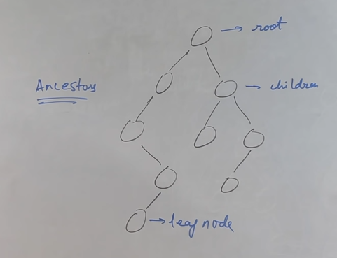
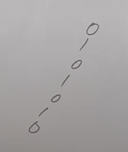
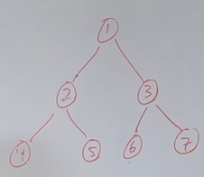
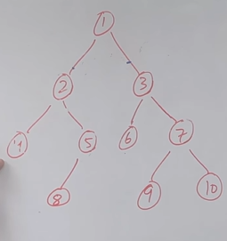
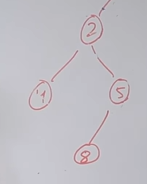
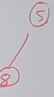
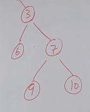
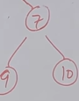
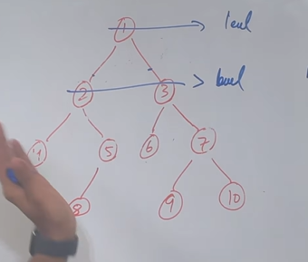

# Trees

Trees are heirarcheal data structures. 

## Important Terms

* __Root Node__: The apex node of the tree from where the tree starts.

* __Child Node__: The nodes connected to a parent node.

* __Leaf Node__: The nodes which have no children, are at the ends of the trees.

* __Sub Tree__: Mini trees that can be extracted from main tree.

* __Ancester__: Parents of parent node.



## Types of trees

* __Full Binary Tree__: The nodes in this tree either have 2 children or 0 children.

* __Complete Binary Tree__: All levels in the tree are completely filled, except the last level. The nodes in the last level run from left to right.

* __Perfect Binary Tree__: All the leaf nodes are all the same level.

* __Balanced Binary Tree__: The height can be maximum of log(N), where N is number of nodes. For instance, for 8 nodes, log<sub>2</sub>8 is 3, hence the maximum levels this tree can have is 3.

* __Degenerate Tree__: These trees look something like this,



Here each tree has a single node. This resembles more of an linked list datastructure.

## Binary Tree Representation In Java

```java
class Node{
    int value;
    Node left;
    Node right;
    public Node(int value){
        this.value=value;
    }
}

public class BinaryTree{

    Node rootNode;

    public BinaryTree(){
        rootNode=null;
    }

    public void insertion(int value){
        rootNode=insertion(rootNode,value);
    }

    public void insertion(Node rootNode, int value){
        if(rootNode==null){
            rootNode.value=value;
            return;
        }

        
        Scanner sc=new Scanner(System.in);

        
        System.out.println("Do you want to enter the leftNode(1 or 0)?");
        int leftNode=sc.nextInt();
        if(leftNode){
            Node newNode=new Node(value);
            node.left=newNode;
            System.out.println("Do you want to add to this left node?")
            int response=sc.nextInt();
            if(response){
                System.out.println("Enter the new value");
                int value=sc.nextInt();
                insertion(newNode,value);
            }
        }


        System.out.println("Do you want to enter the rightNode(0 or 1)?")
        int rightNode=sc.nextInt();
        if(rightNode){
            Node newNode=new Node(value);
            node.right=newNode;
        }
        System.out.println("Do you want to add to this right node?")
        int response=sc.nextInt();
        if(response){
            System.out.println("Enter the new value");
            int value=sc.nextInt();
            insertion(newNode,value);
        }
    }
}
```

## Traversing A Binary Tree

There are generally 2 major kinds of traversal in a tree,

* __Depth First Search__
* __Breadth First Search__

### Breadth First Search

There are 3 different types of traversal in BFS,

* __Pre-order traversal__
* __In-order traversal__
* __Post-order traversal__

Lets first visual what happens in them with the help of a example then we will focus on the coding part.



In __Pre-order traversal__ the concept is `Left Root Right`. That is go the leftmost subtree, print the left node, then parent node, the right node. After the left subtrees are over, print the root node. Then to the rightmost subtree. Print the left node, then the parent node, then the right node. Do this for all right subtrees. Here the operation will end.

For the diagram above, the __Pre-Order Traversal__ will be,

4 2 5 1 6 3 7

In __In-Order Traversal__ the concept is `Root Left Right`. That is, first print the root node, then go to the leftmost subtree. Print the parent node, then left child node, then the right child node. After left subtrees are over, go the rightmost subtree. Print the parent node, left child node, right child node, in that order. After all the right half subtrees are finished the process ends. For this example, the __In-order traversal__ will be,

1 2 4 5 3 6 7

In __Post-Order Traversal__ the concept is `Left Right Root`. That is, first go to the leftmost subtree. Print the left child node, then right child node, then the parent node. After left subtrees are over, go the rightmost subtree. Print the left child node, right child node, parent node in that order. After all the right half subtrees are finished print the root node. After that the process ends. For this example, the __Pre-order traversal__ will be,

4 5 2 6 7 3 1

Lets do this for another example,



__Pre-Order Traversal__

The first node will be the root node itself. Then traversal till this point is,

1

Now, select the left subtree.



Follow `Root Left Right`. On root we have 2. The select the left child, that is 4. The select the right child. Here it is another tree, of 5 and 8.



Apply the `Root Left Right` concept here. Then the traversal will be, root 5, the left child 8. Here the left subtree ends. The traversal till this point is,

1 2 4 5 8

Now we move to the right subtree. This looks something like this,



Applying the `Root Left Right` concept here, first we will have the root 3, followed by the left child that is 6. On the right child, we have another tree.



Here also we will apply the concept of `Root Left Right`. The first node to be printed the parent node 7, followed by left child 9, followed by right child 10. Then the final traversal will be,

1 2 4 5 8 3 6 7 9 10

__In-Order Traversal__

First we will move to the leftmost tree. This will look something like this,


Here we will apply the `Left Root Right` concept. So the first node to be printed will the left child 4, followed by parent node 2, followed by the right child which is a tree again. This subtree looks something like this.


Apply the `Left Root Right` concept here. Then the traversal will be, left child 8, then the root 5. Here the left subtree ends. The traversal till this point is,

4 2 8 5 

Then we will have the root node that is 1. So the traversal till this point is,

4 2 8 5 1

Now we move to the right subtree. This looks something like this,


Applying the `Left Root Right` concept here, first we will have the left child that is 6, followed by root 3. On the right child, we have another tree.


Here also we will apply the concept of `Left Root Right`. The first node to be printed will be the left child 9, followed the root 7, followed by right child 10. Then the final traversal will be,

4 2 8 5 1 6 3 9 7 10

__Post-Order Traversal__

First we will move to the leftmost tree. This will look something like this,


Here we will apply the `Left Right Root` concept. So the first node to be printed will the left child 4,followed by the right child which is a tree again. This subtree looks something like this.


Apply the `Left Right Root` concept here. Then the traversal will be, left child 8, then the root 5 since there is no right child. 

Then will be the root node of this left subtree which is, 2. Here the left subtree will end. Traversal till this point will be,

4 8 5 2

Now we move to the right subtree. This looks something like this,


Applying the `Left Right Root` concept here, first we will have the left child that is 6, followed by the right child, we have another tree.


Here also we will apply the concept of `Left Right Root`. The first node to be printed will be the left child 9,followed by right child 10, followed the root 7. This will be followed by the root node of right subtree that is, 3.

Then the traversal till this point will be,

4 8 5 2 6 9 10 7 3

Then we will have the root node that is 1. So the final traversal is,

4 8 5 2 6 9 10 7 3

### Breadth First Search

Lets visualise this, for the following tree,



As observable in the diagram, the node are printed level by level from left to right.

Then the final traversal will be,

1 2 3 4 5 6 7 8 9 10

Now that we have visualised how do these traversals work, the next thing to do is coding. Following will be the codes to each of these traversals.

### Code For Pre-Order Traversal

```java
public class Preorder{

    public void preorder(Node node){
        if(node==null){
            return;
        }
        System.out.println(node.value);
        preorder(node.left);
        preorder(node.right);
    }

    public static void main(String[] args){
        Node startingNode=new Node();
        preorder(startingNode);
    }
}
```

### Code for In-Order Traversal

```java
public class Inorder{
    public void inorder(Node node){
        if(node==null){
            return;
        }
        inorder(node.left);
        System.out.println(node.value);
        inorder(node.right);
    }

    public static void main(String[] args){
        Node startingNode=new Node();
        inorder(startingNode);
    }
}
```

### Code For Post-Order Traversal

```java
public class PostOrder{
    public void postorder(Node node){
        if(node==null){
            return;
        }
        postorder(node.left);
        postorder(node.right);
        System.out.println(node.value);
    }

    public static void main(String[] args){
        Node startingNode=new Node();
        postorder(startingNode);
    }
}
```
### BFS Implementation Code

```java
public class BreadthFirstSearch{
    public static void main(String[] args){
        Queue<Node> queue=new LinkedList<>();
        List<List<Integer>>levelWise=new ArrayList<>();
        if(root==null){
            return;
        }
        queue.add(root);
        while(!queue.isEmpty()){
            int numberOfNodeOnCurrentLevel=queue.size();
            List<Integer>currentLevelValues=new ArrayList<>();
            for(int i=0;i<numberOfNodeOnCurrentLevel;i++){
                Node nodeRemovedFromQueue=queue.remove();
                currentLevelValues.add(nodeRemovedFromQueue);
                if(nodeRemovedFromQueue.left!=null){
                    queue.add(nodeRemovedFromQueue.left);
                }
                if(nodeRemovedFromQueue.right!=null){
                    queue.add(nodeRemovedFromQueue.right);
                }
            }
            levelWise.add(currentLevelValues);
        }
    }
}
```

The time complexity of this code is $O(N)$ and space complexity is also $O(N)$.

Now that we have the tools for the coding purposes, now lets make a note of techniques involved in all the questions.

## Height Of Tree

The general code for this is,

```java
class Solution {
    public int maxDepth(TreeNode root) {
        if(root==null){
            return 0;
        }
        int lh=maxDepth(root.left);
        int rh=maxDepth(root.right);

        return(1+Math.max(lh,rh));
    }
}
```
This is a base code that will be used for solving of other complex questions.

## Diameter of Binary Tree

The diameter of a binary tree is the length of the longest path between any two nodes in a tree. This path may or may not pass through the root.

The solution is a modification of height of tree code,

```java
class Solution {

    //This is the logical code.

    public int height(TreeNode root,int[] maxHeight){
        if(root==null){
            return 0;
        }
        int lh=height(root.left,maxHeight);
        int rh=height(root.right,maxHeight);
        maxHeight[0]=Math.max(maxHeight[0],lh+rh);
        return(1+Math.max(lh,rh));
    }

    //This is not the logical code but just the motor code.

    public int diameterOfBinaryTree(TreeNode root) {
        int[] maxHeight=new int[1];
        height(root,maxHeight);        
        return(maxHeight[0]);
    }
}
```

As observable in the logical code above, the base code is of `Height Of Binary Tree` with an extra component of `maxHeight` that is being continously being updated on each recursive call, which will be returned as the solution by the motor function.

## Check For Identical Tree

The code employed to solve this question is,

```java
class Solution {

    //This is the logical code.

    public void dfs(TreeNode root,List<List<Integer>> list){
        if(root==null){
            return;
        }
        ArrayList<Integer>level=new ArrayList<>();
        level.add(root.val);
        list.add(level);
        Queue<TreeNode> queue=new LinkedList<>();
        queue.add(root);
        while(!queue.isEmpty()){
            ArrayList<Integer> valueOfCurrentDepth=new ArrayList<>();
            for(int i=0;i<queue.size();i++){
                TreeNode popNode=queue.remove();
                if(popNode.left!=null){
                    valueOfCurrentDepth.add(popNode.left.val);
                    queue.add(popNode.left);
                }
                else{
                    valueOfCurrentDepth.add(null);
                }
                if(popNode.right!=null){
                    valueOfCurrentDepth.add(popNode.right.val);
                    queue.add(popNode.right);
                }
                else{
                    valueOfCurrentDepth.add(null);
                }
            }
            list.add(valueOfCurrentDepth);
        }
    }

    //This is the motor code.

    public boolean isSameTree(TreeNode p, TreeNode q) {
        List<List<Integer>> leftTree=new ArrayList<>();
        List<List<Integer>> rightTree=new ArrayList<>();
        dfs(p,leftTree);
        dfs(q,rightTree);
        return(leftTree.equals(rightTree));
    }
}
```

Now if you look at the logical code, the question is being solved via the implementation of level-order traversal. We feed logical code with two things, `root of tree` and `ArrayList` specific to root of the tree.

We start level order traversal of each tree and then we store the values in the arraylist provided along for each tree. Note we generally ignore null components when performing level order traversal but in this case, we will consider null elements too and add them to arraylist.

At last we compare these two arraylists. If they turn out to be the same, the true is returned, but if they are not the same, false is returned.

## Binary Tree Zigzag Level Order Traversal

The solution code is,

```java

//Logical code and the motor code are the same.

class Solution {
    public List<List<Integer>> zigzagLevelOrder(TreeNode root) {
        if(root==null){
            return new ArrayList<>();
        }
        Queue<TreeNode> queue=new LinkedList<>();
        List<List<Integer>> solution=new ArrayList<>();
        int turn=0;
        queue.add(root);
        while(!queue.isEmpty()){
            List<Integer> nodeOnCurrentLevel=new ArrayList<>();
            int currentSize=queue.size();
            for(int i=0;i<currentSize;i++){
                TreeNode popNode=queue.remove();
                nodeOnCurrentLevel.add(popNode.val);
                if(popNode.left!=null){
                    queue.add(popNode.left);
                }
                if(popNode.right!=null){
                    queue.add(popNode.right);
                }    
            }
            if(turn%2==0){
                solution.add(nodeOnCurrentLevel);
            }
            else{
                Collections.reverse(nodeOnCurrentLevel);
                solution.add(nodeOnCurrentLevel);
            }
            turn=turn+1;
        }
        return(solution);
    }
}
```

The simple logic is, take the root node from the user, create a turn variable and implement level-order traversal. Initialise the turn variable to 0. The simple concept will be to go level by level, store the components of each level in the arraylist. The next will be to see weather the value of turn variable is even or not. If even, the arraylist storing the level's data will be added to solution arraylist as it is without making any changes. If odd, the arraylist storing the level's data will be added to the solution arraylist after it is reversed.

After all the levels are traversed, the solution arraylist will be returned.

## Vertical Order Traversal Of Binary Tree

#### Problem Statement:
Given a binary tree, return its vertical order traversal. Nodes in the same vertical column should be output together in a list, ordered from left to right and top to bottom. If two nodes are in the same position, they should be sorted by their value.

The code is as follows,

```java
class Solution {

    //Helper Class
    class Node {
        TreeNode node;
        int row;
        int column;

        public Node(TreeNode node, int row, int column) {
            this.node = node;
            this.row = row;
            this.column = column;
        }
    }

    //Level Order Traversal for storing rows with coordinates.
    public List<List<Integer>> verticalTraversal(TreeNode root) {
        if (root == null) {
            return new ArrayList<>();
        }

        Queue<Node> queue = new LinkedList<>();
        List<Node> valueCoordinates = new ArrayList<>();
        queue.add(new Node(root, 0, 0));

        while (!queue.isEmpty()) {
            Node popNode = queue.poll();
            valueCoordinates.add(popNode);

            if (popNode.node.left != null) {
                queue.add(new Node(popNode.node.left, popNode.row + 1, popNode.column - 1));
            }
            if (popNode.node.right != null) {
                queue.add(new Node(popNode.node.right, popNode.row + 1, popNode.column + 1));
            }
        }

        // Sort based on column, row, and node value
        valueCoordinates.sort((a, b) -> {
            if (a.column != b.column) {
                return Integer.compare(a.column, b.column);
            } else if (a.row != b.row) {
                return Integer.compare(a.row, b.row);
            } else {
                return Integer.compare(a.node.val, b.node.val);
            }
        });

        // Group nodes by column
        List<List<Integer>> solution = new ArrayList<>();
        int i = 0;
        while (i < valueCoordinates.size()) {
            int currentCol = valueCoordinates.get(i).column;
            List<Integer> col = new ArrayList<>();
            while (i < valueCoordinates.size() && valueCoordinates.get(i).column == currentCol) {
                col.add(valueCoordinates.get(i).node.val);
                i++;
            }
            solution.add(col);
        }

        return solution;
    }
}
```

#### Algorithm:

1. **Define a Helper Class (Node):**
   - Create an inner class `Node` to store the following:
     - `TreeNode node`: The tree node itself.
     - `int row`: The row (depth) of the node in the binary tree.
     - `int column`: The column index of the node, calculated based on its horizontal position in the tree.

2. **Handle Base Case:**
   - If the root is `null`, return an empty list, as there is no tree to traverse.

3. **Perform Level Order Traversal:**
   - Initialize a queue (BFS traversal) and a list `valueCoordinates` to store the nodes along with their row and column information.
   - Enqueue the root node along with its initial coordinates (`row = 0`, `column = 0`).
   - While the queue is not empty:
     - Dequeue a node (let's call it `popNode`) and add it to `valueCoordinates`.
     - If `popNode` has a left child, enqueue it with updated coordinates (`row + 1`, `column - 1`).
     - If `popNode` has a right child, enqueue it with updated coordinates (`row + 1`, `column + 1`).

4. **Sort the Nodes by Column, Row, and Value:**
   - Sort the `valueCoordinates` list based on the following priorities:
     1. Primary: Column index (ascending).
     2. Secondary: Row index (ascending).
     3. Tertiary: Node value (ascending).

5. **Group Nodes by Column:**
   - Initialize an empty list `solution` to store the final vertical order traversal.
   - Iterate through the sorted `valueCoordinates` list and group nodes by their column index:
     - For each column, create a sublist and collect all nodes belonging to that column.
     - Add the sublist to `solution`.

6. **Return the Solution:**
   - Return the `solution` list, which contains nodes grouped and ordered according to the vertical order traversal.

#### Key Points:
- BFS is used to traverse the tree level by level, ensuring nodes at the same depth are processed sequentially.
- Sorting ensures that the vertical order adheres to the specified priorities (column > row > value).
- Grouping nodes by column creates the final structure for the vertical order traversal.

#### Example Walkthrough:

**Input Tree:**
```
       3
      / \
     9   20
        /  \
       15   7
```

**Steps:**
1. Perform BFS:
   - Enqueue nodes along with their coordinates.
   - Output of `valueCoordinates` after BFS:
     ```
     [(3, row=0, column=0), (9, row=1, column=-1), (20, row=1, column=1),
      (15, row=2, column=0), (7, row=2, column=2)]
     ```

2. Sort `valueCoordinates`:
   - Sorted list:
     ```
     [(9, row=1, column=-1), (3, row=0, column=0), (15, row=2, column=0),
      (20, row=1, column=1), (7, row=2, column=2)]
     ```

3. Group by Column:
   - Column -1: [9]
   - Column  0: [3, 15]
   - Column  1: [20]
   - Column  2: [7]

4. Final Output:
   ```
   [[9], [3, 15], [20], [7]]
   ```

## Top View Of Binary Tree

### Code

```java
class Solution {
    
    //Helper function
    static class Triplet{
        Node node;
        int row;
        int col;
        public Triplet(Node node,int row,int col){
            this.node=node;
            this.row=row;
            this.col=col;
        }
    }
    
    static ArrayList<Integer> topView(Node root) {
        
        //Handling base case
        if(root==null){
            return new ArrayList<>();
        }
        
        //Running level order traversal for determing the rows and columns of each node
        Queue<Triplet> queue=new LinkedList<>();
        List<Triplet>nodeCoordinates=new ArrayList<>();
        int minColumn=0;
        int maxColumn=0;
        Triplet node=new Triplet(root,0,0);
        queue.add(node);
        while(!queue.isEmpty()){
            Triplet popNode=queue.remove();
            nodeCoordinates.add(popNode);
            minColumn=Math.min(minColumn,popNode.col);
            maxColumn=Math.max(maxColumn,popNode.col);
            if(popNode.node.left!=null){
                node=new Triplet(popNode.node.left,popNode.row+1,popNode.col-1);
                queue.add(node);
            }
            if(popNode.node.right!=null){
                node=new Triplet(popNode.node.right,popNode.row+1,popNode.col+1);
                queue.add(node);
            }
        }
        
        //Process column to extract top view
        ArrayList<Integer> solution=new ArrayList<>();
        for(int col=minColumn;col<=maxColumn;col++){
            List<Triplet> currentColNodes=new ArrayList<>();
            for(int i=0;i<nodeCoordinates.size();i++){
                if(col==nodeCoordinates.get(i).col){
                    currentColNodes.add(nodeCoordinates.get(i));
                }
            }
            Collections.sort(currentColNodes,(a,b)->Integer.compare(a.row,b.row));
            solution.add(currentColNodes.get(0).node.data);   
        }

        //Returning solution
        return(solution);
        
    }
}
```


### Algorithm for Top View of Binary Tree

#### Problem Statement:
Given a binary tree, return the top view of the tree as a list of nodes visible when the tree is viewed from the top. Nodes should be listed from left to right.

#### Algorithm:

1. **Define a Helper Class (Triplet):**
   - Create a static nested class `Triplet` to store:
     - `Node node`: The tree node itself.
     - `int row`: The row (depth) of the node in the binary tree.
     - `int col`: The column index of the node, determined by its horizontal position in the tree.

2. **Handle Base Case:**
   - If the root is `null`, return an empty list as there is no tree to process.

3. **Perform Level Order Traversal:**
   - Initialize a queue for BFS traversal and a list `nodeCoordinates` to store nodes along with their row and column information.
   - Track the minimum and maximum column indices (`minColumn` and `maxColumn`) encountered during traversal.
   - Enqueue the root node with its initial coordinates (`row = 0`, `col = 0`).
   - While the queue is not empty:
     - Dequeue a node (let's call it `popNode`) and add it to `nodeCoordinates`.
     - Update `minColumn` and `maxColumn` based on the current node's column index.
     - If the node has a left child, enqueue it with updated coordinates (`row + 1`, `col - 1`).
     - If the node has a right child, enqueue it with updated coordinates (`row + 1`, `col + 1`).

4. **Process Columns to Extract Top View:**
   - Initialize an empty list `solution` to store the top view.
   - Iterate over each column index from `minColumn` to `maxColumn`.
     - For each column, filter nodes from `nodeCoordinates` that belong to the current column index.
     - Sort these nodes by their row values to prioritize nodes closest to the top of the tree.
     - Add the first node's value in the sorted list (top-most node) to the `solution` list.

5. **Return the Solution:**
   - Return the `solution` list, which contains the top view of the tree.

#### Key Points:
- BFS ensures that nodes at each depth are processed sequentially, maintaining the order of traversal.
- Sorting by row ensures the correct node is selected for the top view when multiple nodes share the same column index.
- Tracking `minColumn` and `maxColumn` helps limit the range of column indices to process.

#### Example Walkthrough:

**Input Tree:**
```
       1
      / \
     2   3
    / \   \
   4   5   6
```

**Steps:**

1. Perform BFS:
   - Enqueue nodes along with their coordinates.
   - Output of `nodeCoordinates` after BFS:
     ```
     [(1, row=0, col=0), (2, row=1, col=-1), (3, row=1, col=1),
      (4, row=2, col=-2), (5, row=2, col=0), (6, row=2, col=2)]
     ```
   - `minColumn = -2`, `maxColumn = 2`.

2. Process Columns:
   - For each column:
     - Column -2: Nodes = [(4, row=2)]. Top view = 4.
     - Column -1: Nodes = [(2, row=1)]. Top view = 2.
     - Column  0: Nodes = [(1, row=0), (5, row=2)]. Top view = 1.
     - Column  1: Nodes = [(3, row=1)]. Top view = 3.
     - Column  2: Nodes = [(6, row=2)]. Top view = 6.

3. Final Output:
   ```
   [4, 2, 1, 3, 6]
   ```


## Bottom View Of Binary Tree

### Code

```java
class Solution
{
    //Helper Class
    class Triplet{
        Node node;
        int row;
        int col;
        public Triplet(Node node,int row,int col){
            this.node=node;
            this.row=row;
            this.col=col;
        }
    }
    
    public ArrayList <Integer> bottomView(Node root)
    {
        //Handing Base Case
        if(root==null){
            return new ArrayList<>();
        }
        
        //Level-Order Traversal for finding the column and row of each node
        Queue<Triplet> queue=new LinkedList<>();
        ArrayList<Triplet>nodeCoordinates=new ArrayList<>();
        int minColumn=0;
        int maxColumn=0;
        Triplet newTriplet=new Triplet(root,0,0);
        queue.add(newTriplet);
        while(!queue.isEmpty()){
            Triplet popNode=queue.remove();
            nodeCoordinates.add(popNode);
            minColumn=Math.min(minColumn,popNode.col);
            maxColumn=Math.max(maxColumn,popNode.col);
            if(popNode.node.left!=null){
                newTriplet=new Triplet(popNode.node.left,popNode.row+1,popNode.col-1);
                queue.add(newTriplet);
            }
            if(popNode.node.right!=null){
                newTriplet=new Triplet(popNode.node.right,popNode.row+1,popNode.col+1);
                queue.add(newTriplet);
            }
        }
        
        //Process Columns to Extract Bottom View:
        ArrayList<Integer> solution=new ArrayList<>();
        for(int col=minColumn;col<=maxColumn;col++){
            ArrayList<Triplet>nodeOnCol=new ArrayList<>();
            for(int i=0;i<nodeCoordinates.size();i++){
                if(col==nodeCoordinates.get(i).col){
                    nodeOnCol.add(nodeCoordinates.get(i));
                }
            }
            solution.add(nodeOnCol.get(nodeOnCol.size()-1).node.data);
        }

        //Return the Solution:
        return(solution);
    }
}
```

### Algorithm for Bottom View of Binary Tree

#### Problem Statement:
Given a binary tree, return the bottom view of the tree as a list of nodes visible when the tree is viewed from the bottom. Nodes should be listed from left to right.

#### Algorithm:

1. **Define a Helper Class (Triplet):**
   - Create a nested class `Triplet` to store:
     - `Node node`: The tree node itself.
     - `int row`: The row (depth) of the node in the binary tree.
     - `int col`: The column index of the node, determined by its horizontal position in the tree.

2. **Handle Base Case:**
   - If the root is `null`, return an empty list as there is no tree to process.

3. **Perform Level Order Traversal:**
   - Initialize a queue for BFS traversal and a list `nodeCoordinates` to store nodes along with their row and column information.
   - Track the minimum and maximum column indices (`minColumn` and `maxColumn`) encountered during traversal.
   - Enqueue the root node with its initial coordinates (`row = 0`, `col = 0`).
   - While the queue is not empty:
     - Dequeue a node (let's call it `popNode`) and add it to `nodeCoordinates`.
     - Update `minColumn` and `maxColumn` based on the current node's column index.
     - If the node has a left child, enqueue it with updated coordinates (`row + 1`, `col - 1`).
     - If the node has a right child, enqueue it with updated coordinates (`row + 1`, `col + 1`).

4. **Process Columns to Extract Bottom View:**
   - Initialize an empty list `solution` to store the bottom view.
   - Iterate over each column index from `minColumn` to `maxColumn`.
     - For each column, filter nodes from `nodeCoordinates` that belong to the current column index.
     - From these nodes, select the node with the maximum row value (bottom-most node) and add its value to the `solution` list.

5. **Return the Solution:**
   - Return the `solution` list, which contains the bottom view of the tree.

#### Key Points:
- BFS ensures that nodes are processed level by level, maintaining traversal order.
- Tracking `minColumn` and `maxColumn` helps limit the range of column indices to process.
- Filtering and selecting the node with the maximum row value for each column ensures the correct node is chosen for the bottom view.

#### Example Walkthrough:

**Input Tree:**
```
       1
      / \
     2   3
    / \   \
   4   5   6
```

**Steps:**

1. Perform BFS:
   - Enqueue nodes along with their coordinates.
   - Output of `nodeCoordinates` after BFS:
     ```
     [(1, row=0, col=0), (2, row=1, col=-1), (3, row=1, col=1),
      (4, row=2, col=-2), (5, row=2, col=0), (6, row=2, col=2)]
     ```
   - `minColumn = -2`, `maxColumn = 2`.

2. Process Columns:
   - For each column:
     - Column -2: Nodes = [(4, row=2)]. Bottom view = 4.
     - Column -1: Nodes = [(2, row=1)]. Bottom view = 2.
     - Column  0: Nodes = [(1, row=0), (5, row=2)]. Bottom view = 5.
     - Column  1: Nodes = [(3, row=1)]. Bottom view = 3.
     - Column  2: Nodes = [(6, row=2)]. Bottom view = 6.

3. Final Output:
   ```
   [4, 2, 5, 3, 6]
   ```

## Right View Of Binary Tree

### Code

```java
class Solution {
    public List<Integer> rightSideView(TreeNode root) {
        Queue<TreeNode>next=new LinkedList<>();
        List<Integer>solution=new ArrayList<>();
        if(root!=null){
            next.add(root);
        }
        while(!next.isEmpty()){
            int levelLength=next.size();
            TreeNode current=null;
            for(int i=0;i<levelLength;i++){
                current=next.remove();
                if(current.left!=null){
                    next.add(current.left);
                }
                if(current.right!=null){
                    next.add(current.right);
                }
            }
            solution.add(current.val);
        }
        return(solution);
    }
}
```

### Algorithm for Right View of Binary Tree

#### Problem Statement:
Given a binary tree, return the right view of the tree as a list of nodes visible when the tree is viewed from the right side. Nodes should be listed level by level from top to bottom.

#### Algorithm:

1. **Initialize Data Structures:**
   - Create a queue (`next`) to facilitate level-order traversal (BFS).
   - Create a list (`solution`) to store the nodes that form the right view of the tree.

2. **Handle Base Case:**
   - If the root is `null`, return an empty list since there is no tree to process.

3. **Start BFS Traversal:**
   - Add the root node to the queue if it is not `null`.
   - While the queue is not empty:
     - Determine the number of nodes in the current level (`levelLength`) by checking the size of the queue.
     - Initialize a variable `current` to `null` to track the last node processed at the current level.

4. **Process Each Level:**
   - Iterate through all nodes at the current level using a loop that runs `levelLength` times:
     - Dequeue a node (`current`) from the queue.
     - If the node has a left child, enqueue it.
     - If the node has a right child, enqueue it.
   - After processing all nodes in the current level, add the value of the last node (`current.val`) to the `solution` list.

5. **Return the Solution:**
   - After processing all levels, return the `solution` list containing the right view of the tree.

#### Key Points:
- The queue ensures that nodes are processed level by level.
- The `current` variable keeps track of the last node processed in each level, which corresponds to the rightmost node for that level.
- By adding only `current.val` at the end of each level, we capture the right view of the tree.

#### Example Walkthrough:

**Input Tree:**
```
       1
      / \
     2   3
    /     \
   4       5
```

**Steps:**

1. Initialize:
   - Queue (`next`): [1]
   - Solution: []

2. Process Levels:

   - **Level 1:**
     - `levelLength = 1`
     - Dequeue: 1
     - Enqueue: 2, 3
     - Add 1 to `solution`.
     - Queue: [2, 3]
     - Solution: [1]

   - **Level 2:**
     - `levelLength = 2`
     - Dequeue: 2 (enqueue 4), 3 (enqueue 5)
     - Add 3 to `solution`.
     - Queue: [4, 5]
     - Solution: [1, 3]

   - **Level 3:**
     - `levelLength = 2`
     - Dequeue: 4, 5
     - Add 5 to `solution`.
     - Queue: []
     - Solution: [1, 3, 5]

3. Final Output:
   ```
   [1, 3, 5]
   ```

## 

### Code

```java
class Solution {
    
    //This is the helper function that empties the stack into path list whenever leaf node is encountered and adds the path list to solution list.
    public static void accessStack(ArrayList<Integer> path,Stack<Integer> stack,ArrayList<ArrayList<Integer>> solution){
        for(int i=0;i<stack.size();i++){
            path.add(stack.get(i));
        }
        solution.add(path);
    }
    

    //This is the function that inOrderly traverses through all the node filling up the stack with elements lying on the path.
    public static void inOrder(Node node,Stack<Integer> stack,ArrayList<ArrayList<Integer>> solution){
        if(node==null){
            return;
        }
        stack.push(node.data);
        inOrder(node.left,stack,solution);
        if(node.left==null && node.right==null){
            accessStack(new ArrayList<>(),stack,solution);
        }
        inOrder(node.right,stack,solution);
        stack.pop();
        return;
    }
    
    //This is the main function
    public static ArrayList<ArrayList<Integer>> Paths(Node root) {
        Stack<Integer> stack=new Stack<>();
        ArrayList<ArrayList<Integer>> solution=new ArrayList<>();
        inOrder(root,stack,solution);
        return(solution);
    }
}

```

### Algorithm for Root to Leaf Paths in a Binary Tree

#### Problem Statement:
Given a binary tree, return all root-to-leaf paths, where each path is represented as a list of node values.

Refer to this video for easy understaning: https://youtu.be/zIkDfgFAg60?si=YJhwvvNpdfuGzM_8

#### Algorithm:

1. **Initialize Data Structures:**
   - Create a stack (`stack`) to store the current path as nodes are traversed.
   - Create a list of lists (`solution`) to store all root-to-leaf paths.

2. **Define Helper Function `accessStack`:**
   - This function takes the current `stack` and copies its elements into a new `path` list.
   - Add this `path` list to the `solution` list.
   - Purpose: To capture the path whenever a leaf node is reached.

3. **Define Recursive Function `inOrder`:**
   - Input: A `node` (current tree node), `stack` (current path), and `solution` (all paths).
   - If the `node` is `null`, return immediately as there is nothing to process.
   - Push the current node's value (`node.data`) onto the `stack`.
   - Recursively call `inOrder` for the left child of the `node`.
   - Check if the current node is a leaf node (both left and right children are `null`):
     - If true, call `accessStack` to save the current path into the `solution` list.
   - Recursively call `inOrder` for the right child of the `node`.
   - After processing the left and right subtrees, remove the current node's value from the `stack` (backtracking).

4. **Main Function `Paths`:**
   - Input: The root of the binary tree.
   - Initialize an empty stack (`stack`) to track the current path.
   - Initialize an empty list (`solution`) to store all root-to-leaf paths.
   - Call the `inOrder` function with the root node, stack, and solution.
   - Return the `solution` list containing all paths.

#### Key Points:
- The stack keeps track of the current path as nodes are traversed.
- Backtracking is achieved by removing a node's value from the stack after its subtrees are processed.
- When a leaf node is reached, the current path is captured and saved to the solution.

#### Example Walkthrough:

**Input Tree:**
```
       1
      / \
     2   3
    / \     \
   4   5     6
```

**Steps:**

1. Initialize:
   - Stack: []
   - Solution: []

2. Traverse Tree:

   - Start with root (1):
     - Push 1 onto the stack: [1]

   - Visit left child (2):
     - Push 2 onto the stack: [1, 2]

   - Visit left child (4):
     - Push 4 onto the stack: [1, 2, 4]
     - Leaf node detected:
       - Capture path: [1, 2, 4]
       - Solution: [[1, 2, 4]]
     - Backtrack: Pop 4 from the stack: [1, 2]

   - Visit right child (5):
     - Push 5 onto the stack: [1, 2, 5]
     - Leaf node detected:
       - Capture path: [1, 2, 5]
       - Solution: [[1, 2, 4], [1, 2, 5]]
     - Backtrack: Pop 5 from the stack: [1, 2]

   - Backtrack to root (1):
     - Pop 2 from the stack: [1]

   - Visit right child (3):
     - Push 3 onto the stack: [1, 3]

   - Visit right child (6):
     - Push 6 onto the stack: [1, 3, 6]
     - Leaf node detected:
       - Capture path: [1, 3, 6]
       - Solution: [[1, 2, 4], [1, 2, 5], [1, 3, 6]]
     - Backtrack: Pop 6 from the stack: [1, 3]

   - Backtrack to root (1):
     - Pop 3 from the stack: [1]

3. Final Output:
   ```
   [[1, 2, 4], [1, 2, 5], [1, 3, 6]]
   ```


## Lowest Common Ancestor

### Code

```java
class Solution {

    //Helper function. Putting path from root to node stored in a stack to an arraylist.
    public void addParent(Stack<Integer> stack,ArrayList<Integer> parents){
        for(int i=0;i<stack.size();i++){
            parents.add(stack.get(i));
        }
    }

    //inOrder traversal discovering the path from parent to target node.
    public void inOrder(TreeNode root,Stack<Integer> stack,ArrayList<Integer> parents,int key){
        if(root==null){
            return;
        }
        stack.push(root.val);
        inOrder(root.left,stack,parents,key);
        if(root.val==key){
            addParent(stack,parents);
        }
        inOrder(root.right,stack,parents,key);
        stack.pop();
        return;
    }

    //Function compares path from root to node for the two different nodes and returns the last common element in that path.
    public int findCommonParent(ArrayList<Integer> parentsP,ArrayList<Integer> parentsQ){
        int commonParent=-1;
        int i=0;
        int j=0;
        while(i<parentsP.size() && j<parentsQ.size()){
            if(parentsP.get(i)!=parentsQ.get(j)){
                break;
            }
            commonParent=parentsP.get(i);
            i++;
            j++;
        }
        return(commonParent);
    }
    
    //Main function
    public TreeNode lowestCommonAncestor(TreeNode root, TreeNode p, TreeNode q) {
        ArrayList<Integer> parentsP=new ArrayList<>();
        ArrayList<Integer> parentsQ=new ArrayList<>();
        Stack<Integer> stack=new Stack<>();
        inOrder(root,stack,parentsP,p.val);
        stack=new Stack<>();
        inOrder(root,stack,parentsQ,q.val);
        int parent=findCommonParent(parentsP,parentsQ);
        return(new TreeNode(parent));
    }
}
```

This code is same as the last one with a little difference. The previous node finds path from root to leaf, this one finds the path from root to target nodes, then compares there parents and returns the answer.

### Algorithm for Finding the Lowest Common Ancestor (LCA) of a Binary Tree

#### Problem Statement:
Given a binary tree and two nodes `p` and `q`, find their lowest common ancestor (LCA). The LCA is the lowest node in the tree that has both `p` and `q` as descendants (where we allow a node to be a descendant of itself).

#### Algorithm:

1. **Initialize Data Structures:**
   - Use two lists, `parentsP` and `parentsQ`, to store the path (parent nodes) from the root to nodes `p` and `q`, respectively.
   - Use a stack (`stack`) to keep track of the current path during traversal.

2. **Define Helper Function `addParent`:**
   - Copies all elements from the current `stack` into the `parents` list. This captures the path to a given node.

3. **Define Recursive Function `inOrder`:**
   - Input: The `root` node, the `stack` (current path), the `parents` list (to store the path), and the `key` (target node value).
   - Base Case: If the current node (`root`) is `null`, return immediately.
   - Push the current node’s value (`root.val`) onto the stack.
   - Recur for the left subtree.
   - If the current node matches the `key`, call `addParent` to save the path to the target node.
   - Recur for the right subtree.
   - After processing both subtrees, pop the current node from the stack (backtracking).

4. **Define Function `findCommonParent`:**
   - Input: Two lists of parents (`parentsP` and `parentsQ`) for nodes `p` and `q`.
   - Initialize a variable `commonParent` to `-1` (default value for no common parent).
   - Iterate through both lists simultaneously using two pointers:
     - If the current elements in both lists are equal, update `commonParent` to the current element.
     - If the elements differ, break the loop as the paths diverge.
   - Return the last common value as the `commonParent`.

5. **Main Function `lowestCommonAncestor`:**
   - Input: The `root` of the tree, and nodes `p` and `q`.
   - Initialize `parentsP` and `parentsQ` as empty lists to store paths to `p` and `q`, respectively.
   - Use the `inOrder` function to populate `parentsP` and `parentsQ` with paths from the root to nodes `p` and `q`.
   - Call `findCommonParent` to find the LCA of `p` and `q`.
   - Return a new TreeNode containing the value of the LCA.

#### Key Points:
- The in-order traversal ensures that all paths from the root to leaf nodes are explored.
- Backtracking with the stack allows the algorithm to explore all potential paths efficiently.
- The two paths to `p` and `q` are compared to find the point where they diverge, identifying the lowest common ancestor.

#### Example Walkthrough:

**Input Tree:**
```
       3
      / \
     5   1
    / \ / \
   6  2 0  8
     / \
    7   4
```
**Nodes:**
`p = 5`, `q = 1`

**Steps:**

1. **Find Path to Node `p`:**
   - Path to `5`: [3, 5]

2. **Find Path to Node `q`:**
   - Path to `1`: [3, 1]

3. **Compare Paths:**
   - Common Path: [3]
   - LCA: 3

**Output:**
The LCA of nodes `5` and `1` is `3`.

#### Complexity Analysis:
- **Time Complexity:**
  - `O(N)`, where `N` is the number of nodes in the tree. Each node is visited once during the traversal.
- **Space Complexity:**
  - `O(H)`, where `H` is the height of the tree, due to the recursive stack and the storage of paths.

#### Final Output:
The function returns the lowest common ancestor of the two given nodes as a TreeNode object.


## Maximum Width Of Binary Tree

### Code

```java
class Solution {

    //Supporting class
    class Pair{
        TreeNode node;
        int index;
        public Pair(TreeNode root,int index){
            this.node=root;
            this.index=index;
        }
    }

    int maxWidth=-1;

    //LevelOrder traversal. Index is given to each node at each level and difference is calculated between leftmost and rightmost node. The level with the highest difference marks the diameter of the tree.
    public void levelOrder(TreeNode root){
        
        if(root==null){
            return;
        }
        
        Queue<Pair> queue=new LinkedList<>();
        
        queue.add(new Pair(root,0));
        
        while(!queue.isEmpty()){
            int sizeOfQueue=queue.size();
            ArrayList<Integer> currentLevel=new ArrayList<>();
            for(int i=0;i<sizeOfQueue;i++){
                Pair popNode=queue.remove();
                currentLevel.add(popNode.index);
                if(popNode.node.left!=null){
                    queue.add(new Pair(popNode.node.left,popNode.index*2+1));
                }
                if(popNode.node.right!=null){
                    queue.add(new Pair(popNode.node.right,popNode.index*2+2));
                }
            }
            maxWidth=Math.max(maxWidth,(Math.abs(currentLevel.get(0)-currentLevel.get(currentLevel.size()-1))+1));
        }
    }

    public int widthOfBinaryTree(TreeNode root) {
        levelOrder(root);
        return(maxWidth);
    }
}
```

### Algorithm for Finding the Maximum Width of a Binary Tree

#### Problem Statement:
Given a binary tree, find its maximum width. The width of a level is defined as the number of nodes between the leftmost and rightmost non-null nodes in that level, including null placeholders between nodes. The maximum width is the largest width among all levels.

#### Algorithm:

1. **Define Supporting Class (`Pair`):**
   - Create a `Pair` class to store each node along with its `index` in a virtual array representation of the tree.
   - The `index` of the root node is 0. For any node at index `i`:
     - The left child is at index `2 * i + 1`.
     - The right child is at index `2 * i + 2`.

2. **Initialize Variables:**
   - Use a `Queue<Pair>` to perform level-order traversal.
   - Maintain a variable `maxWidth` to track the maximum width observed across all levels.

3. **Level-Order Traversal:**
   - If the root is `null`, return 0.
   - Add the root node to the queue with an initial index of 0.
   - For each level in the binary tree:
     - Get the size of the queue (number of nodes at the current level).
     - Initialize a list `currentLevel` to store the indices of nodes at this level.
     - Process all nodes in the current level by dequeuing each node and adding its index to `currentLevel`.
     - For each node:
       - If it has a left child, enqueue the left child with its computed index.
       - If it has a right child, enqueue the right child with its computed index.
     - Calculate the width of the current level as:
       - `width = (last index - first index + 1)`.
     - Update `maxWidth` if the current level’s width is greater.

4. **Return the Maximum Width:**
   - After completing the traversal, return the `maxWidth`.

#### Key Steps in the Code:

1. **Class Definition:**
   - The `Pair` class is used to encapsulate a `TreeNode` and its `index` in the virtual array representation.

2. **Level-Order Traversal Logic:**
   - Nodes are processed level by level, and their indices are calculated dynamically.
   - By keeping track of the leftmost and rightmost indices for each level, the width is efficiently computed.

3. **Width Calculation:**
   - The width of each level is the difference between the last and first indices in the level plus one.

4. **Complexity Analysis:**
   - **Time Complexity:** `O(N)`, where `N` is the number of nodes in the tree. Each node is visited once.
   - **Space Complexity:** `O(W)`, where `W` is the maximum width of the tree, representing the maximum number of nodes stored in the queue at any level.

#### Example Walkthrough:

**Input Tree:**
```
        1
       / \
      3   2
     /     \
    5       9
   / \     /  \
  6   7   8   10
```

**Step-by-Step Execution:**
1. **Level 0:**
   - Nodes: [1]
   - Indices: [0]
   - Width: 1

2. **Level 1:**
   - Nodes: [3, 2]
   - Indices: [1, 2]
   - Width: 2

3. **Level 2:**
   - Nodes: [5, 9]
   - Indices: [3, 6]
   - Width: 4

4. **Level 3:**
   - Nodes: [6, 7, 8, 10]
   - Indices: [7, 8, 13, 14]
   - Width: 8

**Output:**
Maximum Width = 8

#### Final Output:
The function returns the maximum width of the binary tree as an integer.

## Children Sum in a Binary Tree

### Code

```java
class Solution
{
    
    //Level order traversal. popNode stores the node in focus. Then the values of left child and right child are summed. This value is compared to the parent. If equal, further checking of nodes continue. Else false is returned. Leaf nodes are not checked.
    //If all went right true is returned.
    public static boolean levelOrder(Node root){
        if(root==null){
            return true;
        }
        Queue<Node> queue=new LinkedList<>();
        queue.add(root);
        while(!queue.isEmpty()){
            Node popNode=queue.remove();
            int sum=0;
            if(popNode.left!=null){
                queue.add(popNode.left);
                sum=sum+popNode.left.data;
            }
            if(popNode.right!=null){
                queue.add(popNode.right);
                sum=sum+popNode.right.data;
            }
            //If not a leaf node
            if (popNode.left != null || popNode.right != null) {
                if (popNode.data != sum) {
                    return false;
                }
            }
        }
        return(true);
        
    } 
    
    public static int isSumProperty(Node root)
    {
        boolean result=levelOrder(root);
        if(result){
            return(1);
        }
        else{
            return(0);
        }
        
        
    }
}
```

### Algorithm for Checking the Children Sum Property in a Binary Tree

#### Problem Statement:
Determine if a binary tree satisfies the **Children Sum Property**, where the value of each non-leaf node is equal to the sum of its left and right child nodes. If the tree satisfies this property, return 1; otherwise, return 0.

#### Algorithm:

1. **Define Supporting Function (`levelOrder`):**
   - Perform a **level-order traversal** of the binary tree to check if all non-leaf nodes satisfy the children sum property.

2. **Base Case:**
   - If the root is `null`, the tree satisfies the property (return `true`).

3. **Initialize a Queue:**
   - Use a `Queue` to process nodes level by level.
   - Add the root node to the queue.

4. **Process Each Node in the Queue:**
   - While the queue is not empty:
     - Dequeue a node (`popNode`) from the front of the queue.
     - Initialize a variable `sum` to 0 to store the sum of the values of its child nodes.
     - If the left child exists:
       - Add its value to `sum`.
       - Enqueue the left child.
     - If the right child exists:
       - Add its value to `sum`.
       - Enqueue the right child.
     - If the current node is not a leaf node (it has at least one child):
       - Check if the value of the node (`popNode.data`) is equal to `sum`.
       - If not, return `false`.

5. **Return True:**
   - If all nodes satisfy the children sum property, return `true`.

6. **Final Check (`isSumProperty`):**
   - Call the `levelOrder` function to verify the property.
   - If `levelOrder` returns `true`, return `1` (indicating the tree satisfies the property).
   - Otherwise, return `0`.

#### Complexity Analysis:
- **Time Complexity:**
  - `O(N)`, where `N` is the number of nodes in the binary tree. Each node is visited once during the traversal.
- **Space Complexity:**
  - `O(W)`, where `W` is the maximum width of the tree (maximum number of nodes at any level), representing the space required for the queue.

#### Example Walkthrough:

**Input Tree:**
```
       10
      /  \
     4    6
    / \  / \
   1   3 2  4
```

**Step-by-Step Execution:**
1. **Level 0:**
   - Node: 10
   - Sum of children: 4 + 6 = 10
   - Satisfies the property.

2. **Level 1:**
   - Node: 4
   - Sum of children: 1 + 3 = 4
   - Satisfies the property.
   - Node: 6
   - Sum of children: 2 + 4 = 6
   - Satisfies the property.

3. **Level 2:**
   - Nodes 1, 3, 2, and 4 are leaf nodes.
   - Satisfy the property by default.

**Output:**
Tree satisfies the Children Sum Property. Return `1`.

#### Notes:
- Leaf nodes automatically satisfy the property as they have no children.
- The algorithm ensures all non-leaf nodes are validated by comparing their value with the sum of their children.

## Print all the Nodes at a distance of K in a Binary Tree

### Code

```java
class Solution {

    //This function will save the parent and child in a hashmap
    public void markParent(Map<TreeNode,TreeNode> parentMap,TreeNode root){
        if(root==null){
            return;
        }
        Queue<TreeNode> queue=new LinkedList<>();
        queue.add(root);
        while(!queue.isEmpty()){
            TreeNode popNode=queue.remove();
            if(popNode.left!=null){
                parentMap.put(popNode.left,popNode);
                queue.add(popNode.left);
            }
            if(popNode.right!=null){
                parentMap.put(popNode.right,popNode);
                queue.add(popNode.right);
            }
        }
    }

    //This function will find the nodes at distance k from the target node using a BFS traversal which not only considers the left and right child, but also the parents of the nodes.
    public List<Integer> distanceK(TreeNode root, TreeNode target, int k) {
        Map<TreeNode,TreeNode> parentMap=new HashMap<>();
        markParent(parentMap,root);

        //Second Traversal for search
        Set<TreeNode> visited=new HashSet<>();
        Queue<TreeNode> queue=new LinkedList<>();
        queue.add(target);
        visited.add(target);
        int currentLevel=0;
        while(!queue.isEmpty()){
            if(currentLevel==k){
                break;
            }
            currentLevel++;
            int queueSize=queue.size();
            for(int i=0;i<queueSize;i++){
                TreeNode popNode=queue.remove();
                if(parentMap.get(popNode)!=null && !visited.contains(parentMap.get(popNode))){
                    queue.add(parentMap.get(popNode));
                    visited.add(parentMap.get(popNode));
                }
                if(popNode.left!=null && !visited.contains(popNode.left)){
                    queue.add(popNode.left);
                    visited.add(popNode.left);
                }
                if(popNode.right!=null && !visited.contains(popNode.right)){
                    queue.add(popNode.right);
                    visited.add(popNode.right);
                }
            }
        }

        List<Integer> result=new ArrayList<>();
        while(!queue.isEmpty()){
            result.add(queue.remove().val);
        }
        return(result);
    }
}
```

### Algorithm for Printing All Nodes at a Distance K in a Binary Tree

#### Problem Statement:
Given a binary tree, a target node, and an integer `k`, find all nodes that are at a distance `k` from the target node. The distance between two nodes is defined as the number of edges in the shortest path connecting them.

---

#### Steps of the Algorithm:

1. **Mark Parent Nodes:**
   - Create a `parentMap` to store parent-child relationships for all nodes in the tree.
   - Perform a **level-order traversal** (BFS) starting from the root node:
     - For each node, if it has a left child, store the left child’s parent as the current node in `parentMap`.
     - Similarly, store the right child’s parent.
   - This allows upward traversal from any node to its parent.

2. **Initialize for Search:**
   - Create a `visited` set to track nodes that have already been visited (to prevent cycles).
   - Create a `queue` for BFS traversal and add the `target` node to it.
   - Add the `target` node to the `visited` set.
   - Initialize `currentLevel` to `0` to keep track of the distance from the target node.

3. **Perform BFS for Distance K:**
   - While the `queue` is not empty:
     - If `currentLevel` equals `k`, break out of the loop, as all nodes at distance `k` are now in the queue.
     - Increment `currentLevel`.
     - Process all nodes at the current level:
       - Remove a node (`popNode`) from the front of the queue.
       - Check its parent in `parentMap`:
         - If the parent exists and has not been visited, add it to the queue and mark it as visited.
       - Check the left child:
         - If it exists and has not been visited, add it to the queue and mark it as visited.
       - Check the right child:
         - If it exists and has not been visited, add it to the queue and mark it as visited.

4. **Collect Results:**
   - Once the `currentLevel` equals `k`, all nodes remaining in the queue are at distance `k` from the target.
   - Extract their values into a result list.

5. **Return the Result:**
   - Return the list of node values collected from the queue.

---

#### Complexity Analysis:
- **Time Complexity:**
  - Constructing the `parentMap` requires visiting all nodes: `O(N)`.
  - The BFS traversal to find nodes at distance `k` also requires visiting all nodes: `O(N)`.
  - Overall: `O(N)`.
- **Space Complexity:**
  - The `parentMap` and `visited` set each require `O(N)` space.
  - The `queue` can grow to a maximum of `O(W)`, where `W` is the maximum width of the tree.
  - Overall: `O(N)`.

---

#### Example Walkthrough:

**Input Tree:**
```
       3
      / \
     5   1
    / \  / \
   6   2 0  8
      / \
     7   4
```
- Target Node: `5`
- Distance `k = 2`

**Step-by-Step Execution:**
1. **Mark Parent Nodes:**
   - `6 -> 5`, `2 -> 5`, `5 -> 3`, `0 -> 1`, `8 -> 1`, `1 -> 3`, `7 -> 2`, `4 -> 2`

2. **Initialize for Search:**
   - Start BFS from node `5`. Add `5` to the queue and mark it as visited.

3. **Perform BFS:**
   - **Level 0:** Queue = `[5]`
   - **Level 1:** Queue = `[6, 2, 3]`
   - **Level 2:** Queue = `[7, 4, 3]`

4. **Collect Results:**
   - Nodes at level 2 are `[7, 4, 3]`.

5. **Output:**
   - Return `[7, 4, 3]`.

## Burning Tree

### Code

```java
class Solution {
    static Node startNode;
    
    //Maps parent for each node. Also this functions finds the node at which the burning of the tree is to start.
    public static void mapParent(Map<Node,Node> parentMap, Node root,int target){
        if(root==null){
            return;
        }
        Queue<Node> queue=new LinkedList<>();
        queue.add(root);
        while(!queue.isEmpty()){
            Node popNode=queue.remove();
            if(popNode.data==target){
                startNode=popNode;
            }
            if(popNode.left!=null){
                parentMap.put(popNode.left,popNode);
                queue.add(popNode.left);
            }
            if(popNode.right!=null){
                parentMap.put(popNode.right,popNode);
                queue.add(popNode.right);
            }
            
        }
    }

    //Runs a BFS traversal until the queue is empty to calculate the time taken to burn the whole tree.
    public static int minTime(Node root, int target) {
        Map<Node,Node> parentMap=new HashMap<>();
        mapParent(parentMap,root,target);
        
        if (startNode == null) {
            return -1; // Or handle as required by the problem statement
        }
        
        
        Set<Node> visited=new HashSet<>();
        Queue<Node> queue=new LinkedList<>();
        queue.add(startNode);
        visited.add(startNode);
        int currentTime=-1;
        while(!queue.isEmpty()){
            int queueSize=queue.size();
            for(int i=0;i<queueSize;i++){
                Node popNode=queue.remove();
                if(parentMap.get(popNode)!=null && !visited.contains(parentMap.get(popNode))){
                    queue.add(parentMap.get(popNode));
                    visited.add(parentMap.get(popNode));
                }
                if(popNode.left!=null && !visited.contains(popNode.left)){
                    queue.add(popNode.left);
                    visited.add(popNode.left);
                }
                if(popNode.right!=null && !visited.contains(popNode.right)){
                    queue.add(popNode.right);
                    visited.add(popNode.right);
                }
            }
            currentTime++;
        }
        return(currentTime);
    }
}
```

Note that this question is just an extension of the previous one. We first mark the parents as we did in last case. We then start at the target node given in the question and traverse via BFS. The only difference here is that in previous question, we traverse upto distance k, but in this question we traverse the whole tree, while counting the time taken in doing so.

### Algorithm: Burning Tree

1. **Define `startNode` Variable:**
   - Create a static variable `startNode` to hold the reference to the node containing the `target` value.

2. **Map Parent Nodes:**
   - Create a method `mapParent` to map each node to its parent.
   - Use a `Map<Node, Node>` to store the child-to-parent relationships.
   - Perform a level-order traversal (BFS) to populate the map.
   - During traversal, if the `target` value is found, assign the corresponding node to `startNode`.

3. **Handle Edge Case:**
   - If `startNode` remains `null` after mapping, return `-1` as the `target` does not exist in the tree.

4. **Burn the Tree:**
   - Initialize a `Set<Node>` to track visited nodes and avoid cycles.
   - Create a `Queue<Node>` to facilitate level-order traversal starting from `startNode`.
   - Add `startNode` to the queue and mark it as visited.

5. **Simulate Burning Process:**
   - Initialize `currentTime` to `-1` to count the time required to burn the tree.
   - While the queue is not empty, perform the following steps for each level:
     - Increment `currentTime` by `1`.
     - Iterate through all nodes at the current level.
     - For each node, check its:
       - **Parent:** If not visited, add it to the queue and mark as visited.
       - **Left Child:** If not visited, add it to the queue and mark as visited.
       - **Right Child:** If not visited, add it to the queue and mark as visited.

6. **Return Time:**
   - Once all nodes are burned, return `currentTime` as the total time taken to burn the tree.

---

Let me know if you need further clarifications or refinements!

## Serialize and Deserialize

### Code

```java
public class Codec {

    // Encodes a tree to a single string.
    public String serialize(TreeNode root) {
    if (root == null) {
        return ""; // Represent null tree with an empty string
    }
    StringBuilder sb = new StringBuilder();
    Queue<TreeNode> queue = new LinkedList<>();
    queue.add(root);

    while (!queue.isEmpty()) {
        TreeNode popNode = queue.remove();

        if (popNode == null) {
            sb.append("#,");
        } else {
            sb.append(popNode.val).append(",");
            queue.add(popNode.left);  // Always enqueue left
            queue.add(popNode.right); // Always enqueue right
        }
    }

    return sb.toString(); // Return the serialized tree as a comma-separated string
}


    // Decodes your encoded data to tree.
    public TreeNode deserialize(String data) {
    if (data == null || data.isEmpty()) {
        return null; // Handle empty input
    }

    String[] nodes = data.split(","); // Split by comma delimiter
    TreeNode root = new TreeNode(Integer.parseInt(nodes[0])); // Root is the first value
    Queue<TreeNode> queue = new LinkedList<>();
    queue.add(root);

    int index = 1;
    while (!queue.isEmpty() && index < nodes.length) {
        TreeNode popNode = queue.remove();

        // Handle left child
        if (!nodes[index].equals("#")) {
            TreeNode leftChild = new TreeNode(Integer.parseInt(nodes[index]));
            popNode.left = leftChild;
            queue.add(leftChild);
        }
        index++;

        // Handle right child
        if (index < nodes.length && !nodes[index].equals("#")) {
            TreeNode rightChild = new TreeNode(Integer.parseInt(nodes[index]));
            popNode.right = rightChild;
            queue.add(rightChild);
        }
        index++;
    }

    return root;
}
}
```

### Algorithm for Serialize and Deserialize Binary Tree

#### 1. **Serialization**
Serialization converts the binary tree into a single string representation using level-order traversal.

- **Input:** The root node of a binary tree.
- **Output:** A string representation of the binary tree.

**Steps:**
1. If the root is `null`, return an empty string to represent the null tree.
2. Initialize a `StringBuilder` to construct the serialized string and a `Queue` for level-order traversal.
3. Add the root node to the queue.
4. Perform a level-order traversal:
   - Dequeue a node from the queue.
   - If the node is `null`, append `"#,"` to the `StringBuilder`.
   - Otherwise:
     - Append the node's value to the `StringBuilder` followed by a comma.
     - Enqueue the left and right children of the node (even if they are `null`).
5. Return the constructed string from the `StringBuilder`.

#### 2. **Deserialization**
Deserialization reconstructs the binary tree from the serialized string.

- **Input:** A string representation of the binary tree.
- **Output:** The root node of the reconstructed binary tree.

**Steps:**
1. If the input string is `null` or empty, return `null` (no tree to reconstruct).
2. Split the input string by commas to create an array of node values.
3. Initialize the root node using the first value in the array and a `Queue` for reconstruction.
4. Add the root node to the queue and initialize an index pointer to track the array.
5. Perform a level-order reconstruction:
   - Dequeue a node from the queue.
   - If the value at the current index is not `"#"`, create a left child for the dequeued node, add it to the queue, and increment the index.
   - Repeat the process for the right child.
   - Increment the index after handling both children.
6. Return the root node after reconstruction.

#### Key Points
- `"#"` is used to represent `null` nodes in the serialized string.
- The serialization and deserialization processes both use level-order traversal for consistency.
- Deserialization carefully handles edge cases like an empty input or trees with `null` children to ensure correct reconstruction.


## Constructing a unique binary tree from postorder preorder traversal

Its not possible to create a unique subtree from postorder and preorder traversals of tree.

## Constructing a unique binary tree from inorder and preorder traversal


# Binary Search Tree

In binary search tree is matter what is the value held in left and right child of the binary tree.

By rule, any right child of a parent node must have a value greater than the value of the parent. Similarly, any left child of the parent node must have a value less than the value of the parent.

The rule should be followed by each and every node from the root to the leaves. Only in this case, a binary tree is known as a Binary Search Tree.

## Are duplicate valued nodes allowed in binary search tree?

In general, duplicate valued nodes are not allowed in a BST. But if in case they exist, there are two approaches that we can follow,

* The first is to make a slight change in the rule followed by the BST. The new rule is going to be, "for every parent node, the left child can be a node containing value less than or equal to the value of the parent node, whereas the right child can be node that has value greater than the value stored in parent node."

* The second approach is that we store 2 thing in each node of the BST. The value of the node and frequency of its occurance. In this way we can keep track of the duplicate that have occured in the BST.

## Why Binary Search Tree?

When we want to search a element in the normal binary tree, we see that we have to go through all the nodes atleast once in the worst case. Hence the general time complexity comes out to be $O(N)$.

In case of Binary Search Tree, since all the elements in the tree are arranged in accordance to the values stored in them, in place of going through the whole tree for searching an element, at the worst case we need to cover height of the tree for searching of an element.

Note that the heigth of any binary tree is log<sub>2</sub>n.

Hence the worst case time complexity for searching a BST is $O(log2n)$

## Searching In A Binary Tree

```java
class Solution {
    public TreeNode searchBST(TreeNode root, int val) {
        if(root==null){
            return(null);
        }
        TreeNode currentNode=root;
        while(currentNode!=null){
            if(currentNode.val==val){
                return(currentNode);
            }
            if(val<currentNode.val){
                currentNode=currentNode.left;
            }
            else{
                currentNode=currentNode.right;
            }
        }
        return(null);
    }
}
```

The code above is the one we are going to use for searching into a BST.

